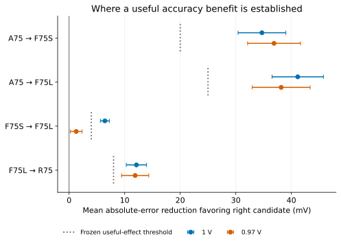

出力から入力MOSのゲートへ抵抗で帰還する増幅器を、75 µAの共通条件で調べました。
大型PMOSを使う帰還型F75Lは、従来の能動負荷A75に比べて平均絶対出力誤差を
60.419 mVから19.275 mVへ減らしました。抵抗負荷R75は7.161 mVで、元の
小振幅の仕事では依然として精度・雑音・帯域に優れています。

帰還型を選ぶ理由は、必要な信号振幅によって変わります。20 mVピーク入力の
名目試験では、R75のTHDは4.156%となり2%制限に違反しました。F75Lは
0.671%でした。帰還型は低歪みと能動負荷の精度改善を両立しますが、抵抗値、
入力源の吸収電流、雑音、容量負荷への速さを同時に考える必要があります。

[英語の設計ガイド](../studies/finite-feedback/)に、端子を明記したテキスト回路、
式、実際のSPICE、図、確認実験の限界をまとめています。
[再現手順](../studies/finite-feedback/reproduce.html)と
[公開例ZIP](../downloads/feedback-study-v1.0.zip)も利用できます。

図をタップすると元のSVGを開けます。狭い画面では表・回路・長い数式を横にスクロールできます。

## どの経路が改善したか

帰還型は出力変化をゲートに戻し、NMOS電流の応答で出力変化を抑えます。
出力電流誤差を電圧誤差へ変換する抵抗は約17 kΩとなり、A75の約90.5 kΩ
より小さくなりました。大型PMOSはさらに負荷・参照の誤差源を減らします。
一方、信号利得を同じ−6に保つため、入力誤差の経路は残ります。

帰還抵抗は出力を負荷するため、利得を単に抵抗比で決める式では足りません。
100 kΩの帰還抵抗と合計10 kΩの入力抵抗に対し、実際の利得は−6です。
既知の動作点から立てた式は、電流・入力・バイアス・電源への介入測定と
0.030%以内で一致しました。この照合は全負荷での安定性や位相余裕の証明ではありません。

## 新しい確認結果と、残った電源依存

設計・測定・停止規則・物理入力を出力観測前に固定し、521個の新しい座標で
4回路×2電源条件、計4,168条件を取得しました。全件の入力、モデル、実現値、
測定値を保存データから照合し、数値的に使える規定外回路も残しています。

| 回路 | 1 Vでの平均絶対誤差 | 0.97 Vでの平均絶対誤差 | 0.97 Vで5項目を満たす数 |
| --- | ---: | ---: | ---: |
| A75 | 60.419 mV | 78.564 mV | 94 / 521 |
| R75 | 7.161 mV | 28.518 mV | 180 / 521 |
| F75S | 25.716 mV | 41.685 mV | 165 / 521 |
| F75L | 19.275 mV | 40.403 mV | 147 / 521 |

F75SからF75Lへの名目条件の改善幅は6.440 mVで、事前に決めた有用な改善幅
4 mVを支持しました。0.97 Vでは1.282 mV、同時区間は0.216–2.348 mVで、
4 mVの改善は支持されません。閾値や標本数は変更していません。
平均が規定範囲の外へずれた状態では、ばらつきを狭めても合格数が増えるとは限りません。

## 支払うコストと選び方

F75LのMOS描画面積は7.467 µm²、内部抵抗の合計は120.401 kΩです。
入力源は名目直流で約0.452 µAを吸収し、20 mV信号では名目ピークで
1.708 µAを吸収、0.832 µAを供給します。実際の入力バッファの実装と電力は
この回路に含まれません。入力抵抗だけの熱雑音床は12.865 µV RMSで、
R75の全入力換算雑音7.092 µV RMSを既に上回ります。

事前指定した6座標の20 mV試験では、帰還2回路は全件で動的条件を満たし、
R75は全件で歪み制限に違反しました。ただしF75Lも直流・交流条件を合わせると
5/6であり、6件から集団全体の動的合格率は推定しません。
16 pFの容量負荷では帰還型の帯域が1 MHzを下回り、R75だけが帯域を満たしました。

元の小振幅の仕事ならR75が有力です。20 mVの低歪みが重要で入力源が電流を
吸収できるなら、F75Lが有用な中間案です。電源変動による中心ずれは残り、
PMOS面積を増やすだけでは解決しません。入力源・上流電源を有限の回路として
つないだ場合や、起動・電源順序への適用は別途確認が必要です。

APM v5.0.0/APM045 VTGとngspice 47によるモデル条件付きの結果です。
受動素子の統計、グローバル・空間・較正済み温度ばらつき、レイアウト寄生、
製造歩留まり、シリコン認定は含みません。設計・実験・執筆・内部確認は同一AIが
実施し、この新しい版について事前の人間レビューや独立査読を主張していません。
公開データから11図・統計の再生成と、指定した4つのSPICE再現例を確認しました。
