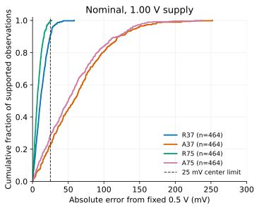

このページは [英語版の研究ガイド](../studies/gain-operating-point-accuracy/index.qmd)
v1.0（研究完了日 2026-09-12 UTC）の概要です。

## 同じ利得でも、誤差の伝わり方は違う

利得 −6、出力中心 0.5 V という共通の役割を持つ 4 回路を比較しました。
抵抗負荷の R37/R75 と、有限の PMOS 基準回路を持つ能動負荷の A37/A75 です。
数字は基準状態での総電流、およそ 37.5 µA または 75 µA を表します。
基準回路の電流も含め、全体の消費を数えています。

入力の誤差に対する感度は、どの回路も約 −6 V/V です。しかし、出力へ流れ込む
誤差電流に対する感度は、R37 が約 11.6 kΩ、A37 が約 90.5 kΩ でした。
利得だけでは、動作点の精度は判断できません。

## 確認実験で分かったこと

候補、物理的なばらつき、測定定義、条件、終了数を先に固定しました。
464 組を基準状態と 0.97 V 電源で比較し、3,712 件を終了しました。
途中でサンプルを引き直したり、個別にバイアスを調整したりしていません。

| 基準状態の平均絶対中心誤差 | R37 | A37 | R75 | A75 |
|---|---:|---:|---:|---:|
| mV | 12.62 | 62.93 | 7.71 | 56.80 |

R75 は R37 より平均絶対誤差が **4.90 mV 小さく**なりました。
ただし、追加で約 37.5 µA と、描画 MOS 面積で約 5.75 µm² が必要です。
回路全体のレイアウト面積や抵抗面積を測った値ではありません。

A75 は基準用 PMOS を 2 個から 5 個に増やします。基準回路由来の分散は
減りますが、出力負荷の PMOS による誤差が大きく残ります。総電流をほぼ
倍にしても改善は限定的でした。平均改善は 6.13 mV ですが、事前に意味のある
差とした 5 mV 以上かどうかは、区間 [2.94, 9.31] mV からは確定できません。

## 条件が変わると選び方も変わる

電源が 0.97 V になると、R75 はばらつき幅が小さいままでも、平均絶対誤差では
R37 より **1.80 mV 悪化**しました。電源による系統的な中心ずれが支配的に
なったためです。ばらつきを小さくすることと、固定目標に近づけることは
分けて考える必要があります。

抵抗負荷案は基準状態で低雑音・広帯域でした。一方、能動負荷案は歪みが小さく、
85 °C では中心電圧を保ちやすいという利点がありました。ただしその高温条件では
利得の仕様を満たせません。調べた全条件を満たす万能な候補はありませんでした。

## 読み方と限界

APM v5.0.0/APM045 VTG と ngspice 47 によるモデル上の観測です。
Local ばらつきは別プロセスの情報を移した仮説であり、製造歩留まり、TSMC55 との
相関、実シリコンの保証を示しません。抵抗ばらつき、配置相関、PEX、温度・雑音の
統計的な校正は今回の範囲外です。動的な確認も、事前指定した一部のサンプルに限ります。

導出・実装・実験・執筆と内部確認は Codex が行いました。ユーザーは研究の方向を
選び、この公開結果をこれから確認します。公開前の人間による査読や承認は主張しません。

[回路と式を含む英語版](../studies/gain-operating-point-accuracy/index.qmd)と
[再現手順・データ](../studies/gain-operating-point-accuracy/reproduce.qmd)を参照してください。
次に考えられる問いは、受動素子のばらつき、能動負荷側への面積配分、電源による
中心ずれを抑える仕組みです。このリリースでは新たな研究を開始していません。
