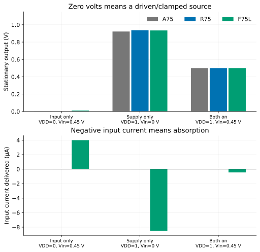
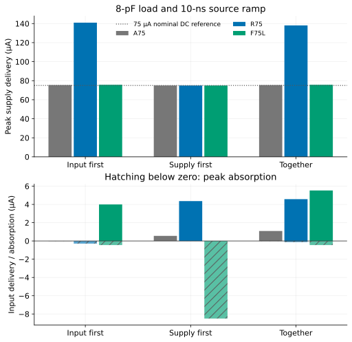

**定常時の75 µAだけでは、接続する電源や入力ドライバを選べません。**
有限の抵抗帰還を使うF75Lは、通常動作では入力源に約0.452 µAを吸収させます。
ところが電源を0 Vに固定して入力を0.45 Vで駆動すると、入力から約3.997 µAを
受け取ります。電源だけを入れて入力を0 Vに固定した状態では、逆に入力源へ
約8.502 µAを流します。

[英語の全文](../studies/power-sequencing/)では、同じA75・R75・F75L回路の
59条件を使い、電流経路、投入順序、整定時間、数値検証を説明しています。
[先行する帰還の研究](../studies/finite-feedback/)の精度・雑音・歪み比較に、
接続先の能力という条件を加える研究です。

## 抵抗の接続は、電源を切っても残る

F75Lでは出力からゲートへ100 kΩ、ゲートから入力源へ合計10 kΩが接続されています。
このため、ゲート電流を無視した近似では、入力電流は

$$I_{in}\simeq\frac{V_{in}-V_o}{110\,\mathrm{k}\Omega}$$

となり、出力と入力の大小関係で向きが変わります。実測されたMOSゲート電流を
含めると、保存波形の入力電流と約1 fA以内で一致しました。電源0 V・入力0.45 Vの
状態では出力が約10.53 mVとなり、入力から来た電流の大部分はNMOSと負荷抵抗を
通って接地側へ流れます。浮いた電源が充電されたという結果ではありません。

ここでの0 Vは**駆動・クランプされた電圧**です。入力の開放や実際の電源断I/O端子を
モデル化したものではありません。実装した入力ドライバの保護回路や電源は、
今回の回路に含まれていません。

## 速さには充電電流の負担がある

8 pF負荷、10 nsのランプで入力を先に与えた場合、ランプ終了後の1 mV帯への
整定はA75が4.445 µs、R75が0.300 µs、F75Lが0.871 µsでした。
R75は速い一方、電源からのピーク電流が約141 µAになります。
F75Lの同じ条件は約75.7 µAですが、入力側の給電・吸収能力が必要です。

R75の電源ランプを1 µsにするとピーク電流は約81.8 µAへ下がります。
ただしランプ開始からの総整定時間は約0.310 µsから1.189 µsへ延びます。
ランプ終了後の遅れだけで速度を比較すると、この代償が隠れます。
これらのピーク電流に、以前のDC用80 µA上限を後付けして合否は付けていません。

電源だけを先に入れると、出力は初期状態ですでに約0.92～0.94 Vになります。
後から入力を与えることで通常の出力へ戻ります。通常信号の振幅制限を超えるこの
期間を記録していますが、許容する起動時の出力範囲は接続先とともに決める条件です。

## 何を確認し、何を残したか

59条件は、抵抗・コンデンサだけの解析解チェック1件、静止状態12件、起動36件、
電源の切断・再投入6件、時間刻み細分化4件です。独立に計算した静止点に対して、
試した全履歴が有限の観測時間内に整定しました。電源を下げた後に「最初の観測点で
すでに帯内」だった結果は、その状態を明記し、ピコ秒単位の整定時間とは扱いません。

364回のMOS実値読戻し、端子電圧範囲、抵抗・容量、電流収支と電荷積分を確認しました。
解析解との最大差は約59.9 nV、時間刻み細分化による波形差は最大56.7 µVです。
取得失敗や結果に応じた条件追加はありません。

これはAPM v5.0.0/APM045 VTGとngspice 47による**公称回路の有限条件の結果**です。
電源断領域でのLocal統計モデルの追加認定、起動確率、任意初期電荷、平衡点の唯一性、
実シリコンの保証ではありません。同じCodexエージェントが解析と内部確認を担当し、
独立追試や今回の結果への事前の人間・査読者の承認は主張していません。

[再現手順](../studies/power-sequencing/reproduce.html)には、公開データからの5枚の図と
集計の再生成、公開モデルからの小さなSPICE再実行4例があります。
入力源の電流制限・出力インピーダンス・クランプ動作を具体化することが、
この結果を次の回路へ接続するときの課題です。
