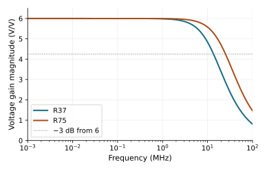
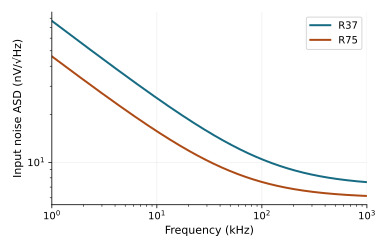

[Previous: MOS operating point and sizing](01-mos-operating-point.qmd) ·
[Reading route](index.qmd) · [Next: mirrors and bias](03-mirrors-and-bias.qmd)

A transistor converts a change in gate voltage into a change in drain current.
The load converts that current into an output voltage. To predict an amplifier,
we must first find the DC state in which both parts agree. A chosen bias current
and a chosen output voltage are requirements to solve together; neither can be
assigned independently to a transistor connected to finite resistors.

This chapter follows **R37**, then spends more current in **R75**. Both are
completed nominal designs from the first study. The names identify circuits,
not universal current recommendations. Their common job is gain −6 around a
0.5-V output center, from a 0.45-V input source at a 1-V supply. The external
load is 100 kΩ in parallel with 1 pF, and the source has 1 kΩ resistance. The
nominal temperature is 26.85 °C. These are APM v5.0.0/APM045 VTG and ngspice 47
observations, not measurements of fabricated silicon.

## Follow the current before calculating gain

This reading view collapses the zero-volt terminal sensors but lists every
MOS terminal. It is documentation, not a new device model. Each NMOS line is
a distinct physical unit. The [exact R37 SPICE](../studies/gain-operating-point-accuracy/circuits/R37.cir)
retains the sensors and full numerical precision.

```text
VDD(vdd, 0) = 1 V
VIN(in, 0) = 0.45 V DC + 5 mV peak sine at 10 kHz
Rsrc(in, gate) = 1 kohm
Rd(vdd, out)   = 13.334310654 kohm
Rload(out, 0)  = 100 kohm
Cload(out, 0)  = 1 pF
Rs(source, 0)  = 82.601808305 ohm

N0(D=out, G=gate, S=source, B=0) W=2.947220014 um L=0.40 um
N1(D=out, G=gate, S=source, B=0) W=2.947220014 um L=0.40 um
N2(D=out, G=gate, S=source, B=0) W=2.947220014 um L=0.40 um
```

VDD delivers current through `Rd` to `out`. There it splits: one part flows
through the external `Rload`, and the rest enters the three NMOS drains. That
bank's source current flows through `Rs` to ground. The gate source controls
conduction but does not supply the main drain current. The model nevertheless
has small gate and body currents, which the exact measurements retain.

At DC, `Cload` carries no stationary current. If the output is 0.5 V, the
100-kΩ load takes 5 µA. A supply budget near 37.5 µA therefore leaves about
32.5 µA for the transistor bank, not 37.5 µA. This subtraction already changes
the transconductance required per unit of transistor current.

## The operating point is a simultaneous solution

Let $I_N$ be the sum of the three drain currents, positive into the NMOS bank.
Neglecting gate/body leakage only for this first calculation, the constraints are

$$
I_N=\frac{V_{DD}-V_O}{R_D}-\frac{V_O}{R_L},
$$

$$
V_S\simeq R_S I_N,\qquad I_N=\sum_{k=0}^{2}F_k(V_{GS},V_{DS},V_{BS}).
$$

Here $F_k$ is the nonlinear MOS current characteristic at the specified
terminal voltages and dimensions. Here $V_{GS}=V_G-V_S$ and $V_{DS}=V_O-V_S$.
The body is grounded, so $V_{BS}=-V_S$; it is not shorted to the
source. The input resistor also obeys
$V_G=V_{IN}-R_{src}I_G$, where $I_G$ is total gate current entering the bank.

These equations hold at the same time. Writing them in this order does not
mean “choose a current, set the source voltage, then force the output.” Changing
the current changes $V_S$, which changes the MOS current itself. Changing
$V_O$ changes both the resistor currents and the transistor's $V_{DS}$. The
SPICE operating-point solve finds their common equilibrium. A proposed
geometry that cannot satisfy them at the desired center needs redesign.

For a first check, $32.5\,\mu\mathrm A\times82.602\,\Omega$ predicts
$V_S\approx2.685$ mV, and $V_{GS}\approx0.447315$ V. The saved nominal solve
gives $V_O=0.500000$ V, $V_S=2.684558$ mV, $V_G=0.449997251$ V and
$I_N=32.497251$ µA. The small difference from the hand calculation is consistent
with the finite gate/body currents and the exact drain resistor. The output
KCL residual recomputed from the saved values is below $10^{-18}$ A; that is
an algebraic consistency check on these stored model values, not an accuracy
claim about a physical current measurement.

The [selected operating-point data](../studies/learning-path-v1/data/resistor-op.json)
and [equation calculation](../studies/learning-path-v1/summary.json) expose the
terminal currents and parameters behind this example.

## gm is a local slope, not current divided by voltage

At the solved operating point, hold the other terminal voltages fixed and
slightly increase $V_{GS}$. The resulting drain-current slope is

$$
g_m=\left.\frac{\partial I_N}{\partial V_{GS}}\right|_{V_{DS},V_{BS}},
\qquad
g_{ds}=\left.\frac{\partial I_N}{\partial V_{DS}}\right|_{V_{GS},V_{BS}}.
$$

For small increments, the bank is approximately

$$i_n=g_m v_{gs}+g_{ds}v_{ds}+g_{mb}v_{bs}.$$

The DC ratio $I_N/V_{GS}$ draws a line from the origin to the operating point;
$g_m$ is the tangent there. They are different quantities. R37 has
$g_m=547.940$ µS, whereas $I_N/V_{GS}\approx72.65$ µS. Using the latter as
transconductance would badly underpredict gain. The useful efficiency ratio
$g_m/I_N=16.861$ V⁻¹ instead asks how much *local incremental control* the
chosen current buys.

Those derivatives describe a transistor with other voltages held fixed. In
the amplifier, the source moves. An input rise increases drain current; `Rs`
raises the source, reducing the increase in $V_{GS}$ and also changing body
bias. This is **source degeneration**, one specific negative-feedback path.

With the supply treated as AC ground, negligible gate current, and capacitance
temporarily omitted, eliminate $v_s$ from the small-signal equations:

$$D=1+R_S(g_m+g_{mb}+g_{ds}),\qquad g_{m,eff}=g_m/D,$$

$$G_O=1/R_D+1/R_L+g_{ds}/D,\qquad
A_v\simeq-\frac{g_{m,eff}}{G_O}.$$

An input rise pulls more current from `out`. Its voltage falls until the load
and transistor increments balance; this explains the minus sign. Simply using
$-g_mR_D$ misses the external load, finite transistor output conductance and
source motion. For R37, ignoring the latter two effects first suggests that
gain magnitude 6 needs about 510 µS. Inserting the saved $g_m$, $g_{mb}=126.451$
µS and $g_{ds}=1.573$ µS gives $D=1.05584$ and $A_v=-6.00066$.
The actual 1-kHz AC result is −6.00000. The approximately 0.011% difference
sets the scale of this useful low-frequency approximation; it is not proof
that the same formula describes high-frequency or large-signal operation.

## Spend more current in a redesigned signal branch

R75 keeps the external job and replaces the bank with six distinct NMOS
units, each $W/L=3.867488768/0.40$ µm. Its $R_D=6.667191719$ kΩ and
$R_S=171.818013565$ Ω are chosen once at nominal. The
[exact R75 circuit](../studies/gain-operating-point-accuracy/circuits/R75.cir)
is a finite redesign; doubling a source current in R37 would not preserve
its center and gain automatically.

| Nominal quantity | R37 | R75 |
| --- | ---: | ---: |
| Total positive delivered port current, µA | 37.500 | 75.000 |
| NMOS drain current, µA | 32.497 | 69.994 |
| Source voltage, mV | 2.685 | 12.027 |
| Bank gm, µS | 547.940 | 1231.172 |
| Low-frequency equation / measured gain | −6.00066 / −6.00000 | −6.00108 / −6.00000 |
| Drawn MOS area, µm² | 3.537 | 9.282 |
| First −3-dB bandwidth, MHz | 13.640 | 25.186 |
| Input noise, 1 kHz–1 MHz, µV RMS | 9.549 | 7.092 |
| THD, 5-mV-peak input at 10 kHz, % | 1.386 | 1.045 |

The [original nominal table](../studies/gain-operating-point-accuracy/data/nominal.csv)
and new equation summary supply these values. The current sum includes VDD
and the input source's positive delivered contribution; the input contributes
only a few nA here. Drawn $\sum WL$ excludes layout overhead, resistor area and
wiring parasitics. Both circuits still depend on the external 1-V supply and
0.45-V source; implementing those sources has an additional, unmeasured cost.

The lower drain resistance in R75 reduces the voltage produced by a current
disturbance and permits a faster loaded response. More transconductance
compensates for that lower resistance to recover the same signal gain.
This is why equal gain does not imply equal current sensitivity.

[](figures/resistor-gain.svg)

An AC sweep linearizes at the DC point and applies a mathematical unit stimulus;
it does not swing the physical gate by 1 V. The plotted magnitude is
$|V_O(f)/V_{IN}(f)|$. Bandwidth is the first crossing 3 dB below its 1-kHz
reference, interpolated in log frequency. This is a signal-response measure,
not a return-ratio or phase-margin measurement.

## Noise and finite signal size ask different questions

Noise is time-varying fluctuation at this stationary operating point. The
plot shows **amplitude spectral density** (ASD) in V/√Hz. Its square is the
power spectral density (PSD) in V²/Hz. For these ADS data, output PSD is referred
to the external input source *at each frequency* using the actual signal gain:

$$S_{in}(f)=S_{out}(f)/|H(f)|^2,\qquad
v_{n,in,rms}=\sqrt{\int_{1\,kHz}^{1\,MHz}S_{in}(f)\,df}.$$

[](figures/resistor-noise.svg)

Integrate PSD, not ASD. Include the band and input port whenever quoting the
RMS value. These observations include the modeled MOS and resistor noise in
the finite circuit. A different bandwidth changes the total. Neither curve
is the distribution of DC output centers across manufactured devices; that
distinct variation question returns in chapter 6.

At 5 mV peak input, magnitude 6 predicts 30 mV peak output, or **60 mV
peak-to-peak**. R37's saved periodic output spans approximately 0.469166 to
0.529171 V. It is slightly asymmetric because gain is a local derivative;
the nonlinear current characteristic changes along a finite excursion. THD
compares the root-sum-square of harmonics 2–10 with the fundamental after
periodic behavior is established. It measures distortion, not random noise.

The earlier 10-mV-peak development trials gave 2.768% THD in R37 and 2.088%
in R75, above the study's 2% criterion. That failed larger-signal job remains
in the record. The common 5-mV job was chosen before the study's physical
confirmation, not relaxed after seeing it. A 0.5-V center also does not promise
half a volt of usable swing in either direction: source motion, transistor
headroom, load current and distortion intervene before a rail-only estimate
becomes a design guarantee.

## Make a conditional design choice

For this nominal job, R75 buys lower noise, lower current-error sensitivity,
more bandwidth and less distortion. It costs roughly twice the current and
2.62 times the drawn MOS area. R37 is useful when its performance suffices
and that spending is not justified. The later studies show why resistor
uncertainty and supply changes can alter an accuracy ranking; this chapter's
nominal comparison does not settle those conditions.

You can now trace a DC path, write the coupled operating-point equations,
predict the gain sign, and judge a finite current increase. The next question
is whether replacing the drain resistor can buy a more favorable load without
losing control of the DC center. To answer it, first learn how a diode-connected
MOS establishes a finite mirror bias in [chapter 3](03-mirrors-and-bias.qmd).

The [full first study](../studies/gain-operating-point-accuracy/index.qmd)
retains its specification, failed development choices, confirmation and
[native reproduction](../studies/gain-operating-point-accuracy/reproduce.qmd).
The [learning package](../studies/learning-path-v1/reproduce.qmd) regenerates
these two plots and the explicit operating-point/equation calculation.
