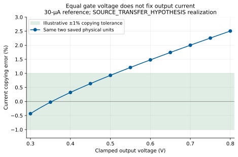

[Previous: common-source amplifier](02-common-source.qmd) · [Reading route](index.qmd) ·
[Next: differential pair and OTA](04-differential-pair-and-ota.qmd)

A drain resistor converts current into voltage but also takes voltage headroom
and fixes a substantial output conductance. A transistor load can supply current
with a much higher incremental resistance. Before using it, however, we must
explain where its gate voltage comes from, which current it actually copies,
and what that new reference branch costs.

## A diode connection establishes a finite bias voltage

Tie the gate and drain of an NMOS together, as introduced in chapter 1. Current
supplied to the combined node raises its voltage until the transistor and its
feeding network agree on current. If the supplying current rises, the bias
voltage must generally rise too. A second NMOS with the same source and gate
voltage can use that bias to draw a related current at a separate drain:

```text
Conceptual NMOS mirror; dimensions must be chosen for the actual job:
  Nref(D=bias, G=bias, S=0, B=0)
  Nout(D=out,  G=bias, S=0, B=0)
  A finite reference network supplies current to bias.
  An external circuit supplies the current drawn at out.
```

Under a simple matched-device approximation, equal gate/source/body voltages
and equal lengths suggest
$I_{out}/I_{ref}\approx W_{out}/W_{ref}$. This first prediction assumes suitable
drain voltages and matching characteristics. The reference has $V_D=V_G$;
the output device usually does not. Finite $g_{ds}$ makes its current depend
on output voltage. Device variation and gate currents also affect the ratio.

**Compliance** is the output-voltage range over which the mirror can perform
its intended current-source job to a stated accuracy. An NMOS sink needs
voltage above ground; a PMOS source needs voltage below VDD. “In saturation”
is useful operating-region information, not a promise of exact copying or
infinite output resistance. Cascoding can reduce output-voltage dependence,
but consumes additional headroom and bias resources. It is a later design
choice, not a free repair to this example.

### Put an accuracy requirement on the copying job

A saved preparation example makes compliance concrete. Two NMOS units each
have $W/L=2/0.24$ µm, source and body grounded. An ideal 30-µA reference feeds
the diode-connected unit; an external voltage source clamps the other drain
from 0.30 to 0.80 V in 10-mV steps. Supply is 1 V and temperature 26.85 °C.
The reference source and output clamp are deliberate diagnostic interfaces,
not a complete finite reference generator.

[](figures/mirror-compliance.svg)

Define the copying error as $I_{out}/(30\,\mu\mathrm A)-1$, with output sink
current positive. The saved observations are −0.434% at 0.30 V, +0.928% at
0.50 V and +2.505% at 0.80 V. The reference node stays near 0.506717 V.
Using **±1% as a retrospective teaching requirement**, the sampled points
0.30–0.51 V fit; the higher sampled points do not. We did not observe voltages
below 0.30 V, so this does not locate the low-voltage compliance knee or prove
continuous behavior outside the grid.

This is one saved **SOURCE_TRANSFER_HYPOTHESIS** realization with nonzero
threshold/mobility coordinates, distinct from the zero-raw nominal resistor
and OTA cases. Output-voltage dependence and this realization's device
differences both contribute to the error; the trace does not isolate their
separate causes or establish a population distribution. The [exact circuit,
raw values and all 51 points](../studies/learning-day-v1/reproduce.qmd)
are retained. The unmodified mirror circuit is an APM example under Apache-2.0.

The useful decision is whether the required current accuracy survives the
**actual receiving node's voltage range**. Equal gate voltages alone cannot
answer it. When the mirror becomes an amplifier load, its current error must
also be multiplied by the receiving node's finite voltage sensitivity.

## Reverse the polarity to supply the amplifier output

The finite active-load amplifier **A37** uses PMOS devices near VDD. Two
diode-connected reference units supply current to a resistor leading to ground.
One PMOS load unit shares their gate voltage and supplies the output node.

```text
VDD(vdd, 0) = 1 V
VIN(in, 0) = 0.45 V + 5 mV peak sine at 10 kHz
Rsrc(in, gate) = 1 kohm
Rload(out, 0) = 100 kohm; Cload(out, 0) = 1 pF

PR0(D=pbias, G=pbias, S=vdd, B=vdd) W=2 um L=0.24 um
PR1(D=pbias, G=pbias, S=vdd, B=vdd) W=2 um L=0.24 um
Rbias(pbias, 0) = 20.495010790 kohm
Vbiasdiag(pbias, pdrive) = 0 V  [normally a short]
PL0(D=out, G=pdrive, S=vdd, B=vdd) W=2 um L=0.24 um

N0(D=out, G=gate, S=source, B=0) W=2.494548593 um L=0.32 um
N1(D=out, G=gate, S=source, B=0) W=2.494548593 um L=0.32 um
Rs(source, 0) = 6.951656551 kohm
```

The [exact A37 SPICE](../studies/gain-operating-point-accuracy/circuits/A37.cir)
retains all terminal sensors and digits. Each MOS above is a distinct physical
unit with D/G/S/B explicit. The zero-volt diagnostic source contributes no
extra bias voltage in the functional circuit.

Rbias pulls `pbias` down; the reference PMOS units pull it up. Their simultaneous
balance sets $V_{SG}$ for PL0. Lowering `pdrive` relative to VDD increases the
PMOS output current. At `out`, that supplied current must equal the NMOS drain
current plus the external load current. The input's positive increment still
increases NMOS current and drives the output down. The polarity of the signal
gain is unchanged from the resistor-loaded amplifier.

At the designed nominal point, about 25 µA flows through the reference branch
and 12.5 µA through the load branch. At 0.5 V, Rload takes 5 µA, leaving only
about 7.5 µA for the signal NMOS bank. The reference consumes most of the
37.5-µA budget. R37 could allocate about 32.5 µA to its NMOS bank at the same
total current because it did not need this additional reference branch.

The comparison is nevertheless meaningful: both complete finite circuits were
designed for the same external center, signed gain, input, load and signal.
A37 uses 3.037 µm² of drawn MOS area versus R37's 3.537 µm². These are not equal
layout-area designs; their resistor sizes and unmodeled parasitics also differ.

## Equal signal gain does not imply equal current-error sensitivity

An active load's high output resistance helps create voltage gain from a small
effective transconductance. It also creates voltage error from unwanted output
current. Retain the source-degeneration factor $D$ from chapter 2 and define

$$G_m=g_{mN}/D,\qquad G_O=1/R_L+g_{dsP}+g_{dsN}/D.$$

For a small positive current disturbance injected into `out`, the approximate
node equation is

$$v_o\simeq-\frac{G_m}{G_O}v_{in}+\frac{i_{dist}}{G_O}.$$

The wanted signal depends on $G_m/G_O$. The unwanted current depends on
$1/G_O$ alone. A lower transconductance paired with a higher output resistance
can preserve signal gain while amplifying an output-current error much more.

| Nominal path, same gain near −6 | R37 | A37 |
| --- | ---: | ---: |
| Effective gm, local estimate, µS | 518.96 | 66.29 |
| Output conductance, local estimate, µS | 86.48 | 11.05 |
| Observed injected-current sensitivity, kΩ | 11.563 | 90.523 |
| Observed supply sensitivity near 1 V, V/V | 0.86714 | 1.99819 |

These [saved path measurements](../studies/gain-operating-point-accuracy/data/sensitivities.csv)
used small signed current/voltage perturbations and separate AC checks. For
orientation, a 10-nA injected current predicts about 0.116 mV output change in
R37 and 0.905 mV in A37. That estimate is local; it is not a specification for
large overload current or a different output voltage.

[](../studies/gain-operating-point-accuracy/figures/error-paths-current.svg)

An ideal extra conductance can reduce this path, but it also reduces signal
gain unless the signal branch is redesigned. The first study's diagnostic
20-µS shunt to an ideal 0.5-V source lowered A37's gain to about −2.135.
That intervention explained a mechanism; it was not a same-function finite
competitor. Chapter 5 instead adds a real output-to-gate feedback path and
counts its input and resistor costs.

## Decide which mirror error is worth reducing

The reference devices, output device and input bank are distinct uncertainty
sources. In **A75**, five reference units replace two and Rbias is reduced
once. The two signal NMOS units, their source resistor and the single output
PMOS stay unchanged. This is a particular investment in the reference branch;
its added devices do not average the separate output-load device.

### First predict what the reference bank can average

At fixed VDD, let $\epsilon_k$ be a small extra current supplied by reference
unit $k$ into `pbias`, evaluated before the node voltage responds. An increase
in `pbias` reduces PMOS $V_{SG}$ and increases resistor current. With identical
nominal reference units, the incremental current balance is

$$(n g_r+G_b)\,\delta v_b=\sum_{k=1}^{n}\epsilon_k,\qquad
 g_r=g_{mR}+g_{dsR},\quad G_b=1/R_{bias}.$$

The diode-connected device contributes both gm and gds because its drain and
gate move together. The source and body stay at the fixed supply. A positive
reference-current error raises `pbias`, weakens the output PMOS and lowers
`out`. Its approximate output increment is
$\delta v_{o,ref}=-Z_Og_{mP}\delta v_b$, with the output PMOS's gds already
included in $Z_O$.

For independent reference-unit errors with the same current variance
$\sigma_\epsilon^2$,

$$\operatorname{Var}(v_{o,ref})\simeq
 (Z_Og_{mP})^2\frac{n\sigma_\epsilon^2}{(n g_r+G_b)^2}.$$

Adding units while keeping Rbias fixed would also change their bias. Here
Rbias is reduced approximately in inverse proportion to unit count, keeping
current per reference unit and the output branch nearly fixed. Then $G_b$
grows with $n$ and reference variance falls approximately as $1/n$. For two
to five units, the first estimate is a variance ratio of $2/5$, or an SD ratio
of $\sqrt{2/5}$. It is the variance of the *sum* divided by the squared node
conductance, not the arithmetic average of device SDs.

These current-error sources summarize the model's mapped threshold/current-
factor variation at each unit. They are independent across the selected model's
units; raw DELVTO and ln(MULU0) within one unit are mapped together.
[Chapter 6](06-errors-and-resources.qmd#predict-with-independent-sources-in-the-correct-coordinates)
spells out that coordinate boundary. No passive, spatial or foundry statistics
are added to this estimate.

### Put the saved budget beside the actual cost

The exact [A37](../studies/gain-operating-point-accuracy/circuits/A37.cir) and
[A75](../studies/gain-operating-point-accuracy/circuits/A75.cir) bodies use
Rbias = 20.495 and 8.198 kΩ: a ratio of 0.400017. The historical first-order
source budget has a reference-variance ratio of 0.400032. This close match is
a retrospective check of the scaling argument using already known designs.

| Quantity | A37: two reference units | A75: five reference units |
| --- | ---: | ---: |
| Total positive-delivered current, µA | 37.500 | 74.989 |
| Drawn MOS area, µm² | 3.037 | 4.477 |
| Input contribution to output SD, mV | 20.397 | 20.397 |
| Reference contribution to output SD, mV | 39.789 | 25.166 |
| Output-load contribution to output SD, mV | 64.713 | 64.714 |
| Quadrature total output SD, mV | 78.657 | 72.369 |

The added three $2/0.24$-µm reference units cost **1.44 µm² and 37.489 µA**.
Current nearly doubles, while predicted total SD falls **8.0%**. Nominal signal
gain remains near −6, bandwidth near 1.747 MHz and output-current sensitivity
near 90.523 kΩ. Those retained paths explain why this investment is selective.
The drawn area excludes layout and resistor implementation; the ideal external
voltage-source implementations are also outside the measured circuit cost.

To see the limit before adding more reference units, hold A37's input/load
variances and their paths fixed. The restricted first-order estimate is

$$\sigma_o^2(n)\simeq
 \left(4603.752+\frac{3166.327}{n}\right)\,\mathrm{mV}^2.$$

At five units it gives 72.367 mV SD, close to the historical A75 value above.
Even removing the entire reference variance leaves **67.851 mV SD**, a maximum
13.7% reduction from A37 under this restriction. This is a mathematical floor:
infinite reference averaging would demand unbounded current and area in this
scaling argument. Changing the load, input or feedback path would define a
different intervention.
The unchanged output PMOS already supplies 67.7% of A37's predicted variance
and about 80.0% of A75's. That is where a different resource choice becomes
worth investigating.

These SDs describe the original local source-transfer estimate of DC variation,
not stationary noise or observed MAE. In the original 464-pair confirmation,
A37→A75 reduced nominal MAE by 6.129 mV, with the frozen family interval
[2.943, 9.314] mV. The direction was supported, but whether it reached the
predeclared **5-mV minimum benefit remained inconclusive**. At 0.97 V the
reduction was 1.534 mV, interval [−1.616, 4.684] mV. Neither a local SD estimate
nor a lower mean MAE authorizes changing that original decision rule.
The paired coordinates are now known evidence; adding units changes the
complete physical inventory.

The [small calculation](calculations/reference-investment.py),
[summary with exact source hashes](calculations/reference-investment-summary.json)
and [three-case table](calculations/reference-investment.csv) read the immutable
first-study ZIP. [Reproduction commands](calculations/index.qmd#reference-current-investment)
need only standard Python. The original [source-budget guide](../studies/gain-operating-point-accuracy/index.qmd#which-source-does-reference-current-reduce)
retains its native mapping and confirmation boundaries.

The next completed study took the alternative seriously: keep 37.5 µA and
allocate a 3.7-µm² drawn-MOS budget among input, reference, output load and a
balanced enlargement. Merely scaling the output PMOS proportionally failed
the tight nominal matching requirement at the supported length boundary.
The retained redesign **AL37W** allowed its width to be chosen separately,
then adjusted the finite input/bias circuit before any confirmation samples.

[](../studies/active-allocation/figures/source-budget.svg)

The original 598-coordinate confirmation found nominal mean absolute output
error of 49.677 mV for AL37W versus 62.467 mV for A37. At the same new area,
reference-only, input-only and balanced allocations had 60.321, 62.054 and
58.335 mV respectively. The output-load investment targeted the dominant
source. Yet R37 still had 12.111 mV MAE at the same current and slightly less
drawn MOS area. Improving a particular active-load circuit did not establish
that it was the best architecture for this output-center requirement.

At 0.97-V supply, the load investment's minimum-benefit comparisons against
A37 and balanced allocation remained **inconclusive** under the frozen
decision thresholds. A supply-induced mean shift limited the benefit of a
narrower distribution. Those results and the failed proportional redesign
remain in the [detailed allocation guide](../studies/active-allocation/index.qmd),
with [reproduction](../studies/active-allocation/reproduce.qmd). The cohort was
fresh for that original study; it is known evidence in this learning edition.

The design judgment is conditional: a mirror can provide high incremental
resistance with less signal current, but finite reference current, headroom,
output-voltage dependence and device errors remain. First identify the dominant
source and its voltage path; then spend resources on the part that limits the
required function. We now have enough circuit language to compare two input
voltages and use a mirror to combine their currents in
[chapter 4](04-differential-pair-and-ota.qmd).
