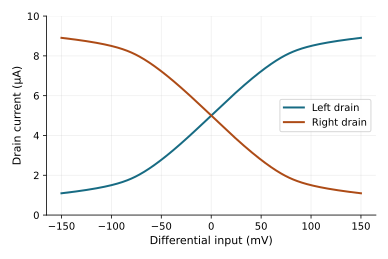
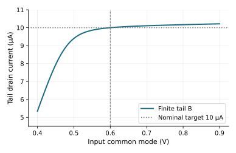
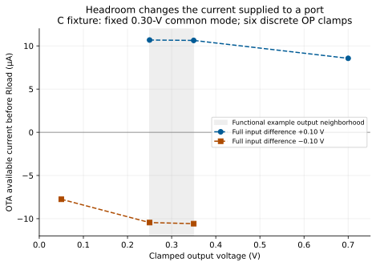
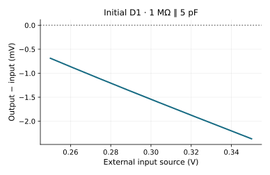
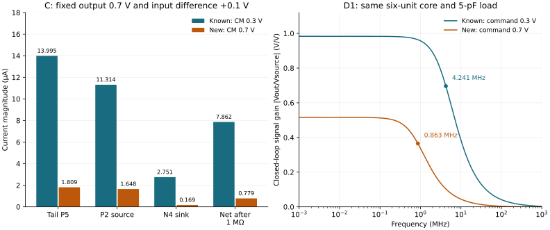

[Previous: mirrors and bias](03-mirrors-and-bias.qmd) · [Reading route](index.qmd) ·
[Next: feedback and response](05-feedback-and-response.qmd)

The common-source amplifier responds to one gate voltage relative to a bias
condition. A differential pair instead responds to the difference between two
inputs. It steers a shared current, and a load converts that steering into a
voltage or a net output current. This is the missing bridge between a transistor
amplifier and an error amplifier in a feedback system.

We follow four specific archived nominal examples, called **A**, **B**, **C**
and **initial D1** here. They were recovered from a pinned archive and their
adopted calculations were checked against the saved arrays and physical
readbacks. The [public learning package](../studies/learning-path-v1/reproduce.qmd)
contains these selected inputs. They are zero-raw nominal interventions,
not new Local samples or a new confirmation. The environment remains APM
v5.0.0/APM045 VTG, ngspice 47 and 26.85 °C.

## A: steer an ideal tail current

Write the inputs as common mode plus opposite halves of a differential signal:

$$V_+=V_{CM}+V_D/2,\qquad V_-=V_{CM}-V_D/2.$$

This convention matters: $V_D$ is the *full* input difference, not the voltage
applied independently to each gate. Example A uses NMOS inputs at
$V_{CM}=0.6$ V and an ideal 10-µA tail sink.

```text
A-alignedload-i10
VDD(vdd, 0) = 1 V
inp = 0.6 V + Vdiff/2; inn = 0.6 V - Vdiff/2
N1(D=dl, G=inp, S=tail, B=0) W=2 um L=0.24 um
N2(D=dr, G=inn, S=tail, B=0) W=2 um L=0.24 um
Itail(tail -> 0) = 10 uA  [ideal diagnostic source]
Rleft(vdd, dl) = 90 kohm; Rright(vdd, dr) = 90 kohm
Cleft(dl, 0) = 1 pF; Cright(dr, 0) = 1 pF
Observed differential output: V(dr) - V(dl)
```

The [exact A circuit](../studies/learning-path-v1/circuits/A-alignedload-i10.cir)
uses dependent sources to impose the differential convention and observe the
output difference. At equal inputs, symmetry predicts half the tail current
in each branch. Each 90-kΩ load then drops about 0.45 V, placing both outputs
near 0.55 V. The saved solve gives 4.999714 µA per drain, 0.550026 V at both
outputs and 0.167556 V at `tail`. Small terminal leakage accounts for the drain
sum differing slightly from the exact tail-source current.

Raise `inp` relative to `inn`. N1 takes more of the shared current, pulling
`dl` down; N2 takes less, allowing `dr` to rise. Thus the selected output
$V(dr)-V(dl)$ increases. If the output order were reversed, its sign would
reverse too. At symmetry and low frequency, each branch changes by roughly
$\pm g_m v_d/2$, and the differential output estimate is

$$A_d\simeq g_m(90\,\mathrm{k}\Omega\parallel r_o).$$

Here $g_m$ is one input device's transconductance, not the sum of both. The
saved OP parameters predict 8.55539 V/V; the archived 1-kHz AC observation is
8.55512 V/V. A centered difference of the saved DC current sweep gives a
differential-current slope of 95.054 µS. This is slightly below the bare-device
gm because the finite drain resistors permit drain-voltage motion.

[](figures/differential-steering.svg)

The curves flatten as most current moves into one branch. A local gain does
not imply a globally linear input range. The ideal tail also hides the
headroom and bias cost of a physical sink. That is the next controlled change.

## B: a finite tail and its reference

B retains the two input devices, 90-kΩ/1-pF loads and 0.6-V common mode. It
replaces the ideal source with a finite NMOS mirror branch:

```text
B-reference-lean-symmetric — same N1/N2 and loads as A
Nt(D=tail, G=bias, S=0, B=0) W=4 um L=0.40 um
Nr(D=bias, G=bias, S=0, B=0) W=1 um L=0.40 um
Rref(vdd, bias) = 226.192620687 kohm
```

The [exact B circuit](../studies/learning-path-v1/circuits/B-reference-lean-symmetric.cir)
has four physical MOS units. Rref and the diode-connected Nr set `bias`; Nt
uses that voltage to sink tail current. At nominal the saved tail current is
10.000107 µA, but VDD supplies **12.536708 µA** in total. The approximately
2.537-µA reference-network contribution cannot be omitted when calling this
a 10-µA pair. Drawn MOS area rises from A's 0.96 to B's 2.96 µm².

Now raise or lower both inputs together. The source node follows enough to
preserve input-device current balance, but that changes Nt's drain voltage.
Finite output conductance changes its current; at low common mode its limited
drain voltage constrains the sink further. The saved 0.4–0.9-V common-mode
sweep spans approximately 5.347–10.215 µA tail current despite a fixed reference
resistor and supply.

[](figures/finite-tail.svg)

In a perfectly symmetric nominal pair, both output voltages can move together
while their difference stays near numerical zero. That does **not** make the
tail ideal or establish population common-mode rejection. Mismatch can convert
a common-mode change into differential output; B's zero-raw symmetry is not a
measurement of that distribution. Judge the headroom and current paths before
using an impressive nominal cancellation number.

The same saved sweep gives a useful voltage budget, without guessing a sharp
threshold at which the tail becomes ideal:

| B input common mode, V | Tail drain voltage, V | Input VGS, V | Input VDS, V | Tail current, µA |
| --- | ---: | ---: | ---: | ---: |
| 0.40 | 0.02940 | 0.37060 | 0.72999 | 5.347 |
| 0.50 | 0.08817 | 0.41183 | 0.48886 | 9.400 |
| 0.60 | 0.16756 | 0.43244 | 0.38247 | 10.000 |
| 0.90 | 0.41453 | 0.48547 | 0.12588 | 10.215 |

At 0.40-V common mode, the input transistors still have substantial VDS,
but the tail transistor has only 29.4 mV across drain and source. Its gate
bias remains nearly unchanged at 0.42611 V. Current falls to about half the
nominal value. At the other end, raising common mode gives the tail more
voltage while reducing the input pair's VDS. Headroom moves between devices;
it is not one scalar margin attached to the whole amplifier. These are
selected [saved node/current observations](../studies/learning-day-v1/reproduce.qmd),
not newly acquired common-mode points.

## C: change the interface and combine the branch currents

The next example asks for a single-ended output near 0.3 V. It changes to
PMOS inputs at 0.3-V common mode and an NMOS mirror load. This is a deliberate
new headroom/interface choice, not a one-device improvement to B. Polarity,
common mode, load and topology all change. The 1-MΩ output load at 0.3 V needs
0.3 µA; the same resistor at 0.6 V would need 0.6 µA. A lower input common
mode lets a PMOS pair place its source node below the positive tail device
while retaining gate-to-source voltage for conduction.

```text
C-area-base — 1 V supply; inp/inn = 0.3 V +/- Vdiff/2
P1(D=mirror, G=inp, S=tail, B=vdd) W=4 um L=0.24 um
P2(D=out,    G=inn, S=tail, B=vdd) W=4 um L=0.24 um
N3(D=mirror, G=mirror, S=0, B=0) W=4 um L=0.24 um
N4(D=out,    G=mirror, S=0, B=0) W=4 um L=0.24 um
P5(D=tail, G=bias, S=vdd, B=vdd) W=4 um L=0.24 um
P6(D=bias, G=bias, S=vdd, B=vdd) W=1 um L=0.40 um
Rbias(bias, 0) = 273.692635412 kohm
Rload(out, 0) = 1 Mohm; Cload(out, 0) = 5 pF
Vout(out, 0) = 0.3 V  [ideal output clamp in this diagnostic]
```

The [exact C circuit](../studies/learning-path-v1/circuits/C-area-base.cir)
contains a five-transistor signal/bias core **plus the sixth reference MOS**.
Its total drawn MOS area is 5.2 µm². P6 and Rbias sustain P5's finite bias;
they are not an invisible ideal 14-µA source. At the central clamped point,
the saved `tail`, `mirror` and `bias` nodes are approximately 0.756744,
0.377742 and 0.550117 V respectively.

Now the voltage budget has reversed polarity. At equal 0.3-V inputs,
$V_{SG}$ of each input PMOS is $0.756744-0.3=0.456744$ V. The high-side
tail PMOS retains $V_{SD}=1-0.756744=0.243256$ V. The input PMOS feeding
the mirror has $V_{SD}=0.379001$ V, and the branch feeding the clamped
0.3-V output has $V_{SD}=0.456744$ V. The output NMOS has 0.3 V across it.
These actual differences explain how this topology accommodates its low
input/output interface. They do not establish rail-to-rail operation. Simply
subtracting 0.3 V from B's 0.6-V gates while demanding unchanged current would
consume the lower tail's headroom; it is not the circuit change performed here.

Trace the sign physically. Raising `inp` reduces P1's source-to-gate voltage,
so less current enters the diode-connected N3. The mirror node falls, reducing
N4's sink current. The other input branch supplies relatively more current
through P2. Both changes increase net current available at `out`. This is
positive transconductance from $V(inp)-V(inn)$ to supplied output current.

Define $I_{avail}=-I_D(P2)-I_D(N4)$ using currents positive *into* each MOS
drain. The clamp measures the imbalance while preventing `out` from moving.
It makes current conversion visible; it is an external source that can deliver
or absorb the missing current, not a functioning voltage amplifier output.

The central differential-current slope is **131.333 µS**. Sweeping the clamped
output slightly gives a loaded output conductance of **2.1394 µS**, including
Rload. Their ratio predicts a positive loaded gain near **61.39**. The differential
input voltage that makes $I_{avail}=0$ is about −0.672 mV, whereas the input
needed to supply the 0.3-µA resistor load is about +1.612 mV. The next chapter
uses those different null conditions to explain finite buffer precision.

### What happens when the receiving voltage moves?

A new, [predeclared finite example](../studies/learning-day-v1/receiving-port-plan.json)
keeps this initial six-unit core and fixes common mode at 0.30 V. It chooses
full differential inputs ±0.10 V and six output clamps to check both current
directions across the buffer's output neighborhood and near a limiting rail.
At +0.10 V, the gates are 0.35/0.25 V; at −0.10 V, they are reversed. The
output clamp is a separate port, so changing it does not change these gate
voltages. This differs from D1's moving negative feedback input below.

[](figures/initial-d1-clamped-current.svg)

| Full input difference, V | Output clamp, V | Available OTA current, µA | Net after the 1-MΩ load, µA |
| --- | ---: | ---: | ---: |
| +0.10 | 0.25 | +10.679 | +10.429 |
| +0.10 | 0.35 | +10.634 | +10.284 |
| +0.10 | 0.70 | +8.562 | +7.862 |
| −0.10 | 0.35 | −10.578 | −10.928 |
| −0.10 | 0.25 | −10.449 | −10.699 |
| −0.10 | 0.05 | −7.753 | −7.803 |

Positive net current can charge a capacitor at that clamped operating state;
negative current can discharge it. Rload subtracts current in both cases:
it consumes part of the source current and helps remove charge during sinking.
The ideal clamp supplies or absorbs the remaining imbalance. These are actual
discrete observations, not a continuous 0.05–0.70-V buffer specification.

At the upper +0.10-V-drive point, P2 has only **59.0 mV VSD**. Moving the
clamp from 0.35 to 0.70 V reduces its supplied current from 12.332 to
11.314 µA. The tail and mirror nodes also move; N4's competing sink current
increases from 1.698 to 2.751 µA. Both measured changes reduce the available
current. The finite mirror/core cannot be replaced by a fixed current limit
attached only to P2. At the lower negative-drive clamp, N4 has 50 mV VDS
and sinks 9.487 µA, versus 12.276 µA at 0.35 V. The opposite PMOS still
supplies 1.734 µA, leaving only 7.753 µA net OTA sinking capability.

The [exact new fixtures and all terminal observations](../studies/learning-day-v1/reproduce.qmd)
preserve these operating points. Current loss is a physical result within
the checked model domain, not a reason to increase bias until a preferred
answer appears. Now release the clamp and let feedback change the input
difference as the output moves.

## Initial D1: let feedback find the output

Initial D1 keeps **all six physical MOS units**, Rbias, 1-MΩ load and 5-pF
capacitor from C. It removes the output clamp and changes the input fixture:

```text
D1-initial-14u — same six-MOS core and output load as C
Vin(source, 0) = 0.3 V DC; AC magnitude 1
Rsource(source, input_access) = 10 kohm
Voffset(inp, input_access) = 0 V
Vfeedback(feedback, out) = 0 V
Vinj(inn, feedback) = 0 V; Iinj(0 -> inn) = 0 A

Functional connection: inp <- external input; inn <- out
Standard input history: 0.25 -> 0.35 -> 0.25 V, 12.5-ns edges
```

The zero-valued sources preserve diagnostic access; in the functional buffer
they connect the negative input to the output. See the
[exact initial-D1 circuit](../studies/learning-path-v1/circuits/D1-initial-14u.cir).
If the output falls below the positive input, the differential input increases;
the OTA supplies more net output current and raises the output. This is
negative feedback with an external differential-input OTA, distinct from
source degeneration or feeding a common-source gate through a resistor.

An ideal high-gain buffer suggests $V_O\approx V_{IN}$. The actual central
output is **0.298456 V** for an external 0.3-V input. The finite input resistor
also has a small drop: `inp` is about 0.300024 V because its source absorbs
modeled gate current. Across the saved 0.25–0.35-V source sweep, the output
ranges 0.249311–0.347634 V and the largest absolute source-to-output error is
2.366 mV. VDD's maximum quiescent delivered current on that grid is 16.085 µA.

[](figures/buffer-accuracy.svg)

This result is an honest functional bridge: the circuit follows a useful
input range with a finite reference, load and bias cost. It is not an ideal
op-amp, a precision reference, or an LDO. C and D1 share a core inventory;
their complete fixtures and saved realization identities differ. The later
archived “selected D1” and its 25-pF transfer use a different selection history
and are not evidence for this initial circuit.

### A high output clamp does not establish high input common mode

The earlier C clamp can source current at a 0.7-V output while its gates stay
at 0.35/0.25 V. In a buffer commanded toward 0.7 V, both input voltages move
upward. That consumes a different part of the voltage budget. A separate
[two-condition plan](../studies/learning-common-mode-v1/plan.json) tests this
distinction using the same six initial units, bias resistor, supply and load.

Start with a first voltage estimate. The old sourcing clamp's tail is
0.759046 V and P2 has VSG=0.509046 V. Translating both gates upward by 0.4 V
while keeping that VSG would require a 1.159046-V tail, above VDD. The old
operating voltages cannot persist. This estimate predicts a headroom problem;
it does not calculate the new current, because body bias, drain voltages and
the current split also change.

The new C observation fixes output at 0.7 V and the full input difference at
+0.1 V, but changes common mode to 0.7 V. Its gates are now 0.75/0.65 V:

| At the same C output/differential clamp | Known CM 0.3 V | New CM 0.7 V |
| --- | ---: | ---: |
| Tail node, V | 0.759046 | 0.992123 |
| Tail P5 VSD, mV | 240.954 | 7.877 |
| Sourcing P2 VSG, V | 0.509046 | 0.342123 |
| Sourcing P2 VSD, V | 0.059046 | 0.292123 |
| Tail current, µA | 13.995 | 1.809 |
| Net sourcing after 1 MΩ, µA | 7.862 | 0.779 |

P2 has **more drain-to-source voltage**, yet supplies less current. Its gate
drive has fallen, and P5 has only 7.9 mV left across it. Rbias and VDD remain
fixed; the reference node moves by only about 7.7 µV. Calling the output
PMOS “in saturation” would miss the limiting tail and input conditions.
The new clamp still has positive net current; the result is reduced capability,
not a claim that all conduction ceases above one sharp common-mode boundary.

[](figures/common-mode-interface.svg)

Now make the separately planned **functional D1** observation. A 0.7-V source
produces **0.663495 V** output, a −36.505-mV tracking error. The positive gate
is 0.699999 V, so the 10-kΩ source's 1.26-µV drop explains very little of this
error. The actual input common mode is 0.681747 V and difference is 36.504 mV.
Tail current is only 1.770 µA; VDD supplies 3.780 µA including the reference.
The lower consumption accompanies a changed operating point and weaker response.

Before that observation, extending the old 0.3-V local gain across a 0.4-V
change gave a deliberately provisional output screen of 0.691783 V. It missed
the new output by 28.289 mV. A local derivative is not a global buffer law.
The [exact two fixtures, observations and reproduction](../studies/learning-common-mode-v1/reproduce.qmd)
retain the failed extrapolation and all numerical checks. These two points do
not locate an exact common-mode limit. Chapter 5 next explains why even the
local feedback gain has changed at this new operating point.

The [selected arrays, definitions and calculations](../studies/learning-path-v1/reproduce.qmd)
support the original A/B/C/D1 examples; the new clamp observations have their
own [supplement and frozen plan](../studies/learning-day-v1/reproduce.qmd).
Next, keep this same core and separate DC precision error from the measured
effect of changing its capacitor in
[chapter 5](05-feedback-and-response.qmd).
