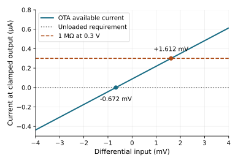
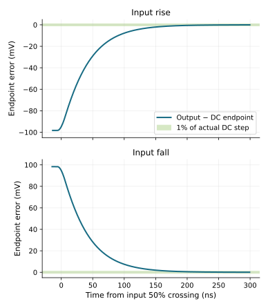
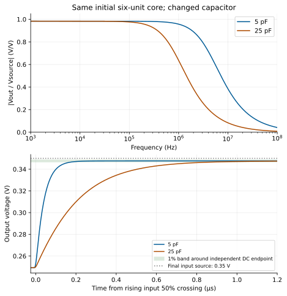
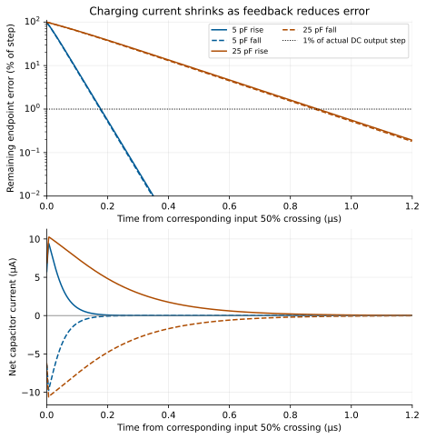
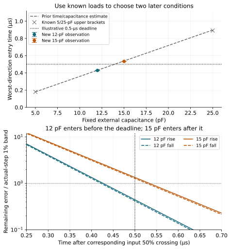
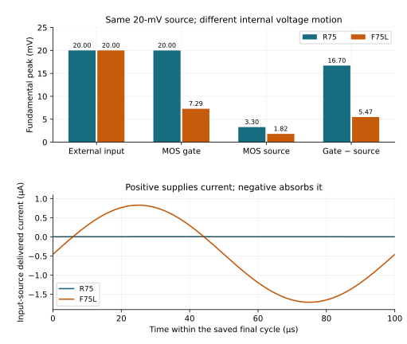
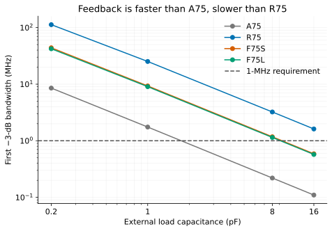

[Previous: differential pair and OTA](04-differential-pair-and-ota.qmd) · [Reading route](index.qmd) ·
[Next: errors and resources](06-errors-and-resources.qmd)

Feedback changes how a circuit reacts to its own output. It can reduce a
disturbance path and distortion, but the connection determines what is sensed,
which ports are loaded, and which errors remain. First trace that connection
and solve its low-frequency behavior. Then ask whether the circuit can move
charge and settle through the required history.

This chapter has two reading stops. **Part A** deals with connection and
precision. **Part B** deals with frequency and time response. The finite
common-source feedback amplifier and the differential OTA buffer remain
separate examples with separate jobs.

## Connection and precision {#connection-and-precision}

### Three connections, three current paths

| Connection | What an output/current increase changes | Cost or limit to retain |
| --- | --- | --- |
| Source degeneration in R37 | More NMOS current raises its source through Rs, reducing VGS and changing body bias. | Source voltage consumes headroom; gm and output conductance both change. |
| Output-to-gate resistance in F75S | Higher output raises the common-source gate through Rf, increasing the opposing sink current. | The input is a loaded summing node; Rf also draws output current. |
| External OTA buffer in initial D1 | Higher output raises the negative differential input, reducing supplied output current. | Finite gain, input common mode, output load and reference bias determine the error. |

Calling each one “negative feedback” is correct only after checking the
physical sign. It does not make their equations or their input impedances
interchangeable. The first uses source motion, the second a resistor-fed gate,
and the third a differential comparison at separate MOS gates.

### Solve the finite common-source feedback network

F75S retains a PMOS active load and finite diode/resistor reference, but adds
a 100-kΩ output-to-gate resistor. The external 1-kΩ source resistance is
followed by a new 9-kΩ input resistor. This reading view lists the signal and
bias devices; [exact F75S SPICE](../studies/finite-feedback/circuits/F75S.cir)
also contains the individual terminal sensors.

```text
VDD(vdd, 0) = 1 V; VIN(in, 0) = 0.45 V + signal
Rsrc(in, drive) = 1 kohm; Rin(drive, gate) = 9 kohm
Rf(out, gate) = 100 kohm
N0(D=out, G=gate, S=source, B=0) W=3.809366130 um L=0.40 um
N1(D=out, G=gate, S=source, B=0) W=3.809366130 um L=0.40 um
N2(D=out, G=gate, S=source, B=0) W=3.809366130 um L=0.40 um
Rs(source, 0) = 601.500159373 ohm
Pref(D=pbias, G=pbias, S=vdd, B=vdd) W=2 um L=0.24 um
Pload(D=out, G=pdrive, S=vdd, B=vdd) W=2 um L=0.24 um
Rbias(pbias, 0) = 10.852303963 kohm
Vbiasdiag(pbias, pdrive) = 0 V
Rload(out, 0) = 100 kohm; Cload(out, 0) = 1 pF
```

An input rise raises the gate and pulls the output down. If a disturbance
raises the output instead, Rf raises the gate and the NMOS bank pulls back.
Rf is also a real output load connected through the input resistances to the
input source. Treating the gate as an ideal virtual-ground node discards the
finite core gain and can mispredict both signal gain and current demand.

Use the source-degenerated $G_m$ and output conductance $G_o$ from chapter 3.
Let $R_t=R_{src}+R_{in}=10$ kΩ and $\beta=R_t/(R_f+R_t)$. With negligible
gate leakage for this low-frequency calculation, gate KCL gives

$$v_g=(1-\beta)v_{in}+\beta v_o.$$

The corresponding output KCL is

$$G_o v_o+G_m v_g+\frac{v_o-v_g}{R_f}=i_{dist},$$

where $i_{dist}$ is positive when injected into the output. $G_o$ includes the
finite signal/load-device conductances and Rload, but not Rf a second time.
Hold the supply and reference setting fixed for this signal/disturbance
calculation. Substitute the gate equation and collect the output terms:

$$\left[G_o+\frac{1}{R_f+R_t}+G_m\beta\right]v_o
=-\frac{G_mR_f-1}{R_f+R_t}v_{in}+i_{dist}.$$

Setting the disturbance or input separately to zero gives the signal gain
and output-current disturbance path:

$$A_v=-\frac{G_mR_f-1}{G_o(R_f+R_t)+1+G_mR_t},$$

$$Z_o=\frac{1}{G_o+1/(R_f+R_t)+G_m\beta}.$$

The numerator contains direct resistor feedthrough. The denominator contains
ordinary output/network conductance plus the additional opposing current
generated by feedback. If transconductance were overwhelmingly large, the
gain would approach $-R_f/R_t=-10$. **F75S's actual gain is approximately −6**.
The finite circuit was designed for that job; it is not accurately described
by the ideal resistor ratio.

At its saved nominal point, $G_o+1/(R_f+R_t)\approx22.77$ µS and
$G_m\beta\approx36.44$ µS. Their ratio is about **1.60**. This is a
low-frequency conductance decomposition at a known operating point, not a
measured return ratio or phase margin. The corresponding observed $Z_o$ is
16.894 kΩ. The equations agree with the original separate current/input/bias/
supply interventions within their documented 0.030% approximation error.

The complete redesign also changes geometry, NMOS current and reference
allocation relative to A75. Its reduction from roughly 90.5 to 16.9 kΩ belongs
to that whole finite circuit. The equation explains the feedback term without
pretending the rest of the redesign stayed fixed.

### Precision costs appear at the input and reference

At nominal, F75S's input source **absorbs about 0.452 µA**. The current arrives
through Rf and both input resistors. The circuit is therefore not a
high-impedance differential input merely because the controlled device is a
MOS gate. Its roughly 120.454-kΩ internal resistance sum is also much larger
than the earlier amplifiers' values. The feedback comparison explicitly
raised the allowed resistance ceiling from 30 to 150 kΩ; it did not establish
an equal-resistance-cost improvement.

Output-current disturbances are reduced, but errors injected at the input
or the finite reference have different transmission paths. Recovering the
same signal gain necessarily retains sensitivity to an external input-voltage
error. The finite reference still transmits supply change: F75S's measured
local line slope is about 1.224 V/V. A small $Z_o$ alone does not make the
amplifier supply-independent.

The [full feedback study](../studies/finite-feedback/index.qmd) retains these
port measurements, matching conditions and the larger-PMOS alternative F75L.
Chapter 6 compares their error sources and noise costs under the appropriate
definitions; chapter 7 follows the input current through power sequencing.

### An OTA buffer must supply its load while reducing the difference

Return to the C/initial-D1 pair in chapter 4. An unloaded differential null
and the differential voltage required to supply a load are different quantities.
At a clamped 0.3-V output, C's saved unloaded null is −0.672 mV. The same
output connected to 1 MΩ requires 0.3 µA. Near the central point,

$$\Delta V_D\approx\frac{I_L}{G_m}
=\frac{0.3\,\mu\mathrm A}{131.333\,\mu\mathrm S}
\approx2.284\,\mathrm{mV}.$$

[](figures/ota-current-balance.svg)

The saved loaded null is +1.612 mV, a 2.284-mV shift from the unloaded value.
The estimate explains why finite load current needs an input difference even
with perfectly nominal devices. In the functional buffer that difference
appears largely as input-to-output error. Initial D1's external 0.3-V input
produces 0.298456 V output, rather than exact equality.

Do not equate the two fixtures numerically term by term: C holds input common
mode and output fixed while sweeping the differential input; D1 ties one
input to the moving output and has a 10-kΩ source with finite gate current.
The near agreement is a local explanation, not an assertion that C's loaded
null is exactly D1's source-to-output offset. Nor would a larger open-loop gain
automatically remove an intrinsic input-referred device offset.

### Keep both input coefficients when common mode changes

The [high-command example](04-differential-pair-and-ota.qmd#a-high-output-clamp-does-not-establish-high-input-common-mode)
adds a useful counterexample. At a 0.7-V source, initial D1 has a 0.663495-V
output and only about 0.516 V/V local signal gain. Its feedback sign is still
correct. The operating point has changed enough that a single unchanged
“OTA gain” no longer describes the two input paths.

For small perturbations about a particular biased state, write the loaded
output as

$$v_o=A_+v_+ + A_-v_-.$$

Each coefficient holds the other input perturbation at zero. This means zero
*increment*, not grounding its DC gate. With unity feedback $v_-=v_o$,

$$h=\frac{v_o}{v_+}=\frac{A_+}{1-A_-}.$$

The familiar $A/(1+A)$ form additionally assumes $A_+=A$ and $A_-=-A$.
Writing $v_\pm=v_{cm}\pm v_d/2$ reveals the omitted path:
$v_o=(A_++A_-)v_{cm}+(A_+-A_-)v_d/2$. The buffer's feedback input moves
both its differential and common-mode increments.

A **retrospective low-frequency calculation** uses the observed gm, gmb and
gds values at each actual D1 operating point. It solves KCL at `tail`,
`mirror` and `out`; a separate construction stamps all six MOS devices and
the reference node. Both algebraic routes agree. They retain body derivatives
and Rload, while omitting capacitance and leakage derivatives. The input
resistor then has no incremental gate-current drop in this approximation.

| D1 source bias | Calculated A+ | Calculated A− | Calculated h | Observed h at 1 kHz |
| --- | ---: | ---: | ---: | ---: |
| Known 0.3 V | +61.545 | −61.582 | 0.983429 | 0.983317 |
| New 0.7 V | +12.117 | −22.474 | 0.516195 | 0.515957 |

The coefficients are derived at the retained operating point, not measured
gains of a separately opened and rebiased circuit. The resulting h agrees
with the real part of native 1-kHz gain within 0.047%; the omitted effects
remain a limit of the approximation.

At the higher command, the tail device's gds has risen from 2.033 to
220.618 µS while the input pair's combined source-voltage coefficient
$\sum(g_m+g_{mb}+g_{ds})$ has fallen from 314.282 to 49.495 µS.
The tail is strongly tied to the AC-grounded supply through its incremental
conductance, and the two input branches have unequal operating currents.
The complete node calculation explains the changed paths; it does not
attribute the changed behavior to a single isolated parameter change. The
[selected equations and replay](../studies/learning-common-mode-v1/reproduce.qmd)
preserve that distinction and the failed large-range linear extrapolation.

**Reading stop:** you can now identify the correcting path, its finite loading
and what error it fails to cancel. Continue when those three circuits and their
different input ports are clear.

## Frequency and time response {#frequency-and-time-response}

### Bandwidth is a property of a specified transfer

Capacitance stores charge. As frequency rises, internal-node and output
charging currents change the gain and phase. A one-pole approximation suggests
$H(s)\approx H(0)/(1+s\tau)$ with $f_p\approx1/(2\pi\tau)$. It can organize
a first estimate, but the physical circuit has more than one charge-storage
node and a finite input source.

For initial D1 at the central input, the observed 1-kHz signal magnitude is
0.983317 V/V and the first −3-dB crossing is 4.241 MHz. The reference is the
actual low-frequency magnitude, not an assumed exact gain of one. This is
$V_O/V_{source}$ with its complete functional feedback connection intact.
It does not measure a broken-loop return ratio.

The high-command example gives a second way to reduce bandwidth without
changing the capacitor. Compare it with the separate 25-pF observation:

| Initial D1 condition | 1-kHz gain magnitude, V/V | Relative −3-dB bandwidth, MHz | DC source-to-output error, mV |
| --- | ---: | ---: | ---: |
| 0.3-V source, 5 pF | 0.983317 | 4.241 | −1.544 |
| 0.3-V source, 25 pF | 0.983317 | 0.848 | −1.544 |
| 0.7-V source, 5 pF | 0.515957 | 0.863 | −36.505 |

The last two bandwidths are close, but their precision and local gain are
different. One change stores more charge at the old DC operating point;
the other changes headroom and current at the same 5-pF load. A bandwidth
number alone cannot rank these interfaces. The new high-command case has
OP/AC observations only; it does not supply a measured large-step settling
time or overload-recovery claim.

A return-ratio measurement asks how an injected perturbation travels around
a specified loop and returns, with the operating point and loading preserved.
Its phase at all relevant unity crossings can inform stability margins under
the stated sign convention. A closed-loop bandwidth, monotonic step or the
1.60 conductance ratio above is not a substitute. This edition does not adopt
an archived loop-margin claim or establish stability for arbitrary loads.

### Settling needs an endpoint and an observation horizon

For an ideal one-pole step, error decays as $e^{-t/\tau}$, so reaching 1% takes
about $4.605\tau$. The initial-D1 bandwidth would suggest a timescale near
173 ns. That is an estimate, not a measured settling time, and a finite input
edge changes the trajectory and time reference.

The saved initial-D1 test ramps the input 0.25→0.35→0.25 V with 12.5-ns
edges and a 5-pF load. A new, explicitly labeled saved-data calculation uses
the independently saved DC endpoints, 0.249311459 and 0.347633528 V. The band
is 1% of their **actual 98.322-mV difference**, not 1% of an ideal 100-mV step.
Time is measured from the input source's 50% crossing.

[](figures/buffer-step.svg)

The output's final observed entry is bracketed at **177.5–179.5 ns on the
rise** and **175.2–177.2 ns on the fall**. The record remains inside the band
through roughly 3.992 µs after each crossing, before the next edge or endpoint
of the observation. These are finite observations at the original 2-ns maximum
step. They do not warrant extra decimal places as physical time resolution.
The original archive used stationary median plateaus; the new DC-endpoint
definition gives the same entry brackets but remains a distinct analysis.

The settled high output still differs from the *ideal* 0.35-V command by
about 2.366 mV. Reaching the band around an actual endpoint does not erase
that DC tracking error. Similarly, an observation that begins inside a band
has an “already in band” status, not a resolved sub-timestep settling time.

### Change only the receiving capacitor

The new **initial-d1-interface-001** example preserves all six initial devices,
bias, source impedance, 1-MΩ resistor and input history. It changes Cload from
5 to **25 pF**, chosen to separate a substantial charging cost from the DC
task. It is not the later archive's selected-D1 load transfer. The
[finite plan and pre-exposure estimates](../studies/learning-day-v1/receiving-port-plan.json)
were saved and privately committed before these new targets were run.

Before observation, the known 5-pF response suggested a 25-pF bandwidth of
$4.24145/5\approx0.84829$ MHz if the external capacitor dominated. The
single-pole 1% timescale would grow from about 0.173 to **0.864 µs**.
Capacitance carries no stationary current, so changing it alone should leave
the DC error unchanged. These are prospective estimates for the new load,
using known 5-pF evidence as their starting point.

| Same initial-D1 task | New 5-pF observation | New 25-pF observation |
| --- | ---: | ---: |
| Output for a 0.30-V DC source, V | 0.298456258 | 0.298456258 |
| Largest DC error at 0.25/0.30/0.35-V sources, mV | 2.36647 | 2.36647 |
| Central signal bandwidth, MHz | 4.241448 | 0.847733 |
| Rising 1% entry bracket, ns | 177.5–179.5 | 889.3–891.3 |
| Falling 1% entry bracket, ns | 175.2–177.2 | 878.9–880.9 |
| Actual capacitor charge excursion, pC | 0.49161 | 2.45805 |

[](figures/initial-d1-load-response.svg)

The DC outputs are identical in the stored solves at all three selected
inputs. The observed bandwidth ratio is 0.199869, close to the estimated 0.2.
Both transient plateaus remain in their independent-OP 1% band through
3.99375 µs after their input 50% crossings. A predeclared 1-ns maximum-step
repeat places the 25-pF rise at 889.6–890.6 ns and fall at 879.2–880.2 ns,
consistent with the 2-ns primary brackets. These are a numerical refinement
and a finite nominal trajectory, not a new device population.

Here bandwidth follows the first learning edition's **−3.000-dB crossing**,
interpolated in dB versus log frequency. The older ADS amplifier studies use
the half-power magnitude $1/\sqrt{2}$ and interpolate magnitude versus log
frequency. Those nearby conventions are retained separately; the 5/25-pF
comparison above uses one definition throughout. Its settling endpoints are
new separate OP solves; the old archived DC-sweep endpoints remain unchanged.

### Follow the changing current through the step

At an output capacitor,

$$C_L\frac{dV_O}{dt}=I_{avail}-I_R-I_{feedback}.$$

Here $I_{feedback}$ is positive **leaving** `out` through the feedback wire.
The recorded source `Vfeedback(feedback,out)=0` uses the opposite current
direction. Therefore the exact measured right side is
$-i(VtM2d)-i(VtM4d)-V_O/R_L+i(Vfeedback)$, not an unsigned tail current.
Integrating it closes the $C_L\Delta V$ charge identity with normalized
residuals about $3.7\times10^{-9}$ and $1.2\times10^{-9}$ for the new
5/25-pF primary traces. Intrinsic MOS charge is already included in the
terminal currents; adding it again would double-count it. An independent
AC current/voltage calculation also recovers the specified Cload. These
checks establish numerical consistency for a fixed capacitor.

When an amplifier can supply only a bounded net current, $dV/dt$ is bounded
by $I/C$. That large-signal limit is different from small-signal bandwidth.
The first charge-only estimate, 10 µA charging through 0.1 V, was 50 ns for
5 pF and 250 ns for 25 pF. The actual 1% times are much longer. In the new
25-pF trace the net capacitor current peaks near **+10.243/−10.612 µA**, then
shrinks as the output approaches its endpoint and the feedback input reduces
the differential error. The remaining error is close to an exponential over
most of the plotted interval, rather than a constant-current ramp all the way
to the accuracy band.

[](figures/initial-d1-step-current.svg)

This supports a useful design judgment: the single-pole timescale organizes
this trajectory to within a few percent, while $C\Delta V/I$ is a charge
scale that omits the final approach. Chapter 4's clamped current changes also
show why neither estimate qualifies an arbitrary voltage excursion. Overload
recovery still needs a declared excursion, duration, return condition and
independent final state. No complete pass-device gate model or arbitrary-load
stability claim follows from the fixed-capacitor example.

### Choose a receiving load against a deadline

A response plot becomes a design choice only after the receiving interface
states what it needs. Consider this **new illustrative requirement**: enter
the same actual-endpoint 1% band within **0.5 µs** after either input's 50%
crossing, and remain there through the existing plateau horizon. This was
declared before the next two capacitor conditions were observed. It is not an
original archived D1 requirement or a replacement for its DC tracking error.

For a first design estimate, take the larger known entry-upper-bracket time
per farad from the 5/25-pF cases, separately for rise and fall. The worse
direction gives about **35.893 ns/pF**, suggesting

$$C_{L,estimate}\approx\frac{500\,\mathrm{ns}}{35.893\,\mathrm{ns/pF}}
=13.93\,\mathrm{pF}.$$

That scaling is conservative relative to the two training points. It is not
a proven bound between or beyond them. Before further acquisition, the finite
plan chose **12 pF below** and **15 pF above** that provisional allowance,
with every device, bias, resistor, input trajectory and measurement unchanged.
The independent single-pole estimates were 414.7/518.4 ns; the empirical
scaling forecasts below retain the known trajectory's slower final approach.

| Same initial six-unit core | Prior worst-direction estimate, ns | Observed rise bracket, ns | Observed fall bracket, ns | 500-ns deadline |
| --- | ---: | ---: | ---: | --- |
| 12 pF | 430.7 | 426.2–428.2 | 420.4–422.4 | Meets in both directions |
| 15 pF | 538.4 | 531.8–533.8 | 525.8–527.8 | Misses in both directions |

[](figures/initial-d1-load-budget.svg)

Both observed brackets lie fully on the forecast side of the deadline, with
2-ns sampling brackets much smaller than the margin. The 12-pF worst upper
bracket leaves about **71.8 ns** before the deadline; even the 15-pF rising
lower bracket is **31.8 ns late**. No extra capacitor, relaxed band or changed
horizon was added afterward. Bandwidth was 1.7665/1.4133 MHz, close to the
predeclared inverse-capacitance estimates, and the three DC outputs remained
identical to the known 5-pF results. KCL, actual capacitance readback and
integrated charge checks pass for both attempts.

For this trajectory and these fixed conditions, **12 pF is the supported
choice between the two tested values**. The 13.93-pF calculation remains an
estimate, not a newly measured continuous maximum. A gate needing a different
voltage excursion or voltage-dependent charge still has a different interface.
The [frozen plan, selected inputs and reproduction](../studies/learning-decisions-v1/reproduce.qmd)
preserve the forecasts and the valid 15-pF deadline failure. These new
conditions used the known nominal units; they were not fresh physical samples.

### Compare speed and distortion in the common-source job

The existing common-source feedback study supplies a separate load/signal
comparison. With 20-mV-peak input, R75 gave 4.156% THD while F75L gave 0.671%.
Both target approximately −6 gain and 75 µA total delivered DC current, with
1 V supply, 26.85 °C, 0.45-V input, 0.5-V output and 100 kΩ || 1 pF load.
F75L uses the same 100-kΩ/10-kΩ feedback/input connection described in Part A,
with 670.366-Ω source resistance and the larger PMOS units in
[its exact circuit](../studies/finite-feedback/circuits/F75L.cir).
Its three NMOS units are each W=4 µm, L=0.4 µm; Pref and Pload are each
W=3.333333 µm, L=0.4 µm, with Rbias=10.731025 kΩ. Their terminal roles and
body connections are those shown in Part A.

Start with the voltage that actually reaches the transistor. Let $I_{in}$
be positive when the external input source delivers current into the circuit.
The two series input resistors give the exact port relation

$$V_g=V_{in}-R_t I_{in}.$$

With $I_g$ positive into the NMOS gates, gate KCL also gives

$$I_{in}+\frac{V_o-V_g}{R_f}=I_g,\qquad
V_g=\frac{R_fV_{in}+R_tV_o-R_tR_fI_g}{R_f+R_t}.$$

If the gate-current term is small, the incremental result is
$v_g\approx0.9091v_{in}+0.09091v_o$. A gain near −6 therefore gives
$v_g\approx0.364v_{in}$. Source degeneration then raises the source as its
current increases, further changing $v_{gs}=v_g-v_s$. These two feedback
paths act at different nodes.

The saved 20-mV cycles make those node motions concrete:

| Fundamental peak | R75 | F75L |
| --- | ---: | ---: |
| External input, mV | 20.00 | 20.00 |
| NMOS gate, mV | 19.998 | 7.290 |
| NMOS source, mV | 3.295 | 1.816 |
| Gate minus source, mV | 16.703 | 5.474 |

The gate and source voltages are selected native observations. The input
resistor identity above agrees with the actual gate waveform to below
$10^{-11}$ V; the independent source-resistor/current check also passes.
The $v_{gs}$ row is measured from the voltage difference before taking its
fundamental, not by subtracting two amplitude magnitudes. Omitting gate current
in F75L's divider gives up to 28.3 µV total voltage error here, or 3.42 µV
after removing only that diagnostic's mean. The actual waveform and all
primary output metrics keep their original centers.

[](figures/feedback-gate-motion.svg)

That smaller internal excursion has a port cost. During the known 20-mV
cycle, F75L needs roughly **+0.832/−1.708 µA** of input delivery/absorption.
R75's input instead supplies about 3.86–8.39 nA. A source that cannot absorb
the returned current may no longer impose the assumed input voltage.
The gain and distortion results depend on that finite interface.

The connection also changes how curvature reaches the output. For a
quasistatic explanation, define $f(u)$ as the output excursion when the gate
is held at an independently specified excursion $u$, with Rs, the active
load, reference and the actual Rf from output to gate retained. This is a
diagnostic fixture definition. It is not a same-function competitor or an
independently measured intrinsic MOS transfer.

Neglecting the gate-current increment, write $\alpha=1-\beta$ and
$y=f(\alpha x+\beta y)$. Differentiate this relation at the operating point:

$$h'=\frac{\alpha f'}{1-\beta f'},\qquad
h''=\frac{\alpha^2f''}{(1-\beta f')^3}.$$

For F75L, the saved OP conductances give
$f'=-(G_m-1/R_f)/(G_o+1/R_f)\approx-16.515$ and
$1-\beta f'\approx2.501$. The resulting external slope is approximately
−6.002, within 0.023% of the native local gain. The conditional multiplier
from $f''$ to $h''$ is about 0.0528. This explains why reducing internal
error motion can strongly reduce curvature transmission. It does not prove
that R75 and F75L had the same underlying $f''$; their devices, current
allocation and source resistance also differ. No phase-margin result follows
from this static algebra.

The independent saved ±0.1-mV DC points give F75L's complete-circuit
$h''\approx-7.57495$ V$^{-1}$. Its quadratic 20-mV estimate is 0.631% THD,
compared with the observed 0.671%. The third harmonic is 85.9 µV peak,
and the second harmonic accounts for 98.84% of the harmonics-2–10
squared-amplitude sum. Curvature inferred from the finite 20-mV sine is
about 5.5% larger in magnitude than the local DC difference. Keep that
departure: a small local derivative does not establish a wide linear range.
The older 10-mV cycle gives another explicitly retrospective estimate,
0.639%, without using the known 20-mV result to refit it.

Both original 20-mV timestep controls and the new one-cycle/ten-harmonic
decomposition retain the same pass/fail decisions. All six cycles and eight
selected static records are old nominal evidence; no new cohort or
fresh confirmation was acquired for this explanation. See the
[signal explanation and exact inputs](../studies/learning-signal-v1/reproduce.qmd).

### Keep the competing speed and noise costs

At 8 pF, R75 had 3.226-MHz bandwidth versus F75L's 1.143 MHz; at 16 pF only
R75 met the 1-MHz bandwidth criterion. With 10-ns 0.43↔0.47-V input edges
and 8 pF, R75 reached its 1% actual-endpoint band in about 0.222/0.224 µs,
F75L in 0.616/0.656 µs, **measured from the end of each edge**. Those time
origins, input amplitudes and loads differ from the OTA example, so the numbers
are not a shared-function ranking across the two circuit families.

[](../studies/finite-feedback/figures/capacitive-load.svg)

At the common 1-pF nominal condition, input noise is 7.092 µV RMS for R75
and 20.458 µV for F75L over the original 1-kHz–1-MHz integration band.
F75L uses less drawn MOS area here, 7.467 versus 9.282 µm², but about
120.401 versus 6.839 kΩ of internal resistance. A lower THD figure does not
erase those source, noise and passive costs.

Choose feedback according to the job: F75L offers lower distortion than R75
at the declared larger signal, while R75 retains stronger noise, accuracy and
speed results for other requirements. Initial D1 demonstrates a finite
differential buffer at its own low-voltage interface. The
[feedback reproduction](../studies/finite-feedback/reproduce.qmd) and
[learning reproduction](../studies/learning-path-v1/reproduce.qmd) retain
their respective definitions. [Chapter 6](06-errors-and-resources.qmd) now
separates the error sources before deciding which resource buys useful accuracy.
