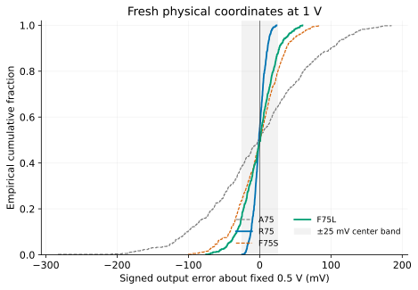
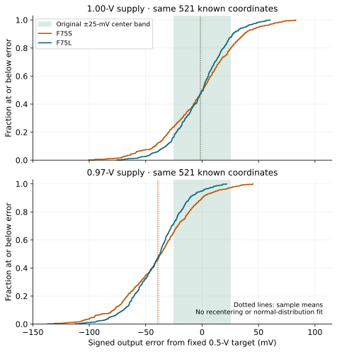
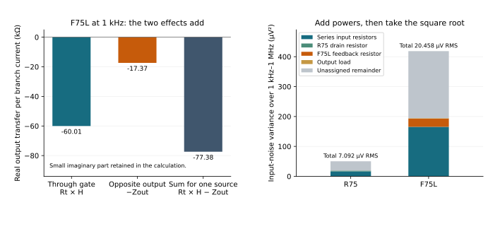
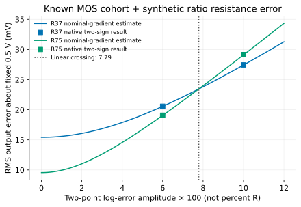

[Previous: feedback and response](05-feedback-and-response.qmd) · [Reading route](index.qmd) ·
[Next: supply and startup](07-supply-and-startup.qmd)

An output error has both an origin and a path through the circuit. A larger
device can reduce a modeled source of variation while leaving its voltage
amplification large. Feedback can reduce an output-current path while retaining
input-voltage sensitivity. Neither action necessarily fixes the mean shift
caused by a changed supply or resistor value.

This chapter combines the earlier circuit lessons without turning unlike
measurements into one leaderboard. First distinguish the quantities; then
predict how a finite redesign should change the one that limits the job.

## Four different meanings of error

| Quantity | What changes | Useful measure and boundary |
| --- | --- | --- |
| Stationary noise | Voltage/current fluctuates with time around one operating point. | PSD/ASD and RMS over a stated band, referred to a stated port. |
| DC offset or tracking error | The stationary output differs from its required value. | Signed error from a fixed target; an unloaded input null is a different definition. |
| Device-to-device variation | A saved physical realization changes device parameters. | Distribution of errors under the specified model; keep correlations and exposure history. |
| Deterministic condition change | Supply, temperature, load or a declared resistor value changes. | Sensitivity or finite difference at stated conditions; it is not a statistical distribution by itself. |

For the common-source studies, output error is $e=V_O-0.5$ V without trimming
or recentering individual observations. For the OTA buffer, it is $V_O-V_{source}$
over a declared input grid. A clamped differential null is yet another quantity.
Calling all of these “offset” without the port and load would obscure the
design question that chapter 5 made visible.

The waveform-induced mean shift in
[chapter 2](02-common-source.qmd#estimate-a-distortion-limit-from-the-complete-transfer)
is a time average of one driven circuit. The means used below are averages
of stationary DC errors over distinct saved realizations. Do not substitute
the former for the latter or silently recenter a DC observation using its
sine-wave mean.

## Predict with independent sources in the correct coordinates

For a small output-current error in the active-load amplifier, chapter 3 gave
$\delta V_O\approx Z_O\delta I$. Thus a source with SD $\sigma_I$ contributes
approximately $Z_O^2\sigma_I^2$ to output variance. A gate-equivalent voltage
source uses a different sensitivity. The circuit cannot reject that voltage
as strongly as an unrelated output current while retaining the required
input signal gain.

More generally, if independent standardized source coordinates $z_j$ contribute
local output increments $a_jz_j$, then

$$\delta V_O\approx\sum_j a_jz_j,\qquad
\operatorname{Var}(V_O)\approx\sum_j a_j^2.$$

The independence is an assumption about those source coordinates. It is not
permission to discard correlations after a change of variables. APM's Local
source-transfer profile is defined using reference-device threshold and
current-factor observables. The actual raw compact-model coordinates are
DELVTO and ln(MULU0). The studies use a native reference Jacobian to map between
them and check each saved physical realization at the reference condition.
DELVTO is not silently substituted for the observable threshold coordinate.

The signal-circuit sensitivities then act on those mapped raw changes. A unit's
geometry changes both its source profile and its circuit operating point;
$\sum WL$ alone does not specify the outcome. These are model-based local
forecasts, with finite nonlinear residuals checked against later observations,
not an independent transistor theory or foundry yield prediction.

The first current-allocation study made the consequence concrete. Enlarging
only the active reference reduced its predicted contribution, while the
unchanged output PMOS remained the dominant error floor. The later equal-area
study put resources at that output source and improved its own architecture.
The resistor-load baseline still had a much smaller output-current path.

## Compare a prediction with the loss the design actually cares about

Mean absolute error is $\operatorname{MAE}=\overline{|e|}$. RMS error is
$\sqrt{\overline{e^2}}$ and weights large errors more strongly. Standard
deviation describes spread about the sample mean; it does not include that
mean's displacement from the target. A functional pass count asks whether
each observation meets every specified check. These quantities can favor
different designs.

The finite-feedback study used the same four circuits on **521 paired physical
coordinates** at each supply setting. Their original nominal results were:

| Circuit | MAE from 0.5 V, mV | SD about its mean, mV | Five DC/AC/current checks passed |
| --- | ---: | ---: | ---: |
| A75 | 60.419 | 75.527 | 136 / 521 |
| R75 | 7.161 | 8.856 | 521 / 521 |
| F75S | 25.716 | 32.545 | 290 / 521 |
| F75L | 19.275 | 24.299 | 369 / 521 |

The five checks cover center, low-frequency gain, signal-band gain, bandwidth
and delivered DC current. They do not turn all 521 coordinates into a noise,
sine, temperature or startup qualification. Separate preselected larger-signal
observations exist on six coordinates; their smaller scope is retained in the
[detailed study](../studies/finite-feedback/index.qmd).

At 0.97 V, F75L has slightly lower MAE than F75S, yet fewer five-test passes:
147 versus 165. To understand that result, keep the mean as well as the spread.
For these $n$ observations, with sample SD $s$ computed using divisor $n-1$,

$$\operatorname{RMS}^2=\overline e^{\,2}+\frac{n-1}{n}s^2.$$

This identity follows by writing $e_i=(e_i-\overline e)+\overline e$ and using
$\sum_i(e_i-\overline e)=0$. It decomposes the **mean square**, not a sum of
RMS magnitudes. It assumes no normal distribution and removes no error from
the actual observations.

| Circuit and supply | Mean error, mV | Sample SD, mV | RMS, mV | MAE, mV | Inside ±25 mV |
| --- | ---: | ---: | ---: | ---: | ---: |
| F75S, 1.00 V | −1.536 | 32.545 | 32.550 | 25.716 | 290 / 521 |
| F75L, 1.00 V | −1.550 | 24.299 | 24.325 | 19.275 | 369 / 521 |
| F75S, 0.97 V | −38.456 | 32.252 | 50.170 | 41.685 | 165 / 521 |
| F75L, 0.97 V | −39.504 | 24.066 | 46.245 | 40.403 | 147 / 521 |

The displacement of F75L's mean from the target accounts for about **73.0% of
its mean-square error** at 0.97 V, compared with 0.406% at nominal. Improving its modeled spread alone
therefore addresses a smaller part of the changed-condition RMS error.
There is no corresponding additive decomposition of MAE into those same two
terms, and a pass count depends on the entire distribution relative to the
fixed window.

To read the plot, subtract the cumulative fraction just below −25 mV from
the fraction at +25 mV. That is the fraction inside the original center band.
At 0.97 V, F75S has **342 below / 165 inside / 14 above**; F75L has
**374 below / 147 inside / 0 above**. Both the mean and the shape differ;
the data do not isolate a variance-only intervention. The comparison does
demonstrate that smaller SD, RMS and MAE can coexist with fewer fixed-window
passes. All four remaining gain/bandwidth/current checks pass for these two
circuits in both supply conditions, so their five-test counts equal the
center-only counts here. That equality is observed in this cohort, not a
general replacement of five checks by one.

The physical investment is also specific. F75S→F75L adds about 1.94 µm² of
drawn MOS area (5.531→7.467 µm²), keeps nearly 75 µA nominal positive-delivered
current, and lowers nominal input noise from 23.537 to 20.458 µV RMS. Both
retain about 120.4 kΩ of internal resistance and the finite input-current
interface. The investment helps the nominal loss; it does not remove the
reference-origin supply path examined in chapter 7. Removing the supply shift
in postprocessing would answer a trimmed question that these circuits were
not designed to perform.

The [selected recalculation](../studies/learning-decisions-v1/reproduce.qmd)
checks the original assignments, metrics and performance flags directly from
the immutable public feedback ZIP. It adds this explanation without changing
the original study's data or definitions.

The original studies froze circuits, physical inputs, conditions, measurements,
useful-effect thresholds and stopping counts before their confirmation targets.
The counts were chosen from their design question and development precision,
not as universal quotas. A paired interval compares corresponding coordinates;
changed device inventories still mean different complete physical circuits.
The reported family-adjusted intervals are approximate uncertainty statements
under the source model, not probabilities of manufacturing success.

One example matters for design: at 0.97 V, enlarging the feedback PMOS pair
reduced MAE by 1.282 mV with interval [0.216, 2.348] mV. That supported a small
positive effect but failed to establish the frozen **4-mV useful improvement**.
The size and threshold were not changed to rescue the conclusion. This edition
reuses that completed evidence; it does not make the exposed cohort fresh again.

## Noise has its own budget

At nominal, the same A75/R75/F75S/F75L circuits have 38.207/7.092/23.537/20.458
µV RMS input noise over 1 kHz–1 MHz. These are stationary model observations
at a nominal point, separately from the 521-coordinate DC variation results.
The definition is frequency-by-frequency output-to-input PSD referral as in
chapter 2. No calibrated distribution of noise parameters was sampled.

The F75 input resistors already set a useful floor. Rsrc and Rin total 10 kΩ
in series, with no branch at their shared node. For independent thermal noise
at 300 K, their equivalent external-input PSD is $4k_BT(R_{src}+R_{in})$.
Over the stated band this gives

$$v_{n,R}\approx\sqrt{4k_BT(10\,\mathrm{k}\Omega)(1\,\mathrm{MHz}-1\,\mathrm{kHz})}
=12.865\,\mu\mathrm V\ RMS.$$

That resistor-only estimate already exceeds R75's total nominal input noise.
Reducing PMOS noise cannot remove it. The calculation is an analytic input
resistor contribution compared with the observed total, not a measured
decomposition of every BSIM noise source. Ideal external voltage generators
add no source noise in these examples; a real reference or driver can add more.

### Keep both terminals of one resistor in the same noise path

The 10-kΩ floor is only part of the passive cost. Follow Rf's noise current
through the actual connection in chapter 5. Let $H(f)=v_o/v_{in}$ with the
input source driven, and let $Z_o(f)=v_o/i_{dist}$ with current injected into
the output and the input source held at AC zero. Both transfers include the
finite MOS core, reference, feedback loading and capacitances.

Define positive resistor-noise current $i_n$ from **output to gate**.
It injects $+i_n$ at the gate and $-i_n$ at the output. With the unbranched
series input resistance $R_t$, the gate injection has the same nodal effect
as an external source voltage $R_ti_n$. Superposition therefore gives

$$v_{o,n}=(R_tH-Z_o)i_n.$$

These are two paths from **one** random source. They must be combined before
squaring the complex magnitude. For an ordinary resistor at temperature $T$,
the one-sided current PSD is $4k_BT/R_f$; the input-referred contribution is

$$S_{v,in,R_f}(f)=
\frac{4k_BT}{R_f}\left|R_t-\frac{Z_o(f)}{H(f)}\right|^2.$$

The resistor model and squared-noise convention are documented in the
[ngspice 47 manual, §§3.3.2 and 11.3.4](https://ngspice.sourceforge.io/docs/ngspice-47-manual.pdf).
Here the source/path calculation uses the original saved complex transfers
and the same 1-kHz–1-MHz input-referral/integration definition as the total.

At 1 kHz in F75L, the real gate-path contribution is −60.009 kΩ and the
opposite output injection contributes −17.367 kΩ. Their sum is −77.376 kΩ;
the small imaginary components remain in the calculation. A current flowing
into the gate increases NMOS pull-down, while the same current leaving the
output also pulls it down. The two effects reinforce each other in this band.

Treating the ends as independent would instead use
$|R_tH|^2+|Z_o|^2$ and discard the cross term. Across the stated band,
that gives **4.235 µV RMS** for Rf, versus **5.246 µV** with the coherent
path. The discarded term accounts for about 34.8% of this resistor's actual
calculated noise variance. Negative signal feedback does not imply that every
noise source in its network is cancelled.

The output resistor's current uses $Z_o$ alone; R75's drain resistor does too
when the ideal supply is held at AC zero. The selected contributions are:

| Input-referred RMS over 1 kHz–1 MHz, µV | R75 | F75L |
| --- | ---: | ---: |
| Series input resistors | 4.068 | 12.865 |
| Drain resistor | 1.613 | — |
| Feedback resistor, both ends together | — | 5.246 |
| 100-kΩ output load | 0.417 | 1.177 |
| Square root of the selected power sum | **4.396** | **13.943** |
| Original observed total | **7.092** | **20.458** |

Add independent-source **variances**, then take a square root; do not add the
RMS entries down the table. These selected resistors account for 38.4% of
R75's and 46.5% of F75L's total noise variance. The gray remainder retains
MOS and unassigned passive noise. It is not a measured breakdown into every
BSIM source, nor a claim that Rs or Rbias is noiseless. The source temperature
is 300 K; no calibrated population of noise parameters is introduced.

The separate low-frequency node equations agree with the reduced transfer
formulas and explain the native 1-kHz signal/current responses within 0.03%.
A separately frozen direct branch diagnostic then applied 1 nA AC from output
to gate on the same five-unit F75L core. Its 241 points over this band match
the prior complex sum within $1.3\times10^{-12}$ relative error, well inside
the declared $10^{-6}$ numerical tolerance. Actual branch current, MOS/passive
readback and gate/output KCL were checked. This validates the branch-path
calculation; it is not a new complete noise analysis or a population test.

The [selected calculation and one native replay](../studies/learning-noise-v1/reproduce.qmd)
retain the original PSD definition, frozen direct-source forecast and compact
observations.

The design judgment remains practical: F75L's lower distortion comes with an
input-resistor noise term that already exceeds R75's complete nominal noise.
More PMOS area can address other contributions, but cannot remove the unchanged
10-kΩ series term. A lower distortion number alone cannot decide between
these two circuits for a noise-limited job.

The archived OTA noise has a different retained convention: total output RMS
is divided by signal gain at 1 kHz after integration. The learning package
labels that old scalar explicitly. It is not mixed into this ADS comparison,
and its buffer job and source/load impedances are different as well.

## Absolute resistor error and ratio error take different paths

In a resistor-loaded common-source stage, increasing Rd supplies less current
to the output, lowering it. Increasing Rs raises the source and weakens the
NMOS sink, raising the output. The signs oppose under a common resistance
shift but reinforce when the ratio changes in opposite directions.

Define a small common log shift $c$ and a log-ratio change $d$ by
$R_S=R_{S0}e^{c+d/2}$ and $R_D=R_{D0}e^{c-d/2}$. If
$s_k=\partial V_O/\partial\ln R_k$, then

$$\Delta V_O\approx(s_S+s_D)c+\tfrac12(s_S-s_D)d.$$

The measured common/ratio coefficients are −0.413701/+0.226722 V for R37
and −0.371896/+0.274834 V for R75, per unit of the corresponding log change.
R75 has more common-shift cancellation but a stronger ratio-error path.
An accurate ratio therefore does not guarantee an accurate transistor bias
current, and an absolute resistor tolerance is not the same specification
as tracking between two resistors.

The passive study applied explicitly **synthetic two-point log scenarios** to
the known 464-circuit MOS cohort. At ratio $d=\pm0.06$, R37/R75 RMS errors
were 20.568/19.083 mV. At $d=\pm0.10$, they were 27.434/29.146 mV: the RMS
ranking reversed. A local calculation predicted a crossing near 0.07786 in
log-ratio amplitude. That is a conditional estimate bracketed by the tested
scenarios, not a calibrated process boundary. Each two-sign row contains
928 conditions on 464 physical circuits, not 928 independent MOS samples.

The [passive guide and data](../studies/passive-sensitivity/index.qmd) preserve
the original definitions, nonlinear residuals and functional failures. Their
log values are not Gaussian sigmas, foundry tolerances or APM Local passive
statistics. No per-sample rebiasing repairs a perturbed resistor.

## Spend against the limiting requirement

The resulting design rule is specific: trace an error to its injection point,
calculate its transmission, and check the relevant loss or hard limit under
the conditions that matter. More area at the dominant PMOS load helps its
variation source; more signal-branch current can reduce output resistance;
feedback can trade distortion and current-error transmission against noise,
input drive and resistance. A mean shift may defeat all three if the supply
or reference path remains strong.

The next chapter follows those supply and reference paths through actual
port currents and power-up histories. Before selecting a driver or bias
source, learn what it must deliver and absorb in
[chapter 7](07-supply-and-startup.qmd).
