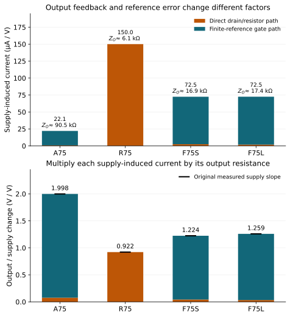
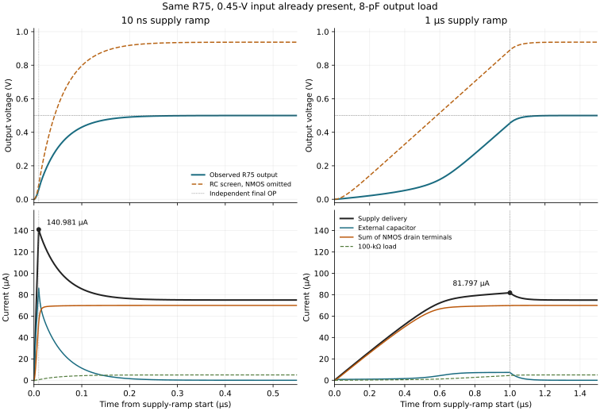

[Previous: errors and resources](06-errors-and-resources.qmd) · [Reading route](index.qmd) ·
[Next: toward an LDO](08-toward-an-ldo.qmd)

A 75-µA nominal operating point does not specify what the circuit needs while
one source is missing or a capacitor is charging. A finite reference can also
transmit supply changes into the output even after startup is complete. Follow
both the stationary sensitivity and the time-dependent port current before
choosing the upstream supply, input driver or reference.

## A reference resistor does not create a supply-independent current

In the active-load stages, diode-connected PMOS units and a resistor to ground
set `pbias`. Each reference PMOS has D=G=`pbias`, S=B=`vdd`; the output PMOS
has D=`out`, G=`pdrive`, S=B=`vdd`. A zero-volt diagnostic source connects
`pbias` to `pdrive` in the unperturbed circuit. Rbias connects `pbias` to ground.
See the exact [A75](../studies/finite-feedback/circuits/A75.cir) and
[F75L](../studies/finite-feedback/circuits/F75L.cir) bodies.

Hold the external input at 0.45 V relative to ground, with its source resistance
and the output load unchanged. Raise the supply slightly. The reference sources
rise, increasing the current available to Rbias. The reference node must rise
until the diode-connected devices and resistor balance again. But some extra
voltage is needed across Rbias to carry that extra current, so `pbias` generally
does not track the supply one-for-one. The output PMOS's source-to-gate voltage
therefore changes too.

We can calculate that motion from chapter 3's diode connection. Let
$G_R=\sum(g_{mR}+g_{dsR})$ for the reference units and $G_b=1/R_{bias}$.
For small perturbations about the known operating point, reference-node KCL is

$$G_R(\delta v_{DD}-\delta v_b)=G_b\delta v_b.$$

Here $v_b$ denotes `pbias`. Source and body move together, so this reference
calculation has no changing PMOS source-to-body voltage. Neglecting leakage
derivatives and capacitance gives

$$\frac{\delta v_b}{\delta v_{DD}}=\frac{G_R}{G_R+G_b},\qquad
q\equiv\frac{\delta v_{SG,P}}{\delta v_{DD}}
=\frac{G_b}{G_R+G_b}=\frac{1}{1+R_{bias}G_R}.$$

For F75L, the saved OP gives $G_R=304.126$ µS and Rbias=10.7310 kΩ.
Thus `pbias` tracks about **0.76546 V/V**, leaving **0.23454 V/V** at the
output PMOS's source-to-gate control. A finite reference that moves a lot
can still leave a substantial control-voltage error.

Define output PMOS current as positive from its source toward `out`. Its local
change is

$$\delta i_P=g_{mP}(\delta v_{DD}-\delta v_b)
             +g_{dsP}(\delta v_{DD}-\delta v_o).$$

The $-g_{dsP}\delta v_o$ term belongs in the output-node conductance. After
including that conductance, the NMOS source feedback, Rload and any finite Rf
path in $Z_O$, the remaining supply-driven injection is

$$K_{DD}\delta v_{DD}=(g_{dsP}+g_{mP}q)\delta v_{DD},\qquad
\delta v_o=Z_OK_{DD}\delta v_{DD}.$$

$Z_O$ is the measured or locally calculated response to an independent current
injected into `out`, with the external input held fixed. Its finite-feedback
denominator was derived in chapter 5. Do not count $g_{dsP}$ twice by adding
another output shunt after using that $Z_O$. A resistor-loaded stage instead
has $K_{DD}=1/R_D$, with $1/R_D$ already included in its output conductance.

The known four-circuit records make the two factors concrete:

| Circuit | Reference control fraction $q$, V/V | OP estimate $K_{DD}$, µA/V | OP estimate $Z_O$, kΩ | Observed supply slope, V/V |
| --- | ---: | ---: | ---: | ---: |
| A75 | 0.12599 | 22.077 | 90.523 | 1.99819 |
| R75 | — | 149.988 | 6.144 | 0.92156 |
| F75S | 0.23097 | 72.471 | 16.889 | 1.22413 |
| F75L | 0.23454 | 72.522 | 17.362 | 1.25882 |

[](figures/supply-reference-paths.svg)

From A75 to F75S, $Z_O$ falls by about 5.36 times, but supply-induced current
per volt rises by about 3.28 times. The line sensitivity therefore improves by
only about 1.63 times. This is a finite redesign with different bias/operating
points, not an Rf-only intervention. F75L's two contributions to its calculated
1.25915-V/V slope are **1.22573 V/V through reference control** and only
**0.03342 V/V directly through PMOS output conductance**. Reducing the latter
alone would leave the dominant path.

An ideal intervention that held the load's VSG constant while preserving the
same OP would remove the first term. That local estimate identifies a useful
reference requirement; it is not a demonstrated finite reference circuit.
Similarly, chapter 3's A37→A75 reference replication reduces an uncertainty
source but approximately preserves $R_{bias}G_R$: more units and an inversely
smaller resistor leave the nominal supply path nearly unchanged. Both original
line slopes remain near 1.998 V/V.

This is a **retrospective OP-based explanation**. A separate four-node KCL
matrix agrees with the reduced expressions to floating-point precision.
Compared with the original native input/current/gate-drop/supply diagnostics,
the largest local discrepancy is below 0.03%. The saved supply diagnostics
use backward steps at the 1-V boundary; F75S/F75L use 0.5/0.25-mV steps.
The approximation omits leakage derivatives and capacitance, and it does not
predict a whole voltage or frequency domain from one OP.

For a worked finite extrapolation, F75L's OP estimate gives a −37.774-mV
output change when supply falls by 30 mV. Starting at its 0.500047-V nominal
output gives **0.462272 V**. The already known 0.97-V observation is
**0.462088 V**, about 0.185 mV lower. This comparison checks the usefulness of
the local explanation; neither record is a fresh target of this edition.
The circuit still fails the original ±25-mV center requirement despite usable
numerics and passing gain/bandwidth checks. Subtracting its new mean would
change the task that chapter 6 kept fixed.

The [public recalculation](../studies/learning-decisions-v1/reproduce.qmd)
contains the actual OP inputs, separate nodal and reduced calculations,
native-derivative comparison and finite extrapolation residuals.

At 85 °C, F75L's nominal-device output is 0.538840 V and its gain is about
−5.310. That separately tested point is not a temperature population model or
a guarantee over a continuous temperature range. A reference redesign must
address the needed supply/temperature domain explicitly; nominal current
matching cannot establish it.

## An output-to-gate resistor keeps conducting when a source is zero

Use **F75L**, the larger-PMOS feedback design. It has the same topology as
F75S in chapter 5, but three NMOS units are each 4/0.40 µm and its one
reference/one output PMOS are each 3.333333/0.40 µm. Rs is 670.3661 Ω and
Rbias is 10.7310 kΩ. Rsrc=1 kΩ, Rin=9 kΩ and Rf=100 kΩ retain their connections.

```text
Input path: in -- Rsrc -- drive -- Rin -- gate -- Rf -- out
N0/N1/N2: D=out, G=gate, S=source, B=0
Pref:    D=pbias, G=pbias, S=vdd, B=vdd
Pload:   D=out, G=pdrive, S=vdd, B=vdd
Vbiasdiag(pbias, pdrive) = 0 V
Rs(source, 0); Rbias(pbias, 0)
Rload(out, 0) = 100 kohm; Cload(out, 0) = 1 or 8 pF
```

The [exact supply-first 8-pF circuit](../studies/power-sequencing/circuits/F75L-supply_first-fast-8p.cir)
includes the complete source history, all physical units and current sensors.
The published sequencing study keeps these geometries and resistor values fixed.

Let $I_{in}$ be positive when the input source delivers current toward the
amplifier and let $I_g$ be current entering the three NMOS gates. With
$R_t=R_{src}+R_{in}=10$ kΩ, gate KCL gives the exact circuit identity

$$I_{in}=\frac{V_{in}-V_o}{R_t+R_f}
       +\frac{R_f}{R_t+R_f}I_g.$$

The first term exists even if a MOS gate draws negligible stationary current.
During a transient, the second term includes intrinsic gate charging. This
identity does not separate individual compact-model leakage and charge terms;
it relates measurable terminal currents to the finite resistor path.

| F75L stationary source state | Output | Input delivered current |
| --- | ---: | ---: |
| VDD held at 0; input held at 0.45 V | 10.532 mV | +3.997 µA |
| VDD held at 1 V; input held at 0 | 934.819 mV | −8.502 µA |
| VDD held at 1 V; input held at 0.45 V | 500.047 mV | −0.452 µA |

Negative delivery means the input source must absorb current. **A voltage
source set to zero remains a driven clamp.** It is not an open circuit or an
unpowered I/O pin. No pad diode, driver rail or protection network is included
in these examples.

[](../studies/power-sequencing/figures/static-interface.svg)

With the input present and VDD clamped to zero, the first estimate is
$0.45\,\mathrm V/110\,\mathrm{k}\Omega=4.091$ µA if output is assumed zero.
The actual 10.532-mV output reduces the resistor contribution to 3.99516 µA;
gate current adds about 0.00157 µA. That predicts the observed 3.99673 µA.
It flows mainly from the input through the feedback path and NMOS/load to
ground. The clamped supply absorbs only about 55.4 pA in this particular state;
the result is not evidence that a floating supply gets charged to a useful
voltage.

With VDD present and the input clamped low, the NMOS bank takes little current.
The output rises until the PMOS supply balances Rload and the feedback path
into the input clamp. The clamp must absorb 8.502 µA to remain at zero. A slower
later input ramp cannot remove this initial stationary requirement.

Port power is $P=VI_{delivered}$. A zero-volt ideal clamp can absorb current at
zero ideal port power; a real driver still needs a circuit that can sustain
that state. Current direction, delivered/absorbed energy and implementation
cost are therefore separate things to report.

## Predict the charging demand and observe a bounded history

For R75's drain resistor, $I_{VDD}=(V_{DD}-V_O)/R_D$. If VDD rises faster
than the output can charge, a drop near 1 V across 6.667 kΩ suggests a current
near 150 µA, compared with about 75 µA at the final 0.5-V output. The measured
peak for input-first startup, a 10-ns supply ramp and 8-pF load is **140.981 µA**.
The nominal DC budget did not forbid that separately measured peak.

Use the actual resistor-loaded circuit for this comparison. R75 has six NMOS
units, each 3.867489/0.40 µm; all bodies connect to ground. There is no PMOS
reference branch in this stage:

```text
Vin(in, 0) = 0.45 V throughout the history
VDD(vdd, 0): 0 -> 1 V, starting at 2 us
Rsrc(in, gate) = 1 kohm
N0 ... N5(D=out, G=gate, S=source, B=0)
Rs(source, 0) = 171.818014 ohm
Rd(vdd, out) = 6667.191719 ohm
Rload(out, 0) = 100 kohm; Cload(out, 0) = 8 pF
```

The [10-ns](../studies/power-sequencing/circuits/R75-input_first-fast-8p.cir)
and [1-µs](../studies/power-sequencing/circuits/R75-input_first-slow-8p.cir)
SPICE bodies retain every terminal and current sensor. Vin is already present;
the independently solved initial output is 3.513 µV with VDD clamped to zero.
Both histories approach the same independently solved 0.500000-V output.
The following calculations use these **already known observations**. Their
RC comparisons are retrospective explanations, with no fitted time constant
or new startup target.

### What the first RC screen includes and omits

Temporarily omit the NMOS bank's drain-terminal current and intrinsic charging.
Keep both output resistors and the external capacitor. Output KCL becomes

$$C\frac{dv_o}{dt}+Gv_o=\frac{v_{DD}}{R_D}.$$

$$G=\frac1{R_D}+\frac1{R_L}.$$

$$\tau=\frac C G,\qquad \alpha=\frac{1/R_D}{G}.$$

Here $R_L$ is Rload and time starts at the supply-ramp beginning. During a
linear ramp $v_{DD}=V_{max}t/T_r$, the solution for $0\leq t\leq T_r$ is

$$\begin{aligned}
v_o(t)&=\frac{\alpha V_{max}}{T_r}\,t\\
&\quad-\frac{\alpha V_{max}\tau}{T_r}\left(1-e^{-t/\tau}\right)\\
&\quad+v_o(0)e^{-t/\tau}.
\end{aligned}$$

After the ramp, this screen approaches $\alpha V_{max}$ exponentially.
The circuit values give $\tau=50.004$ ns and $\alpha=0.937495$.
At the end of the 10-ns ramp, it estimates 87.797 mV output and 136.820 µA
from the supply. The actual output is 60.055 mV and the supply delivers
140.981 µA. The simple calculation gives a useful scale for the fast peak,
but the active bank is already removing current while the capacitor charges.

The omission becomes obvious for the 1-µs ramp. The same passive screen gives
0.890617 V and only 16.406 µA at ramp end; the actual amplifier gives
0.454645 V and 81.797 µA. Its final output is 0.5 V, not the screen's
0.937495 V. A resistor/capacitor estimate that explains a charging scale
does not establish an active amplifier's operating point.

<figure class="figure">
<a href="figures/startup-current-and-charge.svg"><picture>
<source media="(max-width: 600px)" srcset="figures/startup-current-and-charge-narrow.svg">

</picture></a>
<figcaption class="figure-caption">The same R75 under two supply ramps. The RC screen omits the NMOS bank. Panels stack on a narrow screen; open the figure for the full comparison.</figcaption>
</figure>

### Trace the current before choosing the source capacity

The complete output-node identity is

$$\begin{aligned}
I_{VDD}&=\frac{V_{DD}-V_O}{R_D}\\
&=I_C+\frac{V_O}{R_L}+\sum_{k=0}^{5}I_{D,k}.
\end{aligned}$$

The drain currents are measured terminal currents, including compact-model
conduction and displacement. They are not separately extracted channel-current
components. The original sensors measure $I_C$ independently. At the observed
supply peak, which is at ramp end in both selected histories:

| Current, µA | 10-ns ramp | 1-µs ramp |
| --- | ---: | ---: |
| Supply delivers | 140.981 | 81.797 |
| External capacitor receives | 86.143 | 7.357 |
| Six NMOS drain terminals receive | 54.237 | 69.893 |
| Rload receives | 0.601 | 4.546 |

The fast source must provide a large capacitor current before output catches
up. In the slow history, the NMOS bank is much closer to its final current
when the supply reaches 1 V, and the external capacitor needs less current.
The final supply current is 74.994 µA; the input source separately delivers
5.906 nA. A 75-µA nominal total budget therefore describes neither transient
peak nor every upstream interface.

Pointwise output KCL closes within $1.1\times10^{-16}$ A in these full saved
arrays. That numerical balance supports the current accounting. It does not
show that a real source limited to the nominal current can reproduce the
specified ideal voltage ramp; such a source would change the imposed history.

### Stored charge, source charge and energy are different requirements

Use a declared common observation window: **2 µs from the supply-ramp start**,
absolute time 2–4 µs. Integrating the measured capacitor current gives about
4.000 pC in either history. It agrees with $C\Delta V$ within $2.7\times10^{-6}$
relative error, inside the original charge-check tolerance. This is a check
on full native time axes, separate from the interpolated drawing grid.

| Signed quantity in that common window | 10-ns ramp | 1-µs ramp |
| --- | ---: | ---: |
| External capacitor charge, pC | 4.000 | 4.000 |
| Supply-delivered charge, pC | 153.161 | 129.968 |
| Supply-delivered energy, pJ | 152.919 | 109.764 |
| External capacitor energy increase, pJ | 1.000 | 1.000 |

The remaining supply charge flows through the NMOS drain terminals and Rload;
integrating their currents closes the same output KCL. Most supply-delivered
energy in this window is not newly stored in the external capacitor. The
input source also participates, with signed energies about 0.0020/0.0024 pJ.
This accounting does not infer a complete transient compact-model energy
partition from terminal current alone.

The window is part of the comparison. The fast circuit spends more of it
already near normal operation; the slow circuit spends longer at lower supply
and output voltages. The smaller slow-ramp energy here is not an equal-service
efficiency claim, and choosing a different window would change both totals.
Specify ready time, peak current and the relevant energy interval together.

### Estimate the final approach without fitting the waveform

Return to the complete circuit's final OP. Chapter 2's source-node equation
gives the bank's effective output conductance, with the input gate held locally
fixed:

$$D_S=1+R_S(G_m+G_{mb}+G_{ds}).$$

$$g_{ds,eff}=\frac{G_{ds}}{D_S}.$$

$$\tau_{on}=\frac C{1/R_D+1/R_L+g_{ds,eff}}.$$

The capital derivatives are sums over the six NMOS units. The known OP gives
$G_{ds}=3.485915$ µS, a source-feedback denominator 1.260546 and
$g_{ds,eff}=2.765400$ µS. With 8 pF, $\tau_{on}=49.154$ ns. This local model
includes the active bank; it still omits intrinsic capacitance and gate/leakage
derivatives. It is an unfitted one-pole explanation, not a whole-history model.
An independent two-node output/source KCL solve gives the same local output
resistance. The external resistors contribute about 160 µS, much more than
the bank's effective 2.765 µS, so the two time constants are close even though
omitting the bank gives the wrong DC center. Similar time constants do not
make two circuits perform the same function.

Anchor that exponential at each **already observed ramp-end error** $e_r$,
relative to the independent final OP. A local estimate of the subsequent
1-mV-band arrival is

$$T_{tail}\approx\tau_{on}\ln\left(\frac{|e_r|}{1\ \mathrm{mV}}\right).$$

| Time from ramp end, ns | 10-ns ramp | 1-µs ramp |
| --- | ---: | ---: |
| OP-based estimate, observed error as anchor | 299.184 | 187.499 |
| Original measured final-entry bracket | 298.471–300.471 | 178.501–188.501 |

Both estimates fall within the original brackets. This does not create finer
time resolution or make the observed anchor a prospective prediction. The
finite waveform and original 20-µs horizon establish the retained final-entry
measurement. Unlike chapter 5's D1 step example, this measurement starts at
the **ramp end** and uses an absolute 1-mV band around its independent 0.5-V OP.
Adding the ramp duration gives total arrival brackets **308.471–310.471 ns**
and **1178.501–1188.501 ns**. A smaller post-ramp delay can accompany a much
later ready time.

The [saved-data calculation](../studies/learning-startup-v1/reproduce.qmd)
supplies these four selected records, exact source identities, current/charge
arithmetic and one regenerable graph. No new native history was acquired.

[](../studies/power-sequencing/figures/peak-demands.svg)

The fixed sequencing block includes 59 nominal observations and controls:
12 stationary references, 36 startups, six supply cycles, four refinements
and one analytic RC control. The startups combine three circuit designs,
three source orders, two ramp lengths and 1/8-pF output capacitors. These are
declared histories, not a search across arbitrary initial charge or all
possible equilibria.

For the fast 8-pF input-first case, post-ramp settling to a 1-mV band around
the separately solved stationary endpoint takes about 0.300 µs in R75,
0.871 µs in F75L and 4.445 µs in A75. These are different finite designs under
the same declared startup job. Nominal current matching alone would hide
their different ready times and transient source requirements.

On a supply off/on cycle with input held at 0.45 V, F75L continues drawing
about 4 µA from the input during the zero-supply hold. Some slow downward
ramps already end inside the off-state target band. The original measurement
therefore records **IN_BAND_AT_FIRST_OBSERVATION**, with a bracket rather than
a resolved entry time. It is not a picosecond settling result. The
[complete sequencing guide](../studies/power-sequencing/index.qmd) retains
the actual histories, refinements and [public replay](../studies/power-sequencing/reproduce.qmd).

## What a better reference would still need to prove

Self-bias can make circuit currents depend on an internal relation rather
than a single resistor fed directly from a supply. That can be a useful design
direction, but the relation may have multiple equilibria, including an unwanted
low-current state. A startup path must move the circuit into the intended
state and then leave a bounded residual loading/error. Supply tracking,
temperature dependence, available headroom and the reference's own noise and
variation still need evaluation.

This edition does not claim a completed self-biased reference. The saved private
prototype has an unresolved equality-check failure and remains paused; neither
its cause nor its performance is inferred here. The published sequencing
evidence stands on its own frozen inputs and checks and does not establish
startup of that different topology.

The practical choice is now clearer. A source must support DC accuracy and
both directions of current through the required history. R75's accuracy and
speed come with larger charging peaks and larger-signal distortion. F75L's
linearity comes with a conductive input path and larger resistance/noise
costs. [Chapter 8](08-toward-an-ldo.qmd) turns those interface lessons into
the requirements of a possible regulator without assuming a regulator has
already been designed.
