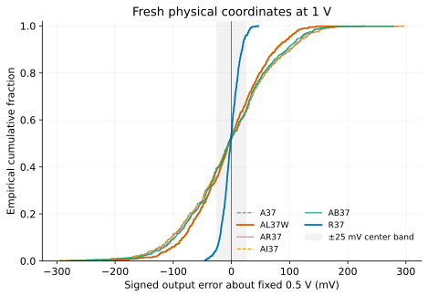
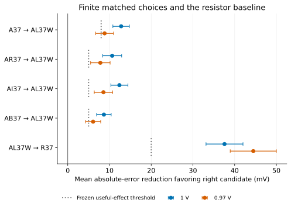
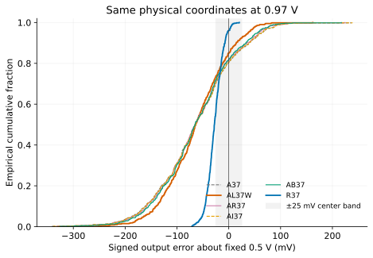
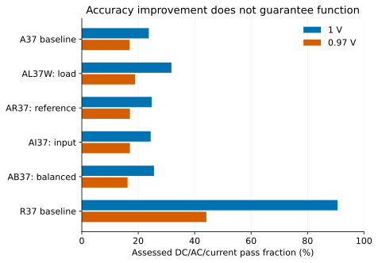
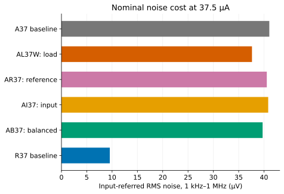
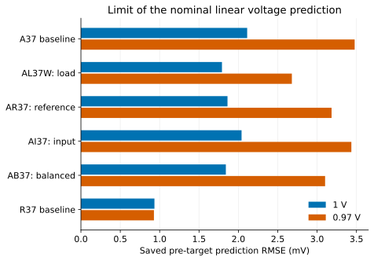

**Finite modeled study: 598 fresh paired coordinates, six circuits, two supply conditions.**

The first active-load amplifier spent most of its error budget at the PMOS
output load. Increasing only the reference current left that source untouched.
The passive study then showed that reference-current growth also leaves strong
bias-resistor and load-resistor transmission paths. We now ask a different
finite question: at the same signal task and 37.5 µA, does a small fixed MOS-area
budget do more useful work in the input, reference or output load?

Four new nominal candidates use 3.7 µm², compared with A37's 3.037 µm² and
A75's 4.477 µm². This is drawn MOS W×L, not total layout or resistor area.
All reference branches and external load/source currents still count. The
input source, external load, supply, temperature, gain and output center stay
at the first study's nominal interface. Passive statistics remain unspecified;
this question begins with nominal resistor values and does not undo their
measured sensitivity.

Expanding W and L together only approximately preserves behavior. Length
changes the actual compact-model threshold and output conductance, while
re-solving current balance changes the required input width and Rs. The first
proportional load expansion reached the supported 0.40-µm length limit and
missed the tight nominal matching requirement. Keeping that length and allowing
a separate load-width choice produced AL37W, which meets the same four targets.
The failed proportional attempt remains part of the design evidence.

The comparison is therefore a finite same-function redesign, not a pure
one-element intervention. Raw diagnostic perturbations and separate current/
voltage injections now establish which source changed and which transmission
path changed. Local sample comparisons will follow only after this development
question and its cost are fixed.


## The circuit that is being changed

The external job is unchanged: 0.45-V input through 1 kohm, nominal output
0.5 V, gain −6, a 100-kohm resistor and 1-pF capacitor at the output, 1-V supply,
26.85 C and a 5-mV peak, 10-kHz signal. The original assessment keeps center
within ±25 mV, gain magnitude within 5.4–6.6 throughout 1–100 kHz, bandwidth
at least 1 MHz and delivered current at most 80 µA. The once-designed nominal
match is tighter: center within 1 mV, gain within 0.5% and current within 0.2%
of 37.5 µA. The four new designs also match 3.7 µm² within 0.002 µm².

This named-terminal reading view describes AL37W. It is an explanation, not an
SV/AMS device library. Zero-volt terminal sensors and the zero-valued current/
voltage injection sources are shown in the exact [AL37W SPICE](circuits/AL37W.cir).
All MOS terminals are explicit; the SPICE file remains the execution authority.

```text
Vin   (positive=in,    negative=0)      = 0.45 V + signal
Rsrc  (in, gate)                       = 1 kohm       [external]
M_N0  (D=out, G=gate, S=source, B=0)    W/L = 2.18825663/0.32 um
M_N1  (D=out, G=gate, S=source, B=0)    W/L = 2.18825663/0.32 um
Rs    (source, 0)                      = 6.88648316 kohm
M_R0  (D=pbias, G=pbias, S=vdd, B=vdd) W/L = 2/0.24 um
M_R1  (D=pbias, G=pbias, S=vdd, B=vdd) W/L = 2/0.24 um
Rbias (pbias, 0)                       = 20.13634425 kohm
Vbiasdiag (pbias, pdrive)              = 0 V          [diagnostic]
M_P0  (D=out, G=pdrive, S=vdd, B=vdd)  W/L = 3.34878939/0.40 um
Rload (out, 0)                        = 100 kohm     [external]
Cload (out, 0)                        = 1 pF         [external]
Vdd   (positive=vdd, negative=0)       = 1 V
```

The reference PMOS units and Rbias set `pbias`; the output PMOS supplies current
to `out`. The NMOS bank sinks it through Rs. Increasing input voltage increases
the sink current, lowering output voltage. Increasing the source voltage pushes
back against that change, so Rs provides local degeneration. The output load
already draws about 5 µA at 0.5 V. In AL37W, about 12.116 µA reaches the output
from the PMOS drain, leaving about 7.116 µA for the NMOS drains. The reference
drains take about 25.375 µA. Actual terminal/gate currents are retained in the
accounting; these rounded branch figures are not substitutes for total supply
and input-port measurements.

By comparison, the resistor-load R37 can put about 32.5 µA into its NMOS drains
at the same total current. It uses a lower output resistance and correspondingly
larger effective input transconductance to obtain gain −6. The active design's
reference is a substantial resource dependency, even though its drawn MOS area
can be smaller. The ideal external input generator's implementation cost and
noise are unspecified in both circuits; actual delivered port current and
power are counted.

| Equal-area redesign | NMOS unit W/L (µm) | Reference PMOS W/L (µm) | Output PMOS W/L (µm) | Rs / Rbias (kohm) |
| --- | ---: | ---: | ---: | ---: |
| [AL37W: load](circuits/AL37W.cir) | 2.188257 / 0.320000 | 2.000000 / 0.240000 | 3.348789 / 0.400000 | 6.886483 / 20.136344 |
| [AR37: reference](circuits/AR37.cir) | 2.743891 / 0.320000 | 2.469742 / 0.296369 | 2.000000 / 0.240000 | 7.122507 / 20.616224 |
| [AI37: input](circuits/AI37.cir) | 2.996221 / 0.377142 | 2.000000 / 0.240000 | 2.000000 / 0.240000 | 6.975309 / 20.495098 |
| [AB37: balanced](circuits/AB37.cir) | 2.802898 / 0.350990 | 2.193690 / 0.263243 | 2.193690 / 0.263243 | 7.037647 / 20.459581 |

Each active circuit has two input, two reference and one output-load unit,
with m=nf=1. The table rounds for reading; the linked SPICE and
[configuration](data/configuration.json) preserve execution precision. The
[A37](circuits/A37.cir) and [R37](circuits/R37.cir) baselines fit the same
3.7-µm² ceiling but use less area. Their comparisons are matched-current and
common-ceiling comparisons, distinct from the four exactly matched-area choices.

## A current error needs a voltage path

The small-signal input transconductance after source degeneration is

$$
G_m=\frac{g_{m,n}}{1+R_s(g_{m,n}+g_{mb,n}+g_{ds,n})},\qquad
G_o=\frac1{R_L}+g_{ds,p}+
\frac{g_{ds,n}}{1+R_s(g_{m,n}+g_{mb,n}+g_{ds,n})}.
$$

Here each bank parameter is the sum over its parallel physical units. With
negligible leakage derivatives, the gain is $-G_m/G_o$ and output resistance
is $1/G_o$. An output current perturbation therefore becomes a large voltage
error when $G_o$ is small. Spending area on a noisy reference does not directly
remove the independently varying PMOS at the output.

The new designs keep output resistance around 90–93 kohm and low-frequency
supply transmission around 2 V/V. They have similar voltage amplification of
an output-current disturbance even though their device error sources differ.
Direct current injection, input-voltage perturbation, supply perturbation and
AC transfers agree with these operating-point equations within the documented
small-signal checks. These are diagnostic interventions on known nominal
circuits; they are not additional finite bias circuits.

## Transform the actual source profile, not just its area

The Local profile specifies threshold and beta observables at a reference
bias. It does not directly specify independent compact-model DELVTO and
mobility multipliers. For physical unit $j$, let $J_j$ map small raw-parameter
changes into those two reference observables, $S_j$ map raw changes into
amplifier output voltage, and $\sigma_j$ contain the two source-profile standard
deviations. Then the nominal first-order variance estimate is

$$
u_j=S_jJ_j^{-1}\operatorname{diag}(\sigma_j),\qquad
\sigma_{out}^2\simeq\sum_j\sum_{k=1}^2 u_{jk}^2.
$$

This calculation uses independent profile observable coordinates, and preserves
the reference mapper's physical conversion. It neither samples a new passive
model nor fits a variance coefficient to amplifier target results. Each drawn
raw realization is separately checked at the pinned native reference condition
before any amplifier target. Reference mapping corrections meet that source
condition; they do not adjust the amplifier's center or gain.

Area alone is insufficient even inside this model. A unit's source standard
deviation is proportional to $A(L)/\sqrt{2WL}$, and the coefficient $A(L)$
changes with length. The new PMOS load has a different coefficient, output
conductance and transconductance; the once-designed input bank also changes.
The source and voltage-transmission terms must be recomputed together.

| Candidate | Input variance (mV²) | Reference variance (mV²) | Load variance (mV²) | Predicted total SD (mV) |
| --- | ---: | ---: | ---: | ---: |
| A37 | 416 | 1,583 | 4,188 | 78.66 |
| AL37W: load | 474 | 1,566 | 1,822 | 62.14 |
| AR37: reference | 378 | 1,153 | 4,266 | 76.14 |
| AI37: input | 340 | 1,587 | 4,197 | 78.25 |
| AB37: balanced | 367 | 1,378 | 3,645 | 73.41 |
| R37 baseline | 229 | 0 | 0 | 15.14 |

[](figures/source-budget.svg)

[Open the full-size figure](figures/source-budget.svg).

The load investment removes about 2,366 mV² from the largest term, at a cost
of 58 mV² more input variance and a small change in reference variance. The
reference investment attacks a smaller term and slightly increases the load
term. Lengthening the input improves its own error while barely changing the
larger PMOS floor. These predictions were saved before the new development
amplifier targets. The model excludes global, spatial, passive and calibrated
temperature statistics, and this source-transfer hypothesis is not a foundry
yield model.

## The development signal and its limits

On 24 paired development coordinates, nominal MAE was 72.18 mV for A37,
55.55 mV for AL37W, 70.31 mV for AR37, 71.71 mV for AI37 and 67.41 mV for
AB37. The lower-area R37 baseline had 14.21 mV MAE. These results support
continuing the load-allocation question, but do not establish the selected
comparison: the same results helped choose its decision thresholds and
confirmation precision.

The known 0.97-V supply condition reduced the development benefit of AL37W
over its equal-area alternatives to about 8–12 mV. Every new nominal design
also failed at least one original functional limit when tested separately at
0.97 V, 85 C, 2 pF or 80 kohm. At 85 C, center remained close to 0.5 V but
gain was too small. At 2 pF, bandwidth fell below 1 MHz. The lower supply and
80-kohm load moved the center well outside its 25-mV half-window. Improving a
mismatch source has not repaired those transmission or dynamic limits.

## What the fresh confirmation is allowed to decide

Before target exposure, fix 598 new coordinates and the same six circuits at
nominal and 0.97-V supply. The settings themselves are already known; freshness
belongs to the saved physical realizations, not to a renamed condition. The
same seed/index/UID pairs the standardized coordinates. A geometry change
changes the raw physical device, so this is not an identical-complete-sample
claim across candidates.

Five directed MAE comparisons at two conditions form one ten-interval family.
Paired t intervals use a Bonferroni adjustment for approximate 95% family
coverage under this simulated model. The desired half-width is 3 mV for area
choices and 8 mV for the much broader comparison with R37. The fixed count is
the smallest common integer meeting those planning targets with 1.25 times
each development paired SD. The inflation is a pilot-uncertainty allowance,
not a guaranteed bound or a power calculation.

An 8-mV minimum improvement over A37 asks whether its extra 0.664 µm² buys a
substantial fraction of the output half-window. A 5-mV minimum distinguishes
useful choices at equal 3.7 µm². The R37 comparison asks for 20 mV. Showing a
nonzero difference is weaker than showing one of those minimum effects. No
result will trigger extra samples, rebiasing, recentering, or a relaxed limit.
Numerical usability, supported terminal domains and the five uniform DC/AC/
current checks remain separate. Two preselected coordinates receive additional
sine checks; they cannot support a population distortion claim.


## What the frozen confirmation found

All 7,176 assigned conditions were numerically usable and within the checked
terminal domain. No retry, redraw, sample extension, trim or recentering was
used. The following counts retain physical specification failures. They are
finite modeled observations, not manufacturing yield.

| Candidate | Nominal MAE (mV) | Nominal SD (mV) | Nominal DC/AC/current passes | 0.97-V MAE (mV) | 0.97-V passes |
| --- | ---: | ---: | ---: | ---: | ---: |
| A37 | 62.467 | 78.786 | 142 / 598 | 81.142 | 101 / 598 |
| AL37W: load | 49.677 | 62.605 | 190 / 598 | 72.317 | 113 / 598 |
| AR37: reference | 60.321 | 76.213 | 148 / 598 | 80.128 | 102 / 598 |
| AI37: input | 62.054 | 78.389 | 146 / 598 | 80.867 | 102 / 598 |
| AB37: balanced | 58.335 | 73.620 | 153 / 598 | 78.390 | 97 / 598 |
| R37 baseline | 12.111 | 15.181 | 542 / 598 | 27.853 | 264 / 598 |

[](figures/confirmation-nominal.svg)

[Open the full-size figure](figures/confirmation-nominal.svg).

The predicted nominal SD ordering survived the fresh data. AL37W has 62.61 mV
observed SD versus the pre-target estimate of 62.14 mV. Its MAE improvement over
A37 is **12.790 mV**, with the simultaneous interval **[10.812, 14.768] mV**.
This supports the frozen minimum improvement of 8 mV for the extra 0.664 µm².
At equal area, the improvements over reference, input and balanced investment
are 10.644, 12.378 and 8.659 mV. Their lower interval limits are 8.371, 10.328
and 6.915 mV, all above the declared 5-mV decision threshold.

The wider question has a different answer: R37 still improves MAE over AL37W
by **37.565 mV**, interval **[33.135, 41.995] mV**, while using slightly less
MOS area at the same current. Investing in the largest active-load error source
improves that circuit; it does not establish that an active load is the best
choice for this external accuracy task.

[](figures/paired-comparisons.svg)

[Open the full-size figure](figures/paired-comparisons.svg).

The ten intervals share an approximate 95% family coverage claim, not ten
independent 95% claims. The chart's short dotted markers are the different
predeclared useful-effect thresholds. Full values and assigned/usable pair
counts are in [statistics.json](data/statistics.json); the
[confirmation policy](confirmation-plan.json) fixes their interpretation.

## Smaller mismatch does not cancel a shifted center

[](figures/confirmation-supply.svg)

[Open the full-size figure](figures/confirmation-supply.svg).

At 0.97 V, all active candidates have roughly −63 to −64 mV mean error, while
R37's mean is −27.414 mV. The strong supply path shifts the center of the entire
active distribution. A narrower distribution around that displaced center
provides less average-error benefit than it did around the nominal target.
The data stay referenced to the fixed 0.5 V; no mean was subtracted to rescue
accuracy.

AL37W still has lower MAE than each active alternative, but two minimum-effect
claims are **inconclusive**. Its advantage over A37 is 8.824 mV with interval
[6.675, 10.973] mV, which does not establish the required 8-mV minimum. Its
advantage over balanced allocation is 6.073 mV with interval [4.254, 7.891] mV,
which does not establish the 5-mV minimum. Reference and input comparisons
retain lower limits of 5.472 and 6.351 mV. These results satisfy the finite
stopping rule; they do not justify adding samples until the desired statement
becomes significant.

[](figures/assessed-function.svg)

[Open the full-size figure](figures/assessed-function.svg).

Accuracy statistics and functional counts answer different questions. Even
AL37W meets the five nominal DC/AC/current checks in only 190 of 598 cases in
this model. Its lower-supply result is 113 of 598. Extra area has not turned
it into a robust 25-mV-center solution. Two preselected nominal coordinates per
candidate also received the sine check; those sparse checks do not extend the
DC/AC/current count into a population dynamic qualification.

## Costs that remain after the accuracy improvement

At 37.5 µA, AL37W has nominal bandwidth 1.706 MHz, 1-kHz–1-MHz input-referred
noise 37.63 µV RMS and 0.473% THD for the 5-mV/10-kHz signal. The other
matched-area active designs span 1.736–1.748 MHz, 39.73–40.83 µV RMS and
0.440–0.461% THD. The same-current R37 baseline has 13.640 MHz, 9.55 µV RMS
and 1.386% THD. Noise includes modeled MOS and all resistor sources; ideal
voltage sources add none. These are nominal noise/distortion observations,
with no calibrated Local noise or temperature population claim.

[](figures/nominal-noise.svg)

[Open the full-size figure](figures/nominal-noise.svg).

The load allocation is therefore a reasonable choice among these four active
circuits when improving untrimmed center accuracy matters. It consumes more
load-device area, slightly narrows bandwidth, and still has much higher error
and noise than R37. An active circuit can remain relevant when its lower
nominal distortion or another explicitly changed interface is valuable; those
preferences do not erase its center failures.

Internal resistor sums are about 27–28 kohm for the active redesigns, versus
13.417 kohm for R37. Their actual layout area is unknown. The earlier
[passive study](../passive-sensitivity/) demonstrated that bias/source resistor
error and external-load uncertainty can dominate a choice. This study holds
those resistors nominal and adds no invented passive or spatial statistics.

## How far the explanation predicts

Each physical target had an output prediction saved before acquisition. It
used the nominal raw-parameter Jacobian and, for 0.97 V, the already measured
supply derivative. It did not use the target's operating point. The prediction
RMSE is 1.79 mV for AL37W at nominal and 2.68 mV at the lower supply; its worst
errors are larger. Across candidates, nominal RMSE spans 0.93–2.11 mV and
lower-supply RMSE spans 0.93–3.48 mV. The voltage-source budget explains the
main spread, while nonlinear tails and operating-point movement limit a local
linear prediction.

[](figures/prediction-error.svg)

[Open the full-size figure](figures/prediction-error.svg).

The new cohort and the earlier first-study cohort have different finite means;
they are not merged or presented as repeated measurements of identical physical
circuits. APM045/VTG Local here is a source-transfer hypothesis. Global process,
spatial correlation, passive statistics, calibrated temperature statistics,
layout/PEX, silicon correlation and manufacturing yield remain outside the
claim. Length support stops at 0.40 µm; the retained failed proportional-load
attempt is evidence of that design constraint, not a failed simulator run.

The practical next decision is whether a finite feedback path can reduce the
remaining supply/current transmission at an acceptable cost in input loading,
resistance, noise and dynamics. Geometry investment alone has not answered it.
That follow-on question does not alter this completed freeze or its outcomes.

## Evidence and reproduction

The work used APM v5.0.0 commit `381517fda5107fabf98af7801d5a5103f38e230c`,
APM045/VTG and ngspice 47. Internal checks verified all target/native file
hashes, actual model and raw-parameter readbacks, saved physical identities,
request conditions and recomputed scalar measurements. Source mapping was
checked separately at its native reference condition. These were checks by
the same Codex agent, not prior human review, peer approval or independent
scientific replication of this new release.

[Reproduce the statistics, figures and preselected native examples](reproduce.qmd).
The [compact evidence receipt](evidence.json), [nominal design attempts including
the failed AL37](data/design-attempts.csv), [development observations](data/development.csv),
[all confirmation observations](data/confirmation.csv), [saved MOS values](data/realizations.csv)
and [data manifest](data/manifest.json) accompany the guide. Bulk native and
calibration observations stay in the private experiment archive; selected
public replay has no private-input dependency.
