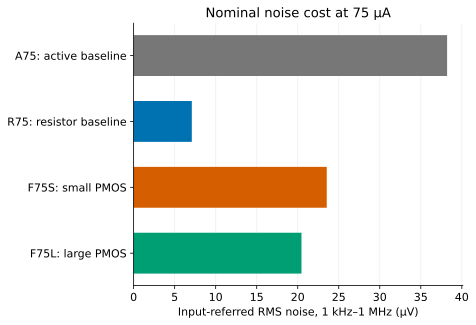
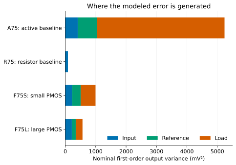
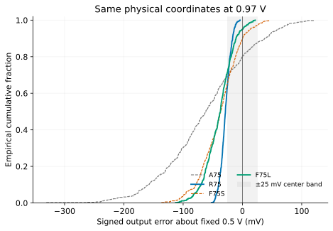
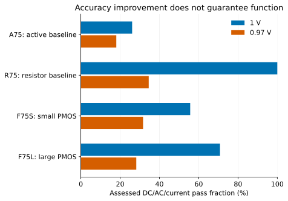
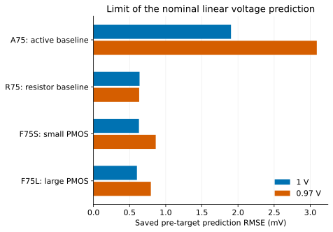
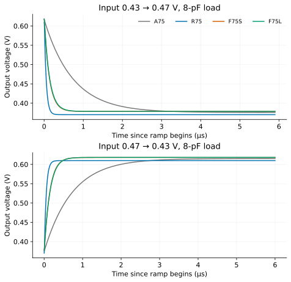
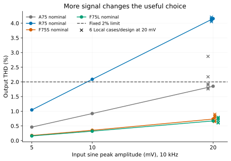
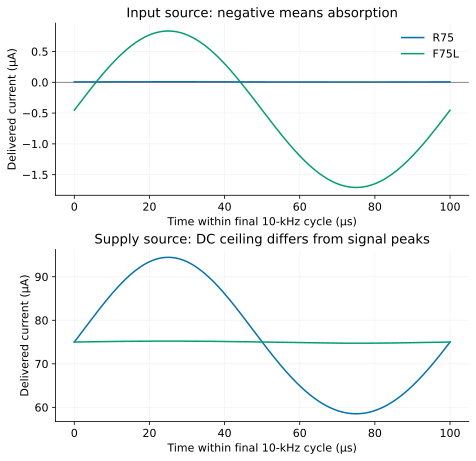

The finite active load in the earlier studies turned output-current error into
a large output-voltage error. Spending area on its PMOS helped the error source,
but left that transmission path and the supply sensitivity largely intact.
Here a resistor feeds the output voltage back to the NMOS gate. The complete
redesign lowers measured output resistance to about 17 kΩ and improves nominal
bandwidth and distortion. It also needs about 120 kΩ of internal resistance,
a source that absorbs current, and a careful accounting of the input and
reference errors that remain.

In the frozen 521-coordinate confirmation, nominal mean absolute output error
falls from A75's 60.419 mV to F75L's 19.275 mV. R75 still gives only 7.161 mV.
The reason to choose feedback is therefore conditional: it combines lower
active-load error with substantially lower distortion at a 20-mV input, at a
cost in resistance, input drive and noise. It does not make the output immune
to the supply or preserve bandwidth under every capacitive load.

This is a finite, simulated design comparison using pinned APM v5.0.0,
APM045/VTG and ngspice 47. Read the [Japanese overview](../../ja/finite-feedback.html),
[executed reproduction](reproduce.qmd) or [selected evidence](evidence.json).

Tap a plot to open its SVG at full size; tables, circuits and wide equations scroll horizontally on narrow screens.

## Keep the external job and costs visible

Use the first study's external job: a 0.45-V input through 1 kΩ, nominal output
0.5 V, signed gain −6, 100-kΩ || 1-pF load, 1-V supply, 26.85 °C and a
5-mV-peak, 10-kHz signal. The nominal delivered-current target is 75 µA. The
five common DC/AC/current tests retain the fixed 25-mV center limit, gain
5.4–6.6 throughout 1–100 kHz, bandwidth at least 1 MHz and current at most
80 µA. Nominal sine checks additionally require at most 2% THD, fundamental
gain within 10% of 6, and output within 0.25–0.75 V.

The new comparison permits at most 10 µm² of drawn MOS area and 150 kΩ of
internal resistance. The resistance ceiling is explicitly larger than the
earlier 30-kΩ contract because the physical feedback network is the subject
of this experiment. No internal capacitor is added. R75 and A75 fit these
common ceilings with fewer resources; the comparison matches nominal current
and function, not exact area or total layout cost. Resistor area and parasitic
capacitance are unmodeled. Each candidate is sized and biased once, before any
Local amplifier target is observed.

| Candidate | Drawn MOS area (µm²) | Internal R sum (kΩ) | Bandwidth (MHz) | Input noise (µV RMS) | THD (%) |
| --- | ---: | ---: | ---: | ---: | ---: |
| A75, previous finite active load | 4.477 | 15.150 | 1.747 | 38.207 | 0.4603 |
| R75, previous resistor load | 9.282 | 6.839 | 25.186 | 7.092 | 1.0450 |
| F75S, smaller PMOS pair | 5.531 | 120.454 | 9.309 | 23.537 | 0.1740 |
| F75L, larger PMOS pair | 7.467 | 120.401 | 9.032 | 20.458 | 0.1583 |

Noise is integrated from 1 kHz to 1 MHz, including all modeled resistors and
devices; ideal voltage sources have no added noise. These are nominal results,
not a Local noise distribution. The earlier study remains the authority for
its unchanged baseline measurements.

There is also an analytic noise floor in the new input interface. Rsrc and Rin
are series resistors with no third connection at their shared node. At 300 K,
their independent thermal noise refers to the external input as
$4 k_B T(R_{src}+R_{in})$. Integrated over 1 kHz–1 MHz, the 10-kΩ total alone
gives 12.865 µV RMS, already above R75's entire observed 7.092-µV nominal
input noise. This resistor term accounts for 29.9% and 39.5% of the total
nominal noise variance in F75S and F75L. It is an analytic series-resistor
contribution compared with the observed total, not a measured decomposition
of every BSIM noise source. Shrinking PMOS noise alone cannot remove it.

[](figures/nominal-noise.svg)


## Read the physical circuit

This structural reading view names every MOS terminal. Each bank consists of
explicit unit devices with m=nf=1. Exact SPICE and saved parameters retain more
digits than the view; the view introduces no new device model.

Exact execution bodies: [F75S](circuits/F75S.cir), [F75L](circuits/F75L.cir),
[A75](circuits/A75.cir) and [R75](circuits/R75.cir). The separate
[F75L 20-mV body](circuits/F75L-signal20m.cir) includes the zero-volt capacitor
current sensor used for the selected signal checks.

```text
Vdd   (positive=vdd, negative=0)                  // 1 V supply
Vin   (positive=in,  negative=0)                  // 0.45 V + signal
Rsrc  (in, drive)       1 kΩ                     // external source
Rin   (drive, gate)     9 kΩ                     // new input resistor
Rf    (out, gate)       100 kΩ                   // physical feedback
Rs    (source, 0)       601.500 Ω / 670.366 Ω
Rload (out, 0)          100 kΩ                    // external load
Cload (out, 0)          1 pF                      // external load

N[0:2] (D=out, G=gate, S=source, B=0)
        W/L=3.809366/0.40 µm (F75S), 4.0/0.40 µm (F75L)
P_ref  (D=pbias, G=pbias, S=vdd, B=vdd)
P_load (D=out,   G=pdrive, S=vdd, B=vdd)
        W/L=2.0/0.24 µm (F75S), 3.333333/0.40 µm (F75L)
Rbias  (pbias, 0)       10.852304 kΩ / 10.731025 kΩ
Vbiasdiag (positive=pbias, negative=pdrive)  0 V   // diagnostic only
Idist  (positive=0, negative=out)           0 A   // diagnostic only
```

The PMOS diode and Rbias establish the load gate voltage through an actual
current-consuming reference branch. The PMOS load supplies the NMOS bank,
the external output resistor, and the feedback resistor. Increasing the input
raises NMOS current and lowers the output. An output rise also raises the
gate through Rf, increasing the opposing NMOS current.

In F75S, the nominal gate is 0.454521 V, source 0.019209 V and PMOS bias
0.408187 V. About 31.93 µA reaches Rs, roughly 37.61 µA flows through Rbias,
and 0.454795 µA flows from output to gate through Rf. Actual terminal sensors
and resistor values close the gate, output, drive and reference-node KCL.
Small gate-leakage currents are included in those numerical checks.

The input source absorbs 0.452052 µA in F75S and 0.452480 µA in F75L. The
current reaches the ideal Vin port through both finite input resistors; it is
an external interface requirement. Nominal supplied current is about 75 µA,
while signed net port power is about 74.8 µW after input-source absorption.
Counting only a nominally high-impedance MOS gate would miss this dependency.
The input source's own implementation, noise and ability to sink current
remain outside the transistor circuit.

F75L reaches the supported 4-µm NMOS width boundary. It still meets the tight
nominal matching limits: output 0.5000466 V, gain −6.0008715 and current
74.99738 µA. That 46.6-µV residual offset is retained in every later accuracy
calculation; it is not removed from individual observations.

## Include feedback loading in the equation

Let the total NMOS small-signal parameters be $g_{m,n}$, $g_{mb,n}$ and
$g_{ds,n}$, and let the PMOS output conductance be $g_{ds,p}$. With the body
fixed at ground, define

$$
D=1+R_s(g_{m,n}+g_{mb,n}+g_{ds,n}),\qquad
G_m=\frac{g_{m,n}}{D},\qquad
G_o=\frac1{R_L}+g_{ds,p}+\frac{g_{ds,n}}{D}.
$$

Set $R_t=R_{src}+R_{in}$ and $\beta=R_t/(R_f+R_t)$. Neglect leakage
derivatives for this low-frequency approximation. Gate KCL gives

$$v_g=(1-\beta)v_{in}+\beta v_o.$$

Output KCL includes current through Rf as well as transistor current. Substituting
the gate voltage yields

$$
\left[G_o+\frac1{R_f+R_t}+G_m\beta\right]v_o
=-\frac{G_mR_f-1}{R_f+R_t}v_{in}+i_{err}.
$$

Consequently,

$$
A_v=-\frac{G_mR_f-1}{G_o(R_f+R_t)+1+G_mR_t},\qquad
Z_o=\frac1{G_o+1/(R_f+R_t)+G_m\beta}.
$$

The numerator contains direct resistor feedthrough. The denominator contains
both resistor loading and the transconductance response to fed-back output.
At the measured F75S operating point these conductances are about 22.77 µS
for $G_o+1/(R_f+R_t)$ and 36.44 µS for $G_m\beta$. Their ratio is only
1.60. It is a useful low-frequency algebraic decomposition, not a measured
loop return ratio or a phase-margin qualification. The actual external gain
is −6 even though $-R_f/R_t=-10$.

The whole redesign also changes NMOS current, unit geometry, and reference
allocation relative to A75. The observed fivefold reduction in output
resistance belongs to that complete circuit. The equation separately identifies
the added feedback term at its actual operating point.

## Measure current, input and supply paths separately

Centered output-current injections and independent AC current drives agree:
F75S has $Z_o=16.894$ kΩ and F75L 17.367 kΩ. Input-voltage perturbations
recover the external gain −6. Bias diagnostic voltage is a different path:
positive Vbiasdiag lowers the PMOS gate and increases output voltage, with
about 5.114 and 5.225 V/V transmission.

Let $g_{m,r}+g_{ds,r}$ be the diode-reference conductance. Its finite Rbias
causes its gate to track only part of a supply change. The approximate line
transfer is

$$
\frac{dv_o}{dV_{DD}}\simeq
Z_o\left[g_{ds,p}+\frac{g_{m,p}}{1+R_b(g_{m,r}+g_{ds,r})}\right].
$$

The measured backward line slopes at 1 V are 1.22413 and 1.25882 V/V;
the AC supply drives independently give 1.22407 and 1.25877 V/V. Backward
steps keep every device within the pinned 1-V terminal domain. The known-OP
equations agree with direct current/input/bias/supply interventions within
0.030%. Halving raw and passive perturbation steps changes their derivatives
by less than 0.00026% in this declared block.

An equivalent input-overdrive offset injects approximately $G_m\delta v$
of current into this expression. Reducing $Z_o$ while recovering the same
signal gain leaves a substantial input-error path. Furthermore, the model's
DELVTO parameter is not numerically identical to that ideal voltage shift:
the summed measured input DELVTO slope is about 7.501 V/V, whereas the
idealized $G_mZ_o$ term is about 6.77. Later source budgets must use the
actual raw derivatives and the pinned reference-map Jacobian. Substituting
an ideal gate-offset gain for every compact-model parameter would mix two
different coordinates.

## Separate the uncertainty source from its transmission

For each physical unit, transform the pinned reference-coordinate source
sigmas through the inverse reference Jacobian into the raw DELVTO/ln(MULU0)
coordinates. Apply the measured circuit derivative to that vector, then sum
independent unit/coordinate variance contributions. This uses no fit to the
later amplifier outputs. In compact form,

$$
\sigma_{v_o}^2\simeq\sum_u\left\|S_uJ_u^{-1}\operatorname{diag}(\sigma_u)\right\|^2.
$$

The resulting nominal first-order standard deviations are 72.369 mV for A75,
9.340 mV for R75, 31.540 mV for F75S and 23.804 mV for F75L. A75 is dominated
by its small PMOS load. Feedback lowers the load-current transmission, and
the larger PMOS pair further lowers the load/reference source contributions.
F75L's input, reference and load variances are approximately 215.0, 129.0 and
222.6 mV²: the old dominant load has become one of three comparable sources.
Spending on that load alone now has a smaller possible payoff.

[](figures/source-budget.svg)

The [source transformations](data/source-transforms.csv) retain each unit's
Jacobian, sigma and sensitivity. [Public statistics code](statistics.py)
reconstructs the ten candidate/role variance totals. Raw compact-model
parameters, reference targets and the first-order prediction remain distinct.

## Freeze the physical comparison, then observe it

Twenty development coordinates, indices 24–43, informed the paired variability
and the confirmation precision calculation. Earlier first-study and allocation
observations were also known development knowledge. No target from the later
confirmation was used to resize a candidate or choose its sample count.

The [frozen policy](confirmation-plan.json) used a 25% allowance on development
paired standard deviations. The smallest common size meeting the eight stated
interval-width targets was 521 coordinates, indices 2000–2520 of the follow-on
seed. The widest required calculation was A75→F75L at nominal supply, with
a 6-mV half-width target. This is a precision calculation, not a power guarantee
or a universal sample quota. The nominal and 0.97-V settings were known; the
physical coordinates were fresh. Shared standardized coordinates across changed
inventories/geometries do not mean identical complete circuits.

The physical freeze at 2026-09-13 00:08:18 UTC bound all 2,084 circuit inputs,
12,504 unit realizations, predictions, conditions and measurement code. Native
reference readback was checked, and 5,716 retained known realizations were
compared for exposure overlap. Main targets began at 00:11:45 UTC after the
private freeze commit was pushed and verified. No redraw, trim, rebias,
recentering, candidate change or outcome-driven sample extension followed.
The retired v4 runtime is not an exhaustive reconstructible exposure archive;
this freshness check concerns the retained ADS inputs and targets.

All 4,168 main observations are numerically usable and within checked terminal
domains. Reanalysis verified saved inputs, model identities, physical readbacks,
frequency grids and scalars, including 25,008 MOS readbacks. Maximum KCL residual
was 3.014×10⁻¹⁶ A. Specification failures remain in every denominator.

| Candidate | MAE at 1 V (mV) | SD at 1 V (mV) | Five-test pass / 521 | MAE at 0.97 V (mV) | Five-test pass / 521 |
| --- | ---: | ---: | ---: | ---: | ---: |
| A75 | 60.419 | 75.527 | 136 | 78.564 | 94 |
| R75 | 7.161 | 8.856 | 521 | 28.518 | 180 |
| F75S | 25.716 | 32.545 | 290 | 41.685 | 165 |
| F75L | 19.275 | 24.299 | 369 | 40.403 | 147 |

[](figures/confirmation-nominal.svg)

Eight Bonferroni paired t intervals provide approximate simultaneous 95%
uncertainty conditional on this finite source-transfer model. Positive numbers
favor the candidate on the right; establishing a positive effect and establishing
the predefined useful effect are separate decisions.

| Choice | Frozen useful reduction (mV) | Reduction at 1 V, interval (mV) | Reduction at 0.97 V, interval (mV) |
| --- | ---: | ---: | ---: |
| A75 → F75S | 20 | 34.704 [30.403, 39.004] | 36.879 [32.119, 41.639] |
| A75 → F75L | 25 | 41.144 [36.521, 45.766] | 38.161 [32.944, 43.378] |
| F75S → F75L | 4 | 6.440 [5.636, 7.245] | 1.282 [0.216, 2.348] |
| F75L → R75 | 8 | 12.114 [10.289, 13.940] | 11.885 [9.425, 14.346] |

All four useful reductions are supported at nominal supply. At 0.97 V, the
larger feedback PMOS pair has a positive MAE benefit, but its entire interval
is below the predefined 4-mV useful improvement. The useful-improvement claim
is not established; the size or threshold was not changed to rescue it.

[](figures/paired-comparisons.svg)

The narrower F75L distribution also passes fewer fixed-center tests than F75S
at 0.97 V. Its mean error is −39.504 mV versus F75S's −38.456 mV, and reduced
spread puts fewer points inside the fixed ±25-mV band. Lower MAE, less spread
and more passing circuits are different objectives under a displaced mean.
R75 remains more accurate at this supply too, but only 180/521 pass the full
five-test job. None of these fractions estimates manufacturing yield.

[](figures/confirmation-supply.svg)

[](figures/assessed-function.svg)

Saved nominal first-order voltage forecasts have confirmation RMSEs of
1.903/0.638/0.629/0.601 mV for A75/R75/F75S/F75L. At reduced supply these
become 3.091/0.632/0.862/0.794 mV. The first-order interpretation is useful
here, with the largest nonlinear residuals in A75; it is not an independent
device model or a prediction of silicon performance.

[](figures/prediction-error.svg)

## Passive and environmental costs remain

For F75L, the center slopes in volts per log resistance are −0.00272 for
Rsrc, −0.02444 for Rin, +0.03522 for Rf, +0.17850 for Rs, −0.49438 for
Rbias and +0.08684 for the external load. The reference resistor remains a
large untrimmed center-error source. Rf/Rin also affect signal gain strongly;
a feedback network is not an exact gain ratio at this finite core gain.
These deterministic derivatives specify no foundry passive distribution.

The separately measured 0.97-V outputs are 0.463071 and 0.462088 V. Both
fail the unchanged 25-mV center limit even though gain and bandwidth pass.
At 85 °C, their outputs rise to 0.548641 and 0.538840 V, with gain only
−5.275 and −5.310; both center and signal-band gain fail. These are valid
physical failures, with usable numerics and supported terminal voltages.

The separate 2-pF cases retain about 4.68/4.55 MHz bandwidth. The separate
80-kΩ cases give output 0.479640/0.479143 V and gain −5.732/−5.726. Both
pass the five assessed DC/AC/current tests at these loads. Sine/noise were
not added to those four environmental observations per design; their passing
DC/AC result is not a joint dynamic qualification.

## More signal is a different useful job

At 20-mV peak input, the fresh nominal sine experiments give 4.156% THD for
R75, 1.852% for A75, 0.733% for F75S and 0.671% for F75L. R75 fails the
unchanged 2% distortion limit; the active circuits pass. All four preserve
fundamental gain and the required output range. At 10 mV, R75 already gives
2.088% THD, consistent with the first study's retained result. These are
explicit larger-signal conditions, separate from the original 5-mV job.

At 20 mV the F75L input port must absorb up to 1.708 µA and supply up to
0.832 µA during each cycle. R75's supply current spans 58.52–94.46 µA,
whereas F75L's spans 74.72–75.21 µA. The original 80-µA limit applies to
DC delivered current; these separately reported signal-dependent peaks tell
the designer what the external sources must handle. Ideal source ports do
not establish that an actual input buffer or upstream supply can do so.

Capacitive load exposes the other tradeoff. At 8 pF the measured bandwidths
are 0.220 MHz for A75, 3.226 MHz for R75, 1.176 MHz for F75S and 1.143 MHz
for F75L. At 16 pF, only R75 meets the 1-MHz bandwidth limit. At 0.2 pF,
R75's first crossing is 112.6 MHz; that load sweep was declared to 1 GHz
because the old 100-MHz range would have censored this expected result.
The extension describes this model's AC behavior, not a microwave process
qualification or a change to the original confirmation measurement grid.

[](figures/capacitive-load.svg)

For the separate 0.43↔0.47-V input ramps, with 10-ns edges and an 8-pF load,
F75L reaches the 1%-of-step band about 0.616/0.656 µs after each edge ends.
R75 takes about 0.222/0.224 µs, and A75 about 3.340/3.302 µs. The target
voltages come from separate DC endpoint solves. A zero-volt series sensor
measures capacitor current directly; its integral agrees with $C\Delta V$.
This is finite observed settling to a stationary target, without tail fitting
or a claim of phase margin or stability under every load.

A MOS-free finite-ramp RC control agreed with its analytic waveform within
91 nV. Across the complete dynamic block, the largest capacitor charge
integration discrepancy was 4.66 ppm and output/device transient KCL residual
was $1.63\times10^{-14}$ A. Doubling frequency density and halving time steps
for the preselected R75/F75L cases changed bandwidth by less than 0.0049%,
THD by less than 0.001%, and the selected settling times by less than 0.33 ns.
All declared refinements passed. Physical bandwidth and distortion failures
remain failures after the refinement.

[](figures/step-response.svg)

The confirmation freeze also preselected six coordinates, 2000–2005, for
20-mV sine observations on all four candidates: exactly 24 attempts. All are
usable and supported. R75 fails distortion in all six, at 4.054–4.205% THD;
F75S and F75L pass the dynamic tests in all six, at 0.646–0.896% and
0.600–0.794%. A75 passes four, with THD spanning 1.760–2.869%.
Combining DC/AC and signal requirements gives 3/6 A75, 0/6 R75, 4/6 F75S
and 5/6 F75L. The selected F75S failures and the remaining F75L failure are
still fixed-center failures. Six coordinates support these finite examples,
not a dynamic population pass-rate claim. No noise distribution was acquired.

[](figures/signal-distortion.svg)

[](figures/port-currents.svg)

## Choose according to the required interface

For the original small-signal job with ideal passives, R75 remains the strongest
accuracy/noise/bandwidth choice among these four, at the highest drawn MOS area.
F75L is a useful compromise when the 20-mV signal's distortion matters and an
input driver can absorb about 2 µA in the checked Local examples. It improves
the active-load accuracy substantially without reaching R75's noise floor or
capacitive-load speed. F75S costs less MOS area; F75L's additional PMOS area
buys a meaningful nominal accuracy improvement, with a weaker case at .97 V.

The remaining supply shift needs a different reference/supply mechanism or a
different interface specification. More PMOS area alone does not cure it.
The feedback resistors also require tolerance, area and parasitic accounting;
the passive study's synthetic scenarios are not automatically calibrated for
this network. A real input buffer and upstream supply can change these results
because their output impedance, noise, source/sink limits and power were not
implemented here. Bounded steady-state and step observations establish neither
startup reachability under every history nor formal loop stability.

## Reproduction, provenance and scope

The [example package](../../downloads/feedback-study-v1.0.zip) retains exact
SPICE, all saved confirmation physical units, compact development/confirmation
data, source transformations, and ordinary graph/statistic/replay scripts.
[Reproduction instructions](reproduce.qmd) identify actually executed clean
input/Python checks and the four examples selected before target exposure.
The public plots use compact interpolation grids; scientific waveform metrics
were computed from complete native observations, not those plotting traces.

The nominal cause block retained an interrupted adapter attempt with 45 complete
observations. Those were re-audited and reused, with only 101 missing declared
conditions acquired in a new destination. No physical sample or historical
evaluation was overwritten. Nominal design attempts, valid specification
failures and the below-threshold confirmation comparison remain part of the
selected evidence. The first study's definitions and immutable download remain
available separately.

This release was designed, simulated, analyzed, written and internally checked
by one AI coding agent under the owner's research/publication authorization.
It has no claimed independent peer review or prior human review of this new
release. Local source-transfer statistics exclude global process, calibrated
passive/spatial/temperature distributions and layout parasitics. No TSMC55
correlation, manufacturing yield, silicon qualification or complete LDO result
is inferred. Original prose, figures and data use CC BY 4.0; original code and
circuits use MIT. Public APM dependencies retain their own applicable terms.
