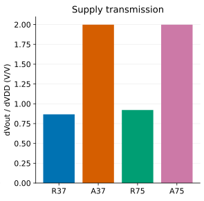
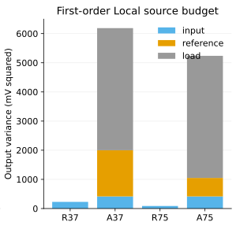
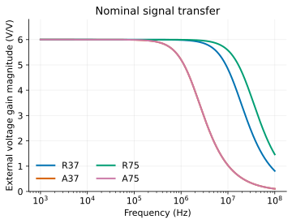
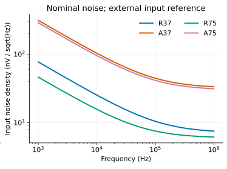
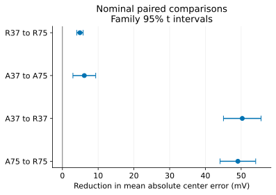
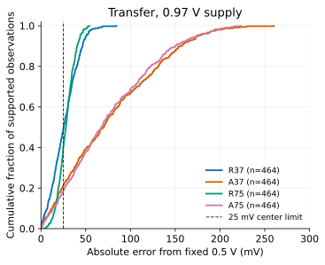

A small amplifier can deliver the desired signal gain while its output DC level
is very sensitive to a load transistor or bias reference. This study separates
those paths, builds four finite circuits with the same nominal function, and
asks where extra current actually buys useful accuracy.

**Study v1.0 — completed 2026-09-12 UTC.** The finite confirmation and internal
evidence review are complete.
All numerical results below are model observations using APM v5.0.0/APM045 VTG
and ngspice 47, unless explicitly identified as a calculation.

## The common job and its boundary

The job is a small inverting voltage amplifier: gain −6 from an external input
source, 0.5-V output center, 1-V supply, and a 1–100-kHz signal band. Input DC is
0.45 V, source resistance 1 kΩ, and load 100 kΩ in parallel with 1 pF. The test
signal is 5 mV peak at 10 kHz, giving about 60 mV peak-to-peak output. This is a
coarse small-signal task with an explicit untrimmed center requirement; it is
not a specification for a precision audio amplifier or a complete regulator.

The center tolerance is ±25 mV about **the same fixed 0.5-V target**. Gain must
stay within 10% of −6 at 1 kHz, magnitude within 5.4–6.6 throughout the sampled
1–100-kHz band, and first −3-dB bandwidth must exceed 1 MHz. Sine THD must be
at most 2%, fundamental gain within 10% of 6, and the actual output must stay
between 0.25 and 0.75 V. A numerically sound circuit can fail these requirements.

The four designs first match center within 1 mV and gain within 0.5% at nominal.
R37/A37 match total current to 37.5 µA; R75/A75 match to 75 µA, each within
0.2%. A separate common ceiling is 80 µA, 10 µm² drawn MOS area, 30 kΩ internal
resistance sum and no added internal capacitor. Current matching is a one-time
nominal design operation. Every resistor, geometry and bias stays fixed across
physical realizations and condition changes.

VDD and the input voltage source are external dependencies. We count the actual
current and power delivered at both ports, including the finite reference
branches and the external load current drawn from VDD. We do not charge a zero-V
terminal sensor a second time for that current. The energy and silicon needed
to implement the external source itself are unknown. Drawn MOS area and summed
resistance do not establish layout area, resistor area or parasitic capacitance.

## Start from current balance

Let $I_N$ be current leaving the output through the NMOS bank. A resistor load
obeys, approximately neglecting leakage,

$$I_N=\frac{V_{DD}-V_O}{R_D}-\frac{V_O}{R_L}.$$

At 0.5-V output and 37.5-µA supply current, $R_D\approx13.33$ kΩ and the
100-kΩ external load takes 5 µA, leaving 32.5 µA for the NMOS. Even before its
finite output conductance and source degeneration are included, gain −6 needs
$g_m/I_D\approx15.7$ V⁻¹. Four clamped-drain nominal trials at lengths
0.12/0.24/0.32/0.40 µm and a 0.55-V gate gave only 9.73–10.43 V⁻¹. Their
optimistic resistor-load gains were about −3.6 to −3.9. This rejects the tested
route at that input bias, rather than proving a global impossibility.

At 0.45-V input, the same characterization gave 15.98–16.65 V⁻¹. Supported
parallel physical units then allowed the finite nominal designs below. The
input change preceded all Local amplifier samples. A second development choice
concerned signal size: at 10 mV peak, R37 and R75 produced 2.768% and 2.088% THD,
whereas A37/A75 produced about 0.922%. We retained that larger-signal challenge
and selected the common 5-mV-peak job, where all four satisfy 2%. No confirmation
result was used to choose or relax the signal requirement.

## Read the actual circuits

These named-port views show electrical connectivity; they are reading aids,
not executable SV/AMS models. Every MOS terminal is listed in **D, G, S, B**
order. The exact SPICE bodies include separate zero-V terminal sensors and
separate instances for every physical unit:
[R37](circuits/R37.cir), [A37](circuits/A37.cir),
[R75](circuits/R75.cir), [A75](circuits/A75.cir).
Models and saved realizations are supplied by the reproduction example.

```text
Shared external connections:
  VDD(vdd, 0) = 1 V
  VIN(in, 0) = 0.45 V DC + 5 mV peak sine at 10 kHz
  Rsrc(in, gate) = 1 kohm
  Rload(out, 0) = 100 kohm; Cload(out, 0) = 1 pF

R37:
  Rd(vdd, out) = 13.334310654 kohm
  Rs(source, 0) = 82.601808305 ohm
  N0(D=out, G=gate, S=source, B=0) W=2.947220014 um L=0.40 um
  N1(D=out, G=gate, S=source, B=0) W=2.947220014 um L=0.40 um
  N2(D=out, G=gate, S=source, B=0) W=2.947220014 um L=0.40 um

A37:
  Rs(source, 0) = 6.951656551 kohm
  Rbias(pbias, 0) = 20.495010790 kohm
  Vbiasdiag(pbias, pdrive) = 0 V   [diagnostic port, normally short]
  N0(D=out, G=gate, S=source, B=0) W=2.494548593 um L=0.32 um
  N1(D=out, G=gate, S=source, B=0) W=2.494548593 um L=0.32 um
  PR0(D=pbias, G=pbias, S=vdd, B=vdd) W=2 um L=0.24 um
  PR1(D=pbias, G=pbias, S=vdd, B=vdd) W=2 um L=0.24 um
  PL0(D=out, G=pdrive, S=vdd, B=vdd) W=2 um L=0.24 um
```

`gate` controls the NMOS bank; `source` rises as the bank draws more current,
providing local negative feedback. `out` is the shared current-balance node.
In A37, diode-connected PR0/PR1 charge `pbias`; Rbias draws current to ground.
That finite bias voltage controls PL0, which supplies current to `out`. A37
spends about 25 µA in its reference and 12.5 µA in its output-load branch.
The external load consumes 5 µA of the latter, so only about 7.5 µA flows in
the NMOS bank. Its reference is a significant part of the power budget.

| Design | NMOS bank: count × W/L, µm | PMOS reference / load count | Rs, Ω | Rd or Rbias, Ω | Drawn MOS area, µm² |
|---|---:|---:|---:|---:|---:|
| R37 | 3 × 2.94722/0.40 | 0 / 0 | 82.602 | Rd 13334.311 | 3.537 |
| A37 | 2 × 2.49455/0.32 | 2 / 1 | 6951.657 | Rbias 20495.011 | 3.037 |
| R75 | 6 × 3.86749/0.40 | 0 / 0 | 171.818 | Rd 6667.192 | 9.282 |
| A75 | 2 × 2.49455/0.32 | 5 / 1 | 6951.657 | Rbias 8198.359 | 4.477 |

Every PMOS in this table is 2/0.24 µm. Each bank unit has its own stable UID,
wrapper and Local draw; multiplying width or SPICE multiplicity is not used as
a substitute for independent units. Table values are rounded; linked SPICE is
exact. R75 reallocates added current to the signal branch, using a larger NMOS
bank and lower drain resistance. A75 adds three reference units and chooses
Rbias once from nominal KCL, including gate current. Its signal devices and Rs
are unchanged; measured total current is 74.989 µA.

## Separate an error source from its path

For a local low-frequency estimate, sum NMOS small-signal parameters over the
bank and neglect gate leakage:

$$D=1+R_S(g_{mN}+g_{mbN}+g_{dsN}),\qquad g_{m,\mathrm{eff}}=g_{mN}/D,$$

$$G_O=1/R_L+1/R_D+g_{dsP}+g_{dsN}/D,$$

where $1/R_D=0$ for an active load and $g_{dsP}=0$ for a resistor load. With
fixed VDD and a positive disturbance current injected into `out`,

$$\Delta v_O\simeq-\frac{g_{m,\mathrm{eff}}}{G_O}\Delta v_{in}
 +\frac{\Delta i_{dist}}{G_O}
 -\frac{g_{mP}}{G_O}\Delta v_{pdrive}.$$




The same $G_O$ appears in wanted signal gain and unwanted current sensitivity.
Holding the signal gain at −6 does not hold the other sensitivities fixed.
These equations are a **retrospective local explanation** using nominal SPICE
gm/gds/gmb values, not an independent prediction of those nominal values.
The standard common-source and body-effect small-signal model is described in
[MIT 6.012 lecture 18](https://ocw.mit.edu/courses/6-012-microelectronic-devices-and-circuits-fall-2009/resources/mit6_012f09_lec18/).

| Path or quantity | R37 | A37 | R75 | A75 |
|---|---:|---:|---:|---:|
| Effective gm, µS, local estimate | 518.96 | 66.29 | 976.70 | 66.29 |
| Output conductance, µS, local estimate | 86.48 | 11.05 | 162.75 | 11.05 |
| Injected-current sensitivity, kΩ, observed | 11.563 | 90.523 | 6.144 | 90.523 |
| Supply sensitivity, V/V, observed near 1 V | 0.86714 | 1.99819 | 0.92156 | 1.99819 |
| Input sensitivity, V/V, observed | −6.00000 | −6.00000 | −6.00000 | −6.00000 |

Input perturbations used ±0.2/±0.1 mV, current injection ±10/±5 nA, and active
bias-gate drop ±0.2/±0.1 mV. Halving those steps changed slopes by less than
0.00015%. Separate AC current, supply and bias excitations agreed with the
small DC perturbations. Supply steps were backward, 1 to 0.999/0.9995 V,
because the model's 1-V terminal boundary rules out an above-domain probe.
Estimated signal gains differed from SPICE by at most 0.0181%; finite gate
leakage and approximation of the transistor small-signal network remain.

A diagnostic 20-µS conductance from A37's output to an ideal 0.5-V center source
holds its operating point but lowers its gain to about −2.135. Its apparent
current-error rejection therefore has a signal-gain cost. That extra ideal
port makes it a causal intervention, not a same-function design competitor.
R75 is the finite alternative that raises output conductance **and** restores
the required transconductance and center, with explicit current and area cost.

A finite active reference also transmits supply changes. If
$G_R\approx\sum(g_{mR}+g_{dsR})$, then

$$\frac{\partial v_O}{\partial V_{DD}}
 \simeq\frac{g_{dsP}+g_{mP}/(1+R_{bias}G_R)}{G_O}.$$

Increasing reference count while lowering its resistor inversely leaves
$R_{bias}G_R$ nearly constant. The deterministic line path therefore barely
changes in A75. Its bias-gate sensitivity is about −15.252 V/V for a positive
change of `pdrive`; a positive diagnostic voltage drop lowers that node and
produces the measured positive 15.252-V/V response.

## Which source does reference current reduce?

Local variation uses APM's approved source-transfer profile, with independent
per-unit maximum-gm threshold and current-factor coordinates. A full N/P
reference Jacobian maps them to saved raw DELVTO and ln(MULU0). DELVTO is not
silently treated as the source threshold coordinate. Each mapping is checked
by actual reference-device SPICE readback at 300 K, |VDS|=50 mV and zero body
bias; the resulting physical parameters are then fixed in the amplifier.

Central raw-parameter perturbations of every explicit unit give a local circuit
Jacobian. Composing it with the nominal reference Jacobian and profile covariance
predicts source contributions before fitting any Local amplifier outcome.
The variance calculation was assembled during development; individual saved
realization forecasts were written before their amplifier targets were run.

| First-order output SD, mV | R37 | A37 | R75 | A75 |
|---|---:|---:|---:|---:|
| Input-bank contribution | 15.14 | 20.40 | 9.34 | 20.40 |
| Reference contribution | 0 | 39.79 | 0 | 25.17 |
| Output-load contribution | 0 | 64.71 | 0 | 64.71 |
| Quadrature total | 15.14 | 78.66 | 9.34 | 72.37 |



Independent variances add; standard deviations do not. The reference variance
falls to approximately 2/5 when two units become five. The output PMOS remains
the dominant source, so this redesign predicts only about an 8% total-SD
reduction despite nearly doubling total current. R75 reduces its input-bank
error through larger physical area and altered current allocation, while keeping
signal gain. Neither result implies rejection of an error that appears as a
common external input voltage: that path remains −6 by the chosen function.

The twelve exploratory paired coordinates gave nominal MAEs of
7.34/72.42/5.42/66.16 mV for R37/A37/R75/A75. They are development evidence,
not the final confirmation population. Fixed raw-Jacobian forecasts had
0.65–1.70-mV RMSE on those amplifier outputs. A local fit can work well over
these cases without becoming a calibrated process or global nonlinear model.

## Costs beyond the output center

| Nominal measured property | R37 | A37 | R75 | A75 |
|---|---:|---:|---:|---:|
| −3-dB bandwidth, MHz | 13.640 | 1.747 | 25.186 | 1.747 |
| Input-referred noise RMS, µV, 1 kHz–1 MHz | 9.55 | 41.05 | 7.09 | 38.21 |
| THD at 5-mV peak input, % | 1.386 | 0.460 | 1.045 | 0.460 |
| THD at 10-mV peak input, % | 2.768 | 0.922 | 2.088 | 0.922 |
| Nominal step final entry, ns, input rise | 49.16 | 416.44 | 26.39 | 416.44 |





Noise includes the simulator's MOS/resistor noise, the source resistor and
external load. Output PSD is divided by frequency-dependent |Vout/Vin|² before
integration. There is no noise-free physical reference hidden in the active
circuits. These are nominal noise results, not Local noise statistics.

The step is a separate larger excursion, 0.44 to 0.46 V and back, with 10-ns
edges. Each stationary output target was independently solved by DC, and the
1% band uses their difference. Entry is measured after the end of each edge,
with no later re-exit over the 5.99-µs horizon. The reported values are upper
ends of approximately 2-ns crossing brackets. Settling to a realized target
and meeting a fixed 0.5-V accuracy requirement are different observations.

A separate active design achieved nominal AC gain −12 at 37.5 µA and 0.5-V
center. Its 10-mV-peak THD was 2.170%, outside the 2% limit. It is retained as a
higher-gain challenge, not ranked against the −6 designs or claimed to meet a
complete common high-gain function. The finite design search does not prove
these circuits are globally optimal.

## Where the judgment changes

The same saved nominal devices were evaluated without rebiasing:

| Condition | R37: output / gain | A37: output / gain | R75: output / gain | A75: output / gain |
|---|---:|---:|---:|---:|
| VDD = 0.95 V | 0.45665 / −5.986 | 0.40011 / −6.036 | 0.45394 / −5.988 | 0.40011 / −6.036 |
| 85 °C | 0.61350 / −3.743 | 0.50482 / −5.316 | 0.60842 / −4.178 | 0.50484 / −5.316 |
| 80 kΩ, 2 pF load | 0.48595 / −5.827 | 0.40754 / −4.903 | 0.49244 / −5.907 | 0.40754 / −4.903 |
| 120 kΩ, 1 pF load | 0.50983 / −6.121 | 0.58841 / −6.994 | 0.50517 / −6.063 | 0.58841 / −6.994 |

Output is in volts; gain is signed V/V at 1 kHz. Every row was numerically usable
and within the checked terminal domain. Several are valid specification failures.
The active designs retain center much better at 85 °C, but still miss the gain
limit. The resistor designs tolerate the selected load changes much better.
Added reference current changes neither pattern materially. None of the four
meets the whole declared function across every development condition.
Temperature transfer away from 300 K is uncalibrated; these results are model
predictions, not measured temperature statistics.

## Frozen confirmation

The fixed plan selects 464 paired coordinates: nominal and a previously
unobserved 0.97-V supply condition, with identical saved physical parameters at
both. Four candidate pairs compare MAE. Meaningful differences are 3 mV for
R37→R75, 5 mV for A37→A75 and 20 mV for each active→resistor comparison.
The largest approximate sample requirement, from the exploratory paired SD,
was 455.6; rounding up to a block of 16 gives 464. The calculation uses 80%
normal-approximation power and four Bonferroni comparisons at family α=0.05.
Its variance estimate is uncertain and does not promise a significant result.

Every circuit realization and its local forecast is saved before target
exposure. Stable UIDs pair standardized coordinates across changed geometries;
only unchanged units in A37/A75 have identical raw physical parameters. A new
OS-random seed differs from retained historical seeds. Available old raw
receipts and ADS inputs are audited; deleted historical raw archives cannot
be exhaustively checked. No old condition is relabelled as a fresh physical
observation merely because a folder name changed.

The stopping rule is all 1,856 fixed circuit assignments at both conditions,
with no outcome-dependent extension, trim, redraw or threshold relaxation.
Numerical/domain failures remain in assigned counts. Only the first four frozen
indices at nominal add sine measurements; dynamic compliance is not inferred
for the rest. Uncertainty intervals will be reported with actual paired counts,
including inconclusive comparisons.

All **3,712 condition attempts** completed with usable finite observations and
supported terminal voltages. No sample was replaced, no numerical retry was
needed, and the fixed stopping rule was reached. The internal review verified
all attempt/model/output identities and actual readbacks again, then exactly
recomputed 40 full saved-data assessments, including all sixteen sine traces.
The largest checked device/output KCL residual was $3.35\times10^{-16}$ A.
Two nominal numerical refinements changed noise/THD/bandwidth by less than
0.005%; these checks establish the numerical route within the stated model.

| Nominal confirmation, 464 per design | R37 | A37 | R75 | A75 |
|---|---:|---:|---:|---:|
| Mean absolute center error, mV | 12.616 | 62.926 | 7.714 | 56.797 |
| Sample SD of signed error, mV | 15.435 | 77.048 | 9.568 | 70.986 |
| Mean signed error, mV | +0.092 | +1.252 | −0.313 | −1.026 |
| DC/AC/current passes | 421/464 | 106/464 | 463/464 | 134/464 |
| Fixed local forecast RMSE, mV | 0.900 | 1.697 | 0.668 | 1.795 |


The first-order predicted SDs were within about 3% of these observed SDs.
That agreement supports the local mechanism under this source-transfer model;
it does not measure the model's unquantified process-transfer error. The saved
forecasts were not corrected using confirmation OP values.

| Nominal paired MAE reduction | Observed, mV | Family 95% interval, mV | Predeclared meaningful difference, mV |
|---|---:|---:|---:|
| R37 → R75 | 4.902 | [4.010, 5.793] | 3 |
| A37 → A75 | 6.129 | [2.943, 9.314] | 5 |
| A37 → R37 | 50.310 | [45.050, 55.570] | 20 |
| A75 → R75 | 49.083 | [44.100, 54.066] | 20 |



R75's nominal improvement exceeds its meaningful 3-mV threshold throughout the
interval. A75 improves on A37, but whether that improvement reaches 5 mV remains
**inconclusive**. The large active-versus-resistor differences exceed the
predeclared 20-mV thresholds. These are four Bonferroni-adjusted paired t
intervals for the nominal condition, conditional on this simulated sampling
model. They are not foundry yield intervals or universal topology rankings.

At the new 0.97-V supply, mean absolute errors were
26.153/77.629/27.954/76.095 mV for R37/A37/R75/A75. Corresponding DC/AC/current
pass counts were 227/98/186/87 out of 464. The deterministic shifts now dominate:
R75's mean signed error was −27.954 mV versus −25.918 mV for R37.
Although R75 still has less spread, its **MAE is 1.801 mV worse**, with a paired
interval of [0.599, 3.003] mV for that worsening. Reduced spread can lower a
fixed-window pass count when a systematic shift moves the center beyond its
boundary. A37→A75's supply-condition MAE reduction was only 1.534 mV, interval
[−1.616, 4.684] mV, so it is inconclusive there.



The unadjusted local supply forecasts had 0.66–2.92-mV RMSE at this new condition.
Residual nonlinear coupling is larger for the active circuits, but the
pre-target explanation of the roughly 2-V/V supply path transfers usefully.
Only sixteen prespecified nominal sine cases were observed. Their joint
DC/AC/current/sine pass counts were 4/4, 2/4, 4/4 and 2/4; the active failures
were center errors. These small subsets do not establish dynamic performance
for the remaining coordinates.

## Make the design choice by its dominant limitation

For the stated low-current, fixed-temperature job with a stable source and
supply, **R37 is the more accurate of the two 37.5-µA implementations**. It also
has much lower nominal input noise and higher bandwidth. A37 uses less drawn
MOS area and provides lower sine distortion, while its high output impedance
magnifies output-load and reference errors.

If nominal Local center accuracy justifies another 37.5 µA and about 5.75 µm²
of drawn MOS area, R75 provides a measured 4.90-mV MAE reduction and faster,
quieter nominal behavior. Its slightly greater line sensitivity matters: extra
current does not cure a drifting supply. Under the 0.97-V condition, R37 has
lower MAE. Both would need another mechanism to hold a precise absolute center
against supply changes.

Spending nearly the same extra current entirely on the active reference buys
only modest total improvement because the output-load device remains dominant.
A75 adds just 1.44 µm² of drawn MOS area, but leaves gain, bandwidth, distortion,
load sensitivity and line sensitivity almost unchanged. It may be appropriate
when that architecture is already required and reference error matters; this
study does not establish it as a cost-effective general accuracy solution.

The 85-°C results caution against selecting solely from nominal Local spread.
The active circuits preserve center much better there, yet fail the gain
requirement. No candidate meets every selected condition. Resistor tolerance,
spatial correlation, a better load/reference allocation, or explicit feedback
could change the judgment and require new evidence. These are possible next
questions, not extra experiments silently added to this release.

## Reading and reproduction limits

The English manuscript is canonical. Exact SPICE, [compact data and its manifest](data/manifest.json), and
[all saved confirmation raw parameters](data/realizations.csv) accompany the
study. The [example instructions](reproduce.qmd) separate graph regeneration
from native replay. [Measurement definitions](measurements-v1.json) and the
[finite confirmation plan](confirmation-plan.json) specify the actual scope. Site rendering never acquires SPICE.
A selected example replay validates its OP/AC route; it does not independently
repeat every original acquisition.

The Local profile transfers a TSMC40 source adaptation into an APM045 model
rectangle under independent-Croon covariance and drawn-area assumptions.
It excludes global/spatial variation, passive variation and calibrated weak-
inversion/temperature/noise statistics. Unquantified process-transfer and
interpolation uncertainty are not sampled away by adding coordinates. These
results do not establish manufacturing yield, TSMC55 correlation, layout/PEX,
silicon qualification or an integrated LDO design.

Codex performed the derivations, implementation, acquisitions, writing and
internal checks. The user selected the research direction and will review the
first public release after publication. No prior human review, peer approval or
independent scientific validation is claimed.
