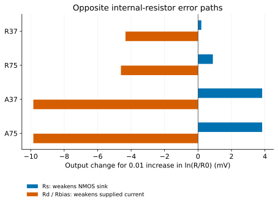
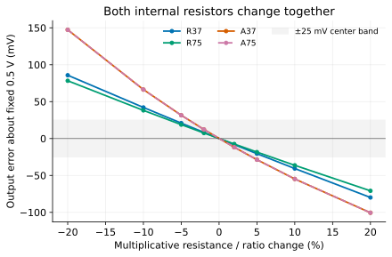
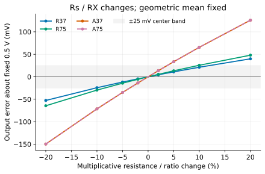
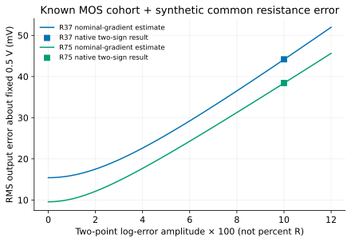
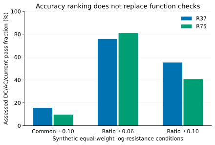

**Study 1.0 — checked synthetic-condition transfer on a known MOS cohort.**
This follows the [first amplifier study](../gain-operating-point-accuracy/).
[Reproduction and compact evidence](reproduce.qmd) accompany the guide.

The first amplifier comparison omitted passive variation. Its resistor-load
design improved when more current went into the signal branch, but that also
changed the drain and source resistances. We now ask how much resistor error
changes that choice, and whether absolute accuracy and matching lead to the
same answer. The common signal task and all four original nominal designs stay
fixed; a passive perturbation is not repaired by changing the input bias.

Absolute resistance and ratio accuracy are separate specifications. The
[Analog Devices resistance tutorial](https://www.analog.com/en/resources/analog-dialogue/articles/ask-the-applications-engineer-24.html)
explains why a ratio-defined gain can tolerate a common resistance shift, while
an absolute current measurement cannot. Here the amplifier is a transistor
current-balance circuit; a good resistor ratio does not automatically make its
output center insensitive to a common shift. No commercial or other-process
tolerance is being adopted as an APM045 statistical model.

Open a plot for its full-size vector figure. Wide circuit blocks and tables
scroll sideways on narrow screens.

## Keep the function and circuit costs visible

All four original nominal designs deliver gain −6 at 1 kHz with output centered
at 0.5 V, from a 0.45-V input through 1 kohm. The load is 100 kohm in parallel
with 1 pF; supply is 1 V and temperature is 26.85 °C. The original requirements
include center within ±25 mV, gain magnitude 5.4–6.6 through 1–100 kHz,
−3-dB bandwidth at least 1 MHz and total delivered current at most 80 µA.
The original 5-mV-peak, 10-kHz sine requirement remains part of the broader
function; the new passive block measures OP/AC/current and does not establish
sine or noise performance under every perturbed condition.

Here are the two topologies, with **D, G, S, B** MOS terminal order. These are
reading views, not executable SV/AMS. The exact original bodies, including
individual zero-V terminal-current sensors, are linked below.

```text
Shared: VDD(vdd,0)=1 V; VIN(in,0)=0.45 V DC
        Rsrc(in,gate)=1 kohm
        Rload(out,0)=100 kohm; Cload(out,0)=1 pF

Resistor-load topology:
  Rd(vdd,out)
  Rs(source,0)
  N_i(D=out,G=gate,S=source,B=0)  [separate physical units]

Finite active-load topology:
  Rs(source,0)
  N_i(D=out,G=gate,S=source,B=0)
  Rbias(pbias,0)
  PR_i(D=pbias,G=pbias,S=vdd,B=vdd)  [diode-connected reference]
  PL_0(D=out,G=pdrive,S=vdd,B=vdd)
  Vbiasdiag(pbias,pdrive)=0 V       [normally a short]
```

| Exact body | Input bank, count × W/L (µm) | PMOS reference / load units | Rs (Ω) | Rd or Rbias (Ω) | Nominal current (µA) | Drawn MOS area (µm²) |
|---|---:|---:|---:|---:|---:|---:|
| [R37](circuits/R37.cir) | 3 × 2.94722/0.40 | 0 / 0 | 82.602 | Rd 13334.311 | 37.500 | 3.537 |
| [R75](circuits/R75.cir) | 6 × 3.86749/0.40 | 0 / 0 | 171.818 | Rd 6667.192 | 75.000 | 9.282 |
| [A37](circuits/A37.cir) | 2 × 2.49455/0.32 | 2 / 1 | 6951.657 | Rbias 20495.011 | 37.500 | 3.037 |
| [A75](circuits/A75.cir) | 2 × 2.49455/0.32 | 5 / 1 | 6951.657 | Rbias 8198.359 | 74.989 | 4.477 |

Every PMOS is 2/0.24 µm. Values in this table are rounded; SPICE is exact.
`out` balances delivered load current against the NMOS sink and external load.
`source` supplies local degeneration. The reference charges `pbias`, Rbias draws
its current, and `pdrive` controls the PMOS output load. Both external voltage
sources and all reference currents are counted. The implementation cost of the
ideal 0.45-V input source is unspecified; it is a shared external dependency.

R75 spends added current in its signal branch; A75 spends it in extra reference
units. Neither the old nominal current matching nor the old resistor-value sum
is silently enforced by retuning a perturbed circuit. Their changed actual
currents and specification outcomes remain part of the observations.

## Predict the sign before changing the resistor

Use the same explicit MOS terminal conventions as the first study. In a
resistor-load stage, Rd connects VDD to `out`, Rload connects `out` to ground,
and the NMOS bank sinks the remaining current. Rs connects the bank's source
to ground. In the active stage, the PMOS load supplies `out`; Rbias draws the
finite reference-bank current from `pbias` to ground. Increasing Rbias raises
`pbias`, reduces the PMOS load's VSG and reduces its delivered current.

Let $s_k=\partial V_O/\partial\ln R_k$, in volts per fractional resistance
change near nominal. Summed nominal small-signal parameters give

$$D=1+R_S(g_{mN}+g_{mbN}+g_{dsN}),\quad
G_O=1/R_L+1/R_D+g_{dsP}+g_{dsN}/D.$$

Neglecting gate/bulk leakage derivatives in this local estimate,

$$s_D=-\frac{(V_{DD}-V_O)/R_D}{G_O},\qquad
s_L=\frac{V_O/R_L}{G_O},$$

$$s_S=\frac{I_S}{G_O}\frac{D-1}{D}.$$

A larger Rd supplies less current, lowering the output. A larger load resistance
draws less current, raising it. A larger Rs raises the NMOS source and weakens
its sink current, also raising the output. The body-effect term stays in D.

For the finite PMOS reference, let $G_R=\sum(g_{mR}+g_{dsR})$ and Vb be the
nominal bias voltage. Its resistor path is approximately

$$s_b=-\frac{g_{mP}}{G_O}\frac{V_b}{1+R_b G_R}.$$

These equations use the already observed first-study nominal operating points.
They explain those points retrospectively and predict the newly declared
small passive perturbations before their acquisition. They are not an
independent prediction of the original transistor operating points.

## Common shifts and ratio changes

For the two internal resistors, define
$c=(\ln(R_S/R_{S0})+\ln(R_X/R_{X0}))/2$ and
$d=\ln(R_S/R_{S0})-\ln(R_X/R_{X0})$, where X is D or b.
Then Rs scales by exp(c+d/2), RX by exp(c-d/2), and

$$\Delta V_O\simeq(s_S+s_X)c+\tfrac12(s_S-s_X)d+s_L\ln(R_L/R_{L0}).$$

The opposite signs of sS and sX make common drift partially cancel and ratio
error reinforce. Whether that cancellation outweighs the different MOS-error
floors is a design question, not a generic claim that matching solves accuracy.

## Measure the individual and combined paths

Four baselines and centered steps of ±0.001 and ±0.0005 in ln(R/R0) give
68 new nominal OP/AC observations. Every observation retained the original MOS
raw values, rebuilt the exact changed resistor body, and read the actual MOS
and resistor values from SPICE. All 68 were numerically usable and within the
model's terminal domain. These are finite development checks, not new process
samples. The table uses the smaller centered step.

| Design | Rs sensitivity | Rd / Rbias sensitivity | External Rload sensitivity | Common internal coefficient | Ratio coefficient |
|---|---:|---:|---:|---:|---:|
| R37 | +0.019871 | −0.433572 | +0.057814 | −0.413701 | +0.226722 |
| R75 | +0.088886 | −0.460782 | +0.030721 | −0.371896 | +0.274834 |
| A37 | +0.383536 | −0.984330 | +0.452613 | −0.600794 | +0.683933 |
| A75 | +0.383536 | −0.984327 | +0.452613 | −0.600791 | +0.683931 |

All coefficients are **V per unit log change**, not dimensionless gain. For
example, 0.01 added to ln(Rbias/Rbias0) moves A37's output by about −9.84 mV.
The KCL estimates agree with the three dominant individual derivatives within
0.019%; halving the finite step changes those derivatives by less than 0.00002%.
The [source observations](data/gradient-observations.csv),
[small-signal OP data](data/nominal-op.csv) and
[derivative table](data/sensitivities.csv) permit recomputation.

[](figures/internal-sensitivity.svg)

R75's larger source-degeneration contribution cancels more of its drain-resistor
path under a common shift. Under a differential ratio change, those same paths
reinforce, so R75 is more sensitive than R37. Reference-current growth barely
changes the active circuit's passive coefficients: it does not repair this
bias-voltage transmission path. The external Rload is especially consequential
for the high-output-resistance active stages.

Rsrc contributes only about 0.0000165, 0.0000354 and 0.00000230 V/logR for
R37, R75 and the active designs respectively. The active half-step estimate
involves nanovolt output differences and is cancellation-limited. A separate
±20% Rsrc check changes the nominal output by at most 7.1 µV across these
circuits. This bounds its DC effect at this operating point; it does not bound
its thermal noise, signal loading or behavior under another interface.

## A good ratio still leaves common drift

A finite 88-case block changes internal common resistance or the internal ratio
by −20%, −10%, −5%, −2%, +2%, +5%, +10%, +20%, plus selected individual-resistor
and external-load conditions. In these plots, percent means a multiplicative
change: a +5% common condition multiplies both resistors by 1.05; a +5% ratio
condition multiplies Rs by √1.05 and RX by 1/√1.05. It is not a standard deviation.
All 88 cases are usable and supported; 46 pass the assessed DC/AC/current limits.
The full [finite-boundary table](data/nominal-boundaries.csv) retains failures.

[](figures/nominal-common.svg)

[](figures/nominal-ratio.svg)

At common ±5%, R37 stays between 0.47950 and 0.52087 V, and R75 between 0.48163
and 0.51883 V. The active designs reach approximately 0.47134 and 0.53154 V,
so they fail the center requirement despite the two resistors tracking exactly.
A ±5% Rbias-only change is stronger still: A37 reaches 0.45271 and 0.55127 V.
A ±5% external Rload change moves it to 0.47725 or 0.52250 V, near the center
limit; corresponding resistor-load shifts are much smaller.

The linear equations are useful locally, but not a substitute for a large-step
solution. At 20% common changes, their output prediction error reaches about
13.3 mV in the active design. The same model is much closer at 5%. This is a
measured approximation limit, not evidence that a real resistor process spans
these ranges.

## When does extra current stop improving center accuracy?

The next question fixes a finite synthetic scenario before observing its
passive-condition targets. Use every R37 and R75 physical circuit from the
known first-study 464-coordinate cohort, with exact saved MOS geometry and raw
parameters. Each gets both signs of three log-error conditions: common ±0.10,
ratio ±0.06 and ratio ±0.10. That is 2 designs × 464 circuits × 6 conditions =
**5,568 observations**, attempted once with no redraw, recentering or tuning.
The [plan](transfer-plan.json) and [evidence receipt](evidence.json) identify
exposure, the freeze and the finite stopping policy.

These MOS samples were already known; only the new passive conditions were
unexposed when their predictions were fixed. The complete old cohort supplies
the error moments used here, avoiding selection of a favorable subset. This is
**prospective condition transfer on known MOS**, not a fresh population
confirmation. The synthetic passive distribution places equal weight on two
log values; it is neither Gaussian nor a calibrated APM passive model.
For d=±0.10, Rs changes by exp(±0.05) and Rd by exp(∓0.05); the ratio changes
by exp(±0.10). Zero mean in log resistance does not mean zero mean resistance.

Let e be the old output error from the fixed 0.5-V target, and let sc and sd
be the common and ratio coefficients. With independent zero-mean log scenarios,
a nominal-gradient estimate of mean squared error is

$$\operatorname{MSE}_j \simeq \overline{e_j^2}
 +s_{cj}^2\sigma_c^2+s_{dj}^2\sigma_d^2.$$

This includes the old bias in the first term. It requires the stated independence
and does not apply unchanged to correlated MOS/passive errors or correlated
common/ratio coordinates. The native test separately exercises the two-point
common and ratio terms. Using the known cohort's MOS-only MSE gives a ratio
crossing near **0.07786 in log-ratio amplitude** when common error is zero:

$$\sigma_d^* \simeq
\sqrt{\frac{\overline{e_{37}^2}-\overline{e_{75}^2}}
{s_{d75}^2-s_{d37}^2}}.$$

The two declared ratio amplitudes straddle that estimate. A second prediction
uses each circuit's previously measured nominal OP to obtain its own passive
slopes. Both predictions were saved before the new condition targets; neither
uses an OP measured at a perturbed target.

[](figures/finite-ratio.svg)

[](figures/finite-common.svg)

| Synthetic log condition | R37 RMS / MAE (mV) | R75 RMS / MAE (mV) | R37 assessed passes / 928 | R75 assessed passes / 928 |
|---|---:|---:|---:|---:|
| Common ±0.10 | 44.188 / 41.396 | 38.435 / 37.203 | 145 | 90 |
| Ratio ±0.06 | 20.568 / 16.773 | 19.083 / 16.796 | 704 | 754 |
| Ratio ±0.10 | 27.434 / 23.456 | 29.146 / 27.507 | 513 | 378 |

Each row contains 464 physical circuits and two equally weighted passive signs
per design; its 928 observations are not 928 independent MOS samples. All
5,568 observations are usable and supported. Accuracy statistics retain every
supported physical failure, and always use the fixed 0.5-V target.
[All target data](data/transfer.csv), [known baselines](data/known-baselines.csv)
and [recomputed summaries](data/statistics.json) are public.

The native results confirm the predicted RMS ranking change: R75 leads by
1.484 mV at ratio ±0.06, whereas R37 leads by 1.712 mV at ±0.10. The local crossing
is a conditional estimate, not a measured exact threshold or a process limit.
With per-MOS OP slopes the linear crossing is 0.07769, close to the nominal
estimate. Native nonlinearity shifts RMS only modestly at the tested points.

The meaning of “better” still matters. At ratio ±0.06 the MAEs are almost equal
and their ordering differs from RMS. Under common ±0.10, R75's lower RMS coexists
with fewer assessed passes: both signed distributions are largely outside the
±25-mV center band, and the narrower distribution does not put more observations
inside that band. A lower average loss cannot replace a hard functional limit.
These fractions describe the declared synthetic finite dataset; they are not
manufacturing yield estimates.

[](figures/finite-function.svg)

## Separate prediction error from nonlinear physical shift

The prediction using a known per-MOS nominal OP reduces the largest absolute
output prediction error from 5.78 to 1.42 mV across the tested transfer block.
Its residual is mostly an even response to the two passive signs. To show this
retrospectively, write the observed signed errors as
$e_\pm=e_0+b\pm a$, where b is the midpoint shift from the old nominal error
and a is half the difference between the two new signs. Then, exactly for that
pair,

$$\tfrac12(e_+^2+e_-^2)=e_0^2+a^2+2e_0b+b^2.$$

Averaging this identity over the known cohort preserves both offset/curvature
coupling and the squared mean-shift term. The mean even shift is −1.329 mV
for R37 and −0.935 mV for R75 under common ±0.10; under ratio ±0.10 it is
−0.415 and −0.628 mV. These shifts were not subtracted to improve accuracy.
The decomposition is an explanation of exposed results, not a new prospective
higher-order model. It also shows why a symmetric tolerance assumption does
not guarantee a centered output distribution.

Every source attempt's saved file hashes, before/applied/after MOS readbacks,
actual passive readbacks and scalar measurements were rechecked. The largest
terminal/output KCL residual across all 5,724 new observations was
$1.87\times10^{-16}$ A (rounded upward). Numerical precision is much smaller
than the measured millivolt effects in this check. Model-transfer uncertainty,
uncalibrated passive statistics and omitted layout effects remain distinct
limitations; a small numerical residual cannot remove them.

## Design judgment and remaining scope

For these untrimmed circuits, classify resistor uncertainty by its electrical
path before deciding where to spend current. Tight ratio tracking alone does
not remove the current-balance stage's absolute-resistance error. R75's extra
current lowers the MOS floor and common-resistance sensitivity, but larger
ratio sensitivity can erase or reverse its center-accuracy advantage. Its
nominal current and drawn MOS area remain approximately twice and 2.6 times
R37's, respectively; resistor technology, matching and total layout costs are
not quantified by this model.

A37/A75 have stronger bias-resistor and load dependencies. Adding reference
current leaves these paths nearly unchanged, so a reference-only investment
cannot be credited with removing passive-induced error. Better physical load
matching, changed resource allocation or feedback are separate redesign
questions; none is proved by this passive perturbation alone.

The tested ±20% and two-point scenarios locate conditional boundaries. They
are not recommendations to purchase a resistor grade, calibrated passive or
spatial statistics, temperature coefficients, foundry yield, or silicon
qualification. No new passive-noise, mismatch-over-temperature, self-heating,
layout/PEX or complete large-signal campaign is implied. APM v5.0.0 APM045/VTG
and ngspice 47 remain pinned; the Local MOS profile remains a source-transfer
hypothesis. The first study's definitions and original evaluation are retained.

Internal scientific and reproduction checks were performed by the same Codex
agent that conducted the work. This release does not claim prior human review,
peer approval or independent scientific replication. The [reproduction page](reproduce.qmd)
separates data/graph regeneration from an actual saved-physical native replay.
