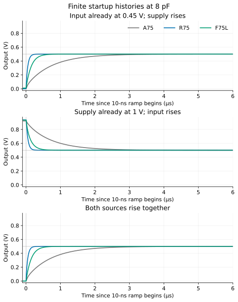
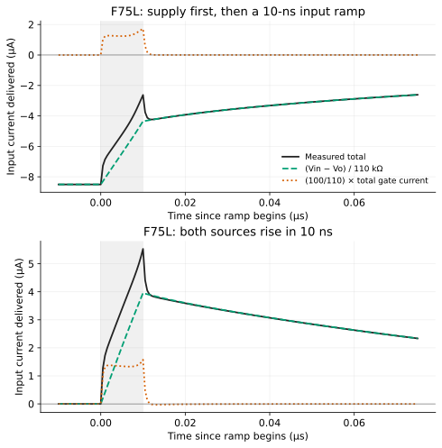
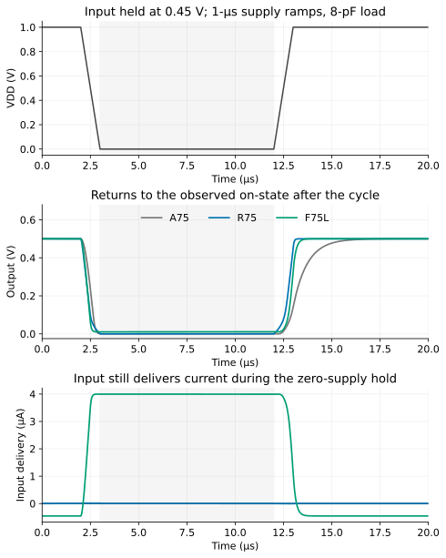

The finite feedback amplifier F75L needs more from its input source than its
normal operating point suggests. With its supply clamped at 0 V and its input
held at 0.45 V, it draws **3.997 µA from the input**. With the supply on and the
input clamped at 0 V, it sends **8.502 µA into that input source**. Normal powered
operation requires only 0.452 µA of input absorption. The conductive feedback
path remains present in all three states.

The resistor-loaded alternative R75 reaches its operating point faster in the
tested histories, but an 8-pF output load and a 10-ns supply ramp demand a
**141-µA supply peak**. These are interface costs alongside the previously
studied accuracy and distortion. The nominal 75-µA DC operating point alone
does not specify an input driver or a supply's transient capability.

This note compares 59 declared nominal observations and controls on unchanged
A75, R75 and F75L circuits. It establishes particular power/input histories,
with ordinary DC initialization at their actual starting voltages. It does not
establish behavior with floating inputs, arbitrary initial charge, every
possible equilibrium, or silicon startup. The
[finite-feedback study](../finite-feedback/) contains the earlier gain,
accuracy, noise, distortion and resource comparisons.

## The circuit and the meaning of “off”

All three designs retain a 0.45-V external input, approximately −6 small-signal
gain, 0.5-V output and approximately 75-µA delivered DC current at 1 V and
26.85 °C. The original output load is 100 kΩ in parallel with 1 pF; selected
histories increase the capacitor to 8 pF. No transistor or resistor is retuned.
A75 has a finite PMOS mirror load, R75 a 6.667-kΩ supply resistor, and F75L a
finite PMOS load with a 100-kΩ output-to-gate feedback resistor.

Here is F75L's reading view. W/L values are in micrometers; sensor-only internal
nodes are collapsed. The listed D/G/S/B connections are explicit. The
[exact instrumented SPICE body](circuits/F75L-supply_first-fast-8p.cir),
[all input definitions](data/configuration.json), and
[saved terminal observations](data/observations.json) are the execution evidence.
The public models are retrieved separately by the replay command.

```spice
* Reading view: Xname D G S B model W L; exact body includes current sensors.
Rsrc  in      drive   1k        ; external source impedance
Rin   drive   gate    9k        ; internal input resistor
Rf    out     gate    100k      ; conductive negative feedback
Rs    source  0       670.3661
Rbias pbias   0       10731.0246
Rload out     0       100k      ; external load
Cload out     0       8p        ; 1p in the original job
Xn0   out gate source 0         apm045_vtg_nmos W=4u       L=0.4u
Xn1   out gate source 0         apm045_vtg_nmos W=4u       L=0.4u
Xn2   out gate source 0         apm045_vtg_nmos W=4u       L=0.4u
Xref  pbias pbias vdd vdd       apm045_vtg_pmos W=3.33333u L=0.4u
Xload out   pbias vdd vdd       apm045_vtg_pmos W=3.33333u L=0.4u
```

`gate` controls the input NMOS bank, `source` provides degeneration, and
`pbias` sets the PMOS load from its finite reference branch. F75L retains
7.467 µm² of drawn MOS area and 120.401 kΩ of internal resistance, excluding
external Rsrc/Rload. The signal source is an explicit external dependency.

**A source at zero volts is still driven or clamped.** It can sink current;
it is neither an open circuit nor a model of an unpowered I/O pin. The supply
source can also absorb current while maintaining its declared voltage. No
pad diode, driver power rail or protection circuit is added. These boundaries
are essential to interpreting the following observations.

## The stationary input path

Let current be positive when the input source delivers it toward the amplifier.
Write $R_t=R_{src}+R_{in}=10$ kΩ, $R_f=100$ kΩ, and let $I_g$ be the sum of
currents entering the three NMOS gate terminals. Gate-node KCL gives

$$
I_{in}+\frac{V_o-V_g}{R_f}=I_g,
\qquad V_{in}-V_g=R_t I_{in}.
$$

Eliminating the gate voltage yields an exact identity for this circuit:

$$
I_{in}=\underbrace{\frac{V_{in}-V_o}{R_t+R_f}}_{\text{resistor path}}
+\underbrace{\frac{R_f}{R_t+R_f}I_g}_{\text{gate-terminal contribution}}.
$$

The equation neglecting gate leakage was the pre-acquisition estimate. The
second term is retained in the measured decomposition. The same identity
holds during transients; gate-terminal current then includes charging of the
intrinsic MOS capacitances. It does not by itself separate that current into
individual compact-model leakage and charge terms.

| Stationary state, F75L | Output | Input delivery | Supply delivery |
| --- | ---: | ---: | ---: |
| VDD=0, Vin=0.45 V | 10.532 mV | +3.997 µA | −55.4 pA |
| VDD=1 V, Vin=0 | 934.819 mV | −8.502 µA | +55.457 µA |
| VDD=1 V, Vin=0.45 V | 500.047 mV | −0.452 µA | +74.997 µA |

With only the input powered, the gate is at 410.033 mV and the common source
at 2.609 mV. The output's 10.532 mV is sufficient to pass 3.890 µA through the
NMOS drain bank; the load resistor takes another 0.105 µA. Approximately
3.995 µA flows from gate toward output through Rf. This is near-threshold MOS
behavior, not an ideal off switch. The observed NMOS threshold parameter is
411.223 mV; treating it as a sharp zero-current boundary would miss the result.

The simple zero-output estimate was 0.45 V / 110 kΩ = 4.091 µA. The measured
output reduces the resistor-path term to 3.99516 µA, and the 1.728-nA total
gate current adds 1.571 nA at the input. That gives the observed 3.99673 µA.
The result is mainly input-to-output/ground conduction. It does **not** show
substantial charging of a floating supply: VDD is clamped and its measured
absorption is only 55.4 pA in this state.

With supply on and input clamped low, the NMOS bank conducts little. The output
rises until the finite PMOS load balances Rload and the feedback path into the
input clamp. Rf then delivers about 8.498 µA toward the gate. The input source
must absorb about 8.502 µA to hold its declared zero voltage. Slowing a later
input ramp cannot remove this initial stationary demand.

[](figures/static-interface.svg)

A75 and R75 have no Rf connection. Their stationary input-only currents are
1.528 nA and 8.661 nA, respectively. Their supply-only input absorptions are
2.097 nA and 10.449 nA. These small bars are nearly invisible at the plot's
microampere scale; [the complete static table](data/static.csv) retains them.
All three both-off stationary outputs are numerically indistinguishable from
zero in this model.

Port current and power have different signs and units. For each ideal source,

$$P(t)=V(t)I_{delivered}(t),\qquad E=\int P(t)\,dt.$$

Positive delivery and absorbed energy are integrated separately. F75L's
input-only state consumes 1.799 µW from the 0.45-V input. Its supply-only input
clamp absorbs current at zero voltage, so that ideal port's power is zero.
Neither observation accounts for the energy needed to implement a real driver.
Full signed/positive/absorbed energy observations are in
[histories.csv](data/histories.csv).

## Reaching the operating point under declared histories

The 36 startup histories combine three candidates, three orders, two ramp
lengths (10 ns and 1 µs), and two capacitors (1 and 8 pF). Sources hold their
initial states for 2 µs, then ramp and remain at VDD=1 V and Vin=0.45 V until
20 µs. Independent static solves supply the final stationary targets. Six
additional histories cycle the supply off and on while holding the input.

For settling, the frozen rule is the final observed entry into a 1-mV band
around that independent stationary target, measured **after the ramp ends**.
The target is an equilibrium reference. It does not replace the original
fixed 0.5-V ±25-mV accuracy requirement. All 54 transistor plateau observations,
including the refinements, reach their target bands within their finite
horizons. This is a finding about the tested source histories.

[](figures/startup-histories.svg)

At 8 pF with a 10-ns ramp, the observed post-ramp settling times are:

| Source order | A75 | R75 | F75L |
| --- | ---: | ---: | ---: |
| Input first; supply rises | 4.445 µs | 0.300 µs | 0.871 µs |
| Supply first; input rises | 4.327 µs | 0.299 µs | 0.818 µs |
| Both rise together | 4.445 µs | 0.298 µs | 0.872 µs |

Supply-first operation starts near 0.92–0.94 V at the output. This exceeds the
original normal-signal upper bound of 0.75 V. We report the excursion and
sampled time outside the original bands without inventing a universal startup
pass limit. R75's maximum is 0.93753 V; F75L's is 0.93531 V in the fast 8-pF
supply-first histories. Most of that excursion already exists in the initial
stationary state.

A slower ramp changes both charging demand and the time spent moving the
sources. For R75 with input already on and 8 pF, extending the supply ramp
from 10 ns to 1 µs reduces its peak supply current from 140.981 to 81.797 µA.
Post-ramp settling falls from 0.300 to 0.189 µs, but total time from the start
of the ramp rises from about 0.310 to 1.189 µs. A shorter post-ramp delay alone
would therefore be a misleading speed comparison. The full 1/8-pF and
10-ns/1-µs results, including their time brackets, are in
[plateaus.csv](data/plateaus.csv).

## Peak demand separates three interface costs

During a fast edge, even a MOS-only input has gate charging current. R75's
fast supply-first input peak reaches 4.365 µA; its fast simultaneous-input/
supply peak is 4.577 µA. Their stationary input currents remain in nanamperes.
For A75 the corresponding peaks are 0.555 and 1.090 µA.

F75L combines charging with its conductive input path. During simultaneous
10-ns ramps it requires 5.529 µA of peak input delivery. During supply-first
operation, the source absorbs current throughout the observed history, from
8.502 µA at the initial clamp toward 0.452 µA at the final operating point.
The gate-current pulse reduces that absorption during the input edge; it does
not erase the stationary requirement.

[](figures/input-current-paths.svg)

This retrospective KCL decomposition agrees with the saved native input
current to a maximum of 1.008 fA across the histories. It is an independent
circuit identity applied to the same observations, not another independent
experiment. Compact interpolated traces draw the graphs; all peaks and
measurements use the full native time axes.

R75's supply current has a simple mechanism:

$$I_{VDD}=\frac{V_{DD}-V_o}{R_d}.$$

When its supply rises faster than the output capacitor can charge, the
instantaneous resistor drop approaches 1 V. With Rd≈6.667 kΩ that implies a
150-µA limiting estimate, compared with roughly 75 µA once Vo≈0.5 V. The
observed 140.981 µA in the declared ramp is consistent with this path. Active
loads A75/F75L supply much smaller charging peaks in these histories, at the
cost of slower output motion and their finite bias branches.

[](figures/peak-demands.svg)

The earlier 80-µA specification is a DC comparison ceiling. These peaks remain
separately reported interface requirements; no retrospective peak-current
ceiling is used to turn the startup observations into new pass/fail counts.
A physically current-limited source could produce different histories and
would need its own defined comparison.

## A supply cycle and what “already in band” means

The cycle starts powered, lowers VDD during 2–3 µs, holds it at zero until
12 µs, then restores it during 12–13 µs. The input remains at 0.45 V. At 8 pF,
A75/R75/F75L return to their on-state bands after approximately
4.274/0.196/0.724 µs following the final ramp. F75L continues drawing about
4 µA from its input throughout the zero-supply hold.

[](figures/supply-cycle.svg)

At the end of each slow downward ramp, the output is already inside the
independent off-state target band at the first following observation. The
retained measurement reports `IN_BAND_AT_FIRST_OBSERVATION`. Its tiny raw
sample offset is **not** a resolved picosecond settling time. The public table
keeps that status and reports the observation bracket; it leaves the resolved
entry-time column empty. Eight such entries include six ordinary cycles and
the two cycle refinements. No tail is fitted beyond the saved observations.

## Numerical controls, reproducibility and limits

The fixed block consists of one MOS-free analytic control, 12 stationary
references, 36 startups, six cycles and four predeclared refinements. The
control has Rt=10 kΩ, Rf=100 kΩ, Rload=100 kΩ and Cload=8 pF. Its DC gain is
10/21 and its time constant is

$$\tau=(100\,\mathrm{k}\Omega\parallel110\,\mathrm{k}\Omega)8\,\mathrm{pF}
=419.048\,\mathrm{ns}.$$

The exact finite-ramp solution differs from the observed waveform by at most
59.91 nV. Actual device/raw/model, resistor, capacitor and source readbacks
were checked. All 364 repeated MOS unit uses retained the saved nominal
geometry/UID and raw values [0,0]. All 58 transistor cases are numerically
usable and within the checked terminal domain. Maximum node/device KCL
residual is 2.827e−13 A; maximum capacitor charge discrepancy is 2.614 ppm.

The four refinements halve the maximum time step and tighten relative
convergence tolerance from 1e−7 to 1e−8. They target R75/F75L's 8-pF fast
supply-first startup and supply cycle. Their largest interpolated output
waveform difference is 56.714 µV, below the predeclared 0.5-mV check. Endpoint
and bracketed settling differences also pass. The original coarse cycle time
0.196 µs for R75 becomes 0.188 µs in the refinement; that distinction is
preserved in the evidence, rather than rounded into false precision.

The [reproduction page](reproduce.qmd) provides deterministic graph/data checks
and four small native examples from public models and saved inputs. The
[complete scalar observations](data/observations.json),
[original finite plan](nominal-plan.json), [audit](nominal-audit.json), and
[regenerated summary](statistics.json) expose the conditions and checks.
No failed acquisition, retry or outcome-driven extension occurred in this block.

These are nominal APM v5.0.0/APM045 VTG, ngspice 47 observations. Earlier Local
source-transfer statistics were not newly qualified for powered-off or
near-threshold behavior. There is no population startup probability, pad or
ESD model, arbitrary-charge initialization, equilibrium-uniqueness proof,
formal stability margin, layout extraction or silicon qualification here.
The same Codex agent performed acquisition, analysis and internal review;
the checks are not prior human approval or independent replication.

For a design decision, retain R75's accuracy and speed advantage only together
with its charging-current and larger-signal distortion costs. Retain F75L's
linearity and moderate charging demand together with a driver that can both
supply and absorb the stated currents. The next interface design should make
source impedance, clamp behavior, current limits and allowed startup output
excursion explicit before applying either amplifier to a larger system.
